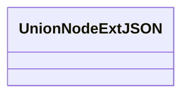
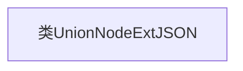

# 基础信息

|      |      |
|------|------|
| 名称 | UnionNodeExtJSON |
| 编码语言 | .java |
| 代码路径 | WeFe/common/java/common-data-mongodb/src/main/java/com/welab/wefe/common/data/mongodb/entity/union/ext/UnionNodeExtJSON.java |
| 包名 | com.welab.wefe.common.data.mongodb.entity.union.ext |
| 依赖项 | [] |
| 概述说明 | UnionNodeExtJSON是一个空的公共类。 |

# 说明

UnionNodeExtJSON是一个空的公共类，未包含任何成员变量或方法，仅作为类定义存在。

# 类列表 Class Summary

| 名称   | 类型  | 说明 |
|-------|------|-------------|
| UnionNodeExtJSON | class | UnionNodeExtJSON是一个空的公共类。 |

## 类 UnionNodeExtJSON

|      |      |
|------|------|
| 访问范围 | public |
| 类型 | class |
| 名称 | UnionNodeExtJSON |
| 说明 | UnionNodeExtJSON是一个空的公共类。 |

### UML类图

这段代码定义了一个名为UnionNodeExtJSON的空类，目前没有任何成员变量或方法。这是一个简单的类结构，可以作为更复杂类的基础或占位符。在类图中，我们清晰地展示了这个空类的结构，符合Mermaid语法规范。根据代码规范，我们使用减号表示私有成员，加号表示公有成员，但目前这个类中没有任何成员需要标注。这个类图可以随着类的功能扩展而逐步完善。

### 内部方法调用关系图

这段流程图描述了一个名为`UnionNodeExtJSON`的空类结构。由于该类未定义任何属性或方法，图中仅包含一个表示类本身的节点。该图展示了最基本的类声明形式，可作为后续扩展的基础框架。当添加成员变量或方法时，可按照标准格式继续扩展该流程图。

### 字段列表 Field List

| 名称  | 类型  | 说明 |
|-------|-------|------|

### 方法列表

| 名称  | 类型  | 说明 |
|-------|-------|------|

