# 基础信息

|      |      |
|------|------|
| 名称 | ext |
| 编码语言 | .java |
| 代码路径 | WeFe/common/java/common-data-mongodb/src/main/java/com/welab/wefe/common/data/mongodb/entity/union/ext |
| 包名 | docs.common.java.common-data-mongodb.src.main.java.com.welab.wefe.common.data.mongodb.entity.union.ext |
| 概述说明 | 多个Java扩展JSON处理类，多数为空实现，功能待定。MemberExtJSON含成员信息字段及方法，DataSetExtJSON有enable属性。RealnameAuthFileInfo存储文件信息。 |

# 说明

## 概述  
该模块是一组用于处理JSON数据扩展的Java类集合，核心职责是为不同业务实体（如数据集、成员服务、实名认证等）提供扩展JSON数据的结构框架。接口规范统一采用空类或基础字段定义，例如MemberExtJSON包含实名认证状态等字段，DataSetExtJSON仅含enable布尔标志。关键数据结构包括实名认证文件信息（RealnameAuthFileInfo）和成员扩展信息（MemberExtJSON）。外部依赖仅涉及Java标准库和MongoDB实体层。例如RealnameAuthFileInfo管理文件ID等元数据，类似文件元信息存储模式。

## 主要业务场景  
模块支持联邦学习场景下的多类型数据扩展管理，如图像数据集（ImageDataSetExtJSON）、表格数据（TableDataSetExtJSON）和信任证书（TrustCertsExtJSON）。交互模式通过getter/setter访问扩展属性，例如MemberExtJSON管理证书请求等敏感数据。功能完整性体现在覆盖数据资源、成员服务、认证流程等维度，例如DataSetDefaultTagExtJSON处理标签扩展。典型应用包括成员实名认证（RealnameAuthAgreementTemplateExtJSON）和数据权限控制（DataSetMemberPermissionExtJSON）。API类型均为POJO扩展类，集成案例类似配置中心的数据结构扩展方案。

### 包内部结构视图

```mermaid
graph TD
    ext --> DataSetDefaultTagExtJSON.java
    ext --> MemberServiceExtJSON.java
    ext --> MemberAuthTypeExtJSON.java
    ext --> TableDataSetExtJSON.java
    ext --> RealnameAuthAgreementTemplateExtJSON.java
    ext --> BloomFilterExtJSON.java
    ext --> MemberExtJSON.java
    ext --> DataSetMemberPermissionExtJSON.java
    ext --> ImageDataSetExtJSON.java
    ext --> UnionNodeExtJSON.java
    ext --> RealnameAuthFileInfo.java
    ext --> MemberFileInfoExtJSON.java
    ext --> DataResourceDefaultTagExtJSON.java
    ext --> DataResourceExtJSON.java
    ext --> TrustCertsExtJSON.java
    ext --> DataSetExtJSON.java
```

该流程图展示了WeFe项目中common-data-mongodb模块下union/ext目录中的17个Java实体类文件。所有文件都直接隶属于ext节点，描述了不同业务场景下的JSON扩展实体，包括数据集标签、成员服务、实名认证协议模板等各类业务实体扩展。

# 文件列表

| 名称   | 类型  | 说明 |
|-------|------|-------------|
| [DataSetDefaultTagExtJSON.java](DataSetDefaultTagExtJSON.md) | file | 类DataSetDefaultTagExtJSON用于处理数据集默认标签的JSON扩展。 |
| [MemberServiceExtJSON.java](MemberServiceExtJSON.md) | file | MemberServiceExtJSON是一个空的公共类。 |
| [MemberAuthTypeExtJSON.java](MemberAuthTypeExtJSON.md) | file | 类MemberAuthTypeExtJSON定义了一个公开的JSON扩展类。 |
| [TableDataSetExtJSON.java](TableDataSetExtJSON.md) | file | 类TableDataSetExtJSON用于JSON数据集的扩展处理。 |
| [RealnameAuthAgreementTemplateExtJSON.java](RealnameAuthAgreementTemplateExtJSON.md) | file | 类RealnameAuthAgreementTemplateExtJSON用于实名认证协议模板扩展JSON数据。 |
| [BloomFilterExtJSON.java](BloomFilterExtJSON.md) | file | BloomFilterExtJSON是一个公开的Java类，可能用于扩展布隆过滤器的JSON功能。 |
| [MemberExtJSON.java](MemberExtJSON.md) | file | MemberExtJSON类包含成员认证状态、服务URL、证书信息及TLS通信开关等字段，用于管理成员认证和证书相关数据。 |
| [DataSetMemberPermissionExtJSON.java](DataSetMemberPermissionExtJSON.md) | file | 类定义：DataSetMemberPermissionExtJSON，用于处理数据集成员权限扩展的JSON数据。 |
| [ImageDataSetExtJSON.java](ImageDataSetExtJSON.md) | file | ImageDataSetExtJSON是一个公共类，用于处理图像数据集扩展的JSON数据。 |
| [UnionNodeExtJSON.java](UnionNodeExtJSON.md) | file | UnionNodeExtJSON是一个空的公共类。 |
| [RealnameAuthFileInfo.java](RealnameAuthFileInfo.md) | file | RealnameAuthFileInfo类包含文件ID、签名和文件名属性，提供getter和setter方法。 |
| [MemberFileInfoExtJSON.java](MemberFileInfoExtJSON.md) | file | 类MemberFileInfoExtJSON用于存储成员文件信息的JSON扩展数据。 |
| [DataResourceDefaultTagExtJSON.java](DataResourceDefaultTagExtJSON.md) | file | 类DataResourceDefaultTagExtJSON定义了一个默认标签扩展的JSON数据结构。 |
| [DataResourceExtJSON.java](DataResourceExtJSON.md) | file | 类DataResourceExtJSON用于处理JSON数据资源。 |
| [TrustCertsExtJSON.java](TrustCertsExtJSON.md) | file | TrustCertsExtJSON是一个公开的Java类，用于处理信任证书扩展JSON数据。 |
| [DataSetExtJSON.java](DataSetExtJSON.md) | file | DataSetExtJSON类包含一个布尔类型属性enable及其getter和setter方法。 |

