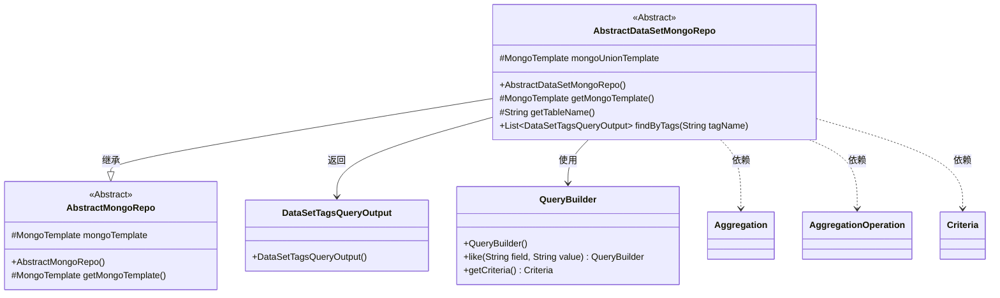
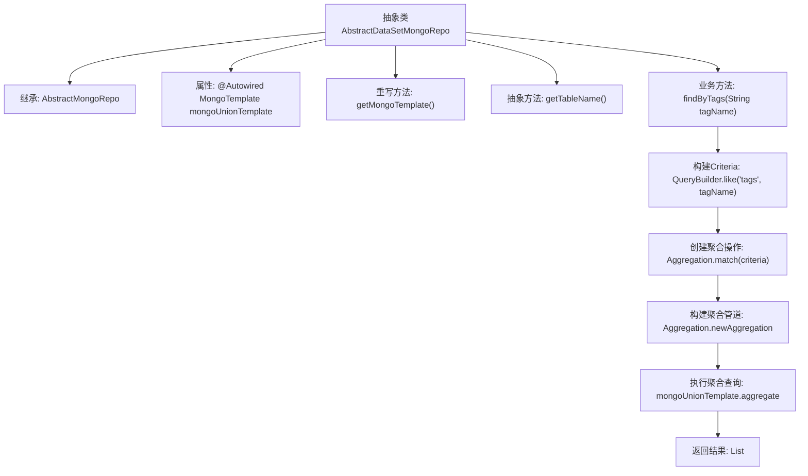

# 基础信息

|      |      |
|------|------|
| 名称 | AbstractDataSetMongoRepo |
| 编码语言 | .java |
| 代码路径 | WeFe/common/java/common-data-mongodb/src/main/java/com/welab/wefe/common/data/mongodb/repo/AbstractDataSetMongoRepo.java |
| 包名 | com.welab.wefe.common.data.mongodb.repo |
| 依赖项 | ['com.welab.wefe.common.data.mongodb.dto.dataset.DataSetTagsQueryOutput', 'com.welab.wefe.common.data.mongodb.util.QueryBuilder', 'org.springframework.beans.factory.annotation.Autowired', 'org.springframework.data.domain.Sort', 'org.springframework.data.mongodb.core.MongoTemplate', 'org.springframework.data.mongodb.core.aggregation.Aggregation', 'org.springframework.data.mongodb.core.aggregation.AggregationOperation', 'org.springframework.data.mongodb.core.query.Criteria', 'java.util.List'] |
| 概述说明 | 抽象类AbstractDataSetMongoRepo继承AbstractMongoRepo，使用MongoTemplate进行聚合查询，通过标签名查找并统计数据集标签结果。 |

# 说明

这是一个名为AbstractDataSetMongoRepo的抽象类，继承自AbstractMongoRepo。它使用MongoTemplate进行数据库操作，通过@Autowired注入名为mongoUnionTemplate的实例。类中包含一个抽象方法getTableName()用于获取表名，以及一个具体方法findByTags()，该方法通过标签名查询数据，使用聚合操作进行匹配、分组、排序和投影，最终返回DataSetTagsQueryOutput类型的列表结果。

# 类列表 Class Summary

| 名称   | 类型  | 说明 |
|-------|------|-------------|
| AbstractDataSetMongoRepo | class | 抽象类AbstractDataSetMongoRepo继承AbstractMongoRepo，使用MongoTemplate查询数据，通过标签名聚合统计标签数量并按降序返回结果。 |

## 类 AbstractDataSetMongoRepo

|      |      |
|------|------|
| 访问范围 | public abstract |
| 类型 | class |
| 名称 | AbstractDataSetMongoRepo |
| 说明 | 抽象类AbstractDataSetMongoRepo继承AbstractMongoRepo，使用MongoTemplate查询数据，通过标签名聚合统计标签数量并按降序返回结果。 |

### UML类图

这段代码展示了一个抽象类`AbstractDataSetMongoRepo`，它继承自`AbstractMongoRepo`，主要用于处理MongoDB数据集标签查询。类中包含核心方法`findByTags`，通过构建聚合查询（使用`QueryBuilder`生成条件、`Aggregation`构建管道操作）来统计标签出现频率，并返回`DataSetTagsQueryOutput`类型的结果列表。类图清晰地呈现了继承关系、依赖组件和返回类型，体现了该仓储类对MongoDB聚合框架的封装使用。

### 内部方法调用关系图

该流程图展示了AbstractDataSetMongoRepo抽象类的核心结构和工作流程。类继承AbstractMongoRepo并通过聚合查询实现标签检索功能，主要流程包括：注入MongoTemplate模板、构建查询条件、创建聚合管道（包含匹配/分组/排序/投影操作）、执行聚合查询并映射结果。其中getTableName()作为抽象方法需要子类实现，体现了模板方法设计模式的应用。

### 字段列表 Field List

| 名称  | 类型  | 说明 |
|-------|-------|------|
| mongoUnionTemplate | MongoTemplate | 使用@Autowired自动注入MongoTemplate实例mongoUnionTemplate。 |

### 方法列表

| 名称  | 类型  | 说明 |
|-------|-------|------|
| getMongoTemplate | MongoTemplate | 重写getMongoTemplate方法，返回mongoUnionTemplate实例。 |
| getTableName | String | 抽象方法，返回表名字符串。 |
| findByTags | List<DataSetTagsQueryOutput> | 该方法通过MongoDB聚合查询，根据标签名模糊匹配数据集标签，按标签分组统计数量并降序排序，返回标签及计数的结果列表。 |

