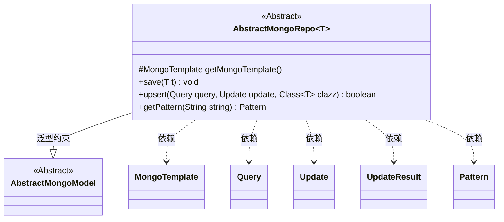
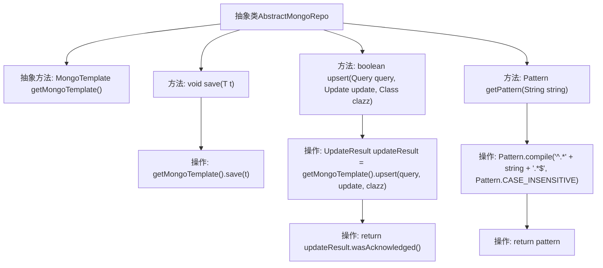

# 基础信息

|      |      |
|------|------|
| 名称 | AbstractMongoRepo |
| 编码语言 | .java |
| 代码路径 | WeFe/common/java/common-data-mongodb/src/main/java/com/welab/wefe/common/data/mongodb/repo/AbstractMongoRepo.java |
| 包名 | com.welab.wefe.common.data.mongodb.repo |
| 依赖项 | ['com.mongodb.client.result.UpdateResult', 'com.welab.wefe.common.data.mongodb.entity.base.AbstractMongoModel', 'org.springframework.data.mongodb.core.MongoTemplate', 'org.springframework.data.mongodb.core.query.Query', 'org.springframework.data.mongodb.core.query.Update', 'java.util.regex.Pattern'] |
| 概述说明 | 抽象MongoDB仓库类，提供保存、更新插入和模糊查询方法，需子类实现模板获取。 |

# 说明

这是一个抽象类AbstractMongoRepo，用于操作MongoDB数据库。它定义了获取MongoTemplate的抽象方法，提供保存实体和更新插入操作的功能。save方法用于保存实体对象，upsert方法执行更新或插入操作并返回是否成功。还包含一个辅助方法getPattern，用于生成不区分大小写的模糊查询正则表达式模式。该类使用泛型T限定为AbstractMongoModel的子类。

# 类列表 Class Summary

| 名称   | 类型  | 说明 |
|-------|------|-------------|
| AbstractMongoRepo | class | 抽象MongoDB仓库类，提供保存、更新插入操作及忽略大小写的模糊查询方法。需子类实现MongoTemplate获取。 |

## 类 AbstractMongoRepo

|      |      |
|------|------|
| 访问范围 | public abstract |
| 类型 | class |
| 名称 | AbstractMongoRepo |
| 说明 | 抽象MongoDB仓库类，提供保存、更新插入操作及忽略大小写的模糊查询方法。需子类实现MongoTemplate获取。 |

### UML类图

该类图展示了一个MongoDB抽象仓库类`AbstractMongoRepo`，它通过泛型`T`约束为`AbstractMongoModel`的子类。核心功能包括文档保存、更新插入操作和模糊查询模式生成，依赖于Spring Data MongoDB的`MongoTemplate`实现数据库交互。类中定义了获取模板的抽象方法，并由具体子类实现，体现了模板方法模式的设计思想。

### 内部方法调用关系图

这段代码是MongoDB数据访问层的抽象基类，提供核心CRUD操作和工具方法。流程图展示了类结构包含1个抽象方法和3个具体方法，其中save()执行文档存储，upsert()实现更新/插入并返回操作状态，getPattern()生成用于模糊查询的正则表达式。所有数据库操作都通过getMongoTemplate()获取模板实例执行，体现了模板方法设计模式。

### 字段列表 Field List

| 名称  | 类型  | 说明 |
|-------|-------|------|

### 方法列表

| 名称  | 类型  | 说明 |
|-------|-------|------|
| save | void | 该方法用于将对象保存到MongoDB数据库，调用MongoTemplate的save方法实现持久化。 |
| getMongoTemplate | MongoTemplate | 抽象方法，返回MongoTemplate实例。 |
| upsert | boolean | Java方法upsert使用MongoTemplate执行更新或插入操作，返回操作是否被确认。 |
| getPattern | Pattern | 该方法接收字符串参数，编译生成不区分大小写的正则表达式模式，匹配任意前后字符的输入字符串。 |

