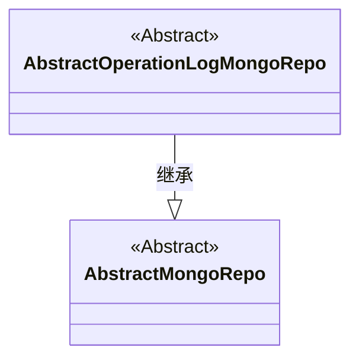
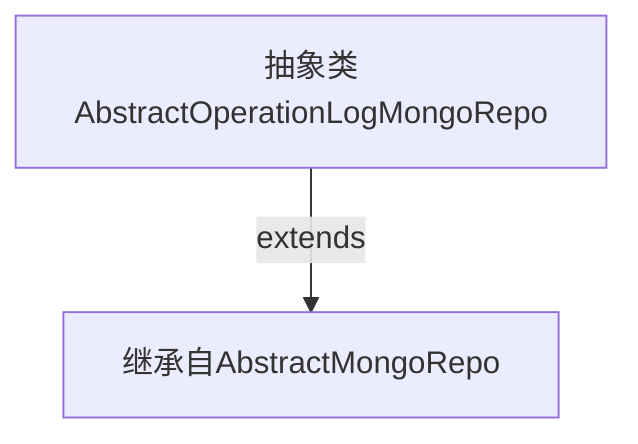

# 基础信息

|      |      |
|------|------|
| 名称 | AbstractOperationLogMongoRepo |
| 编码语言 | .java |
| 代码路径 | WeFe/common/java/common-data-mongodb/src/main/java/com/welab/wefe/common/data/mongodb/repo/AbstractOperationLogMongoRepo.java |
| 包名 | com.welab.wefe.common.data.mongodb.repo |
| 依赖项 | [] |
| 概述说明 | 抽象类AbstractOperationLogMongoRepo继承自AbstractMongoRepo，用于操作日志的MongoDB存储。 |

# 说明

这是一个名为AbstractOperationLogMongoRepo的抽象类，继承自AbstractMongoRepo类。该类用于操作日志相关的MongoDB数据库操作，作为其他具体日志操作类的基类。由于是抽象类，它不能被直接实例化，需要子类实现具体功能。类定义中未包含任何具体方法或属性，主要作用是提供基础框架结构。

# 类列表 Class Summary

| 名称   | 类型  | 说明 |
|-------|------|-------------|
| AbstractOperationLogMongoRepo | class | 抽象MongoDB操作日志仓库基类，继承自AbstractMongoRepo。 |

## 类 AbstractOperationLogMongoRepo

|      |      |
|------|------|
| 访问范围 | public abstract |
| 类型 | class |
| 名称 | AbstractOperationLogMongoRepo |
| 说明 | 抽象MongoDB操作日志仓库基类，继承自AbstractMongoRepo。 |

### UML类图

这段类图展示了一个MongoDB存储库的抽象继承结构。AbstractOperationLogMongoRepo作为操作日志的抽象存储库类，继承自基础抽象类AbstractMongoRepo。两个类均为抽象类，表明它们需要被具体子类实现才能使用。该设计体现了MongoDB存储库的层级关系，为操作日志模块提供了基础框架支持。

### 内部方法调用关系图

这段流程图展示了AbstractOperationLogMongoRepo类的继承关系。该抽象类直接继承自AbstractMongoRepo父类，没有定义任何额外属性或方法。图中使用实线箭头表示明确的继承关系，符合类图中泛化关系的标准表示法。由于是抽象类且未扩展新功能，整个结构非常简单清晰，体现了MongoDB仓储层的基类扩展设计模式。

### 字段列表 Field List

| 名称  | 类型  | 说明 |
|-------|-------|------|

### 方法列表

| 名称  | 类型  | 说明 |
|-------|-------|------|

