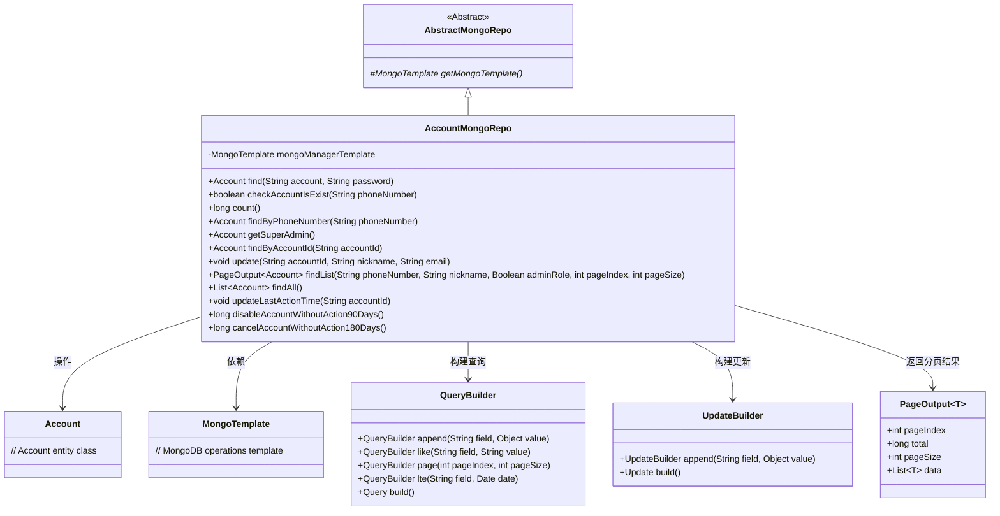

# 基础信息

|      |      |
|------|------|
| 名称 | AccountMongoRepo |
| 编码语言 | .java |
| 代码路径 | WeFe/common/java/common-data-mongodb/src/main/java/com/welab/wefe/common/data/mongodb/repo/AccountMongoRepo.java |
| 包名 | com.welab.wefe.common.data.mongodb.repo |
| 依赖项 | ['com.alibaba.fastjson.JSONArray', 'com.mongodb.client.result.UpdateResult', 'com.welab.wefe.common.data.mongodb.dto.PageOutput', 'com.welab.wefe.common.data.mongodb.entity.manager.Account', 'com.welab.wefe.common.data.mongodb.util.QueryBuilder', 'com.welab.wefe.common.data.mongodb.util.UpdateBuilder', 'com.welab.wefe.common.util.DateUtil', 'com.welab.wefe.common.wefe.enums.AuditStatus', 'org.springframework.beans.factory.annotation.Autowired', 'org.springframework.data.mongodb.core.MongoTemplate', 'org.springframework.data.mongodb.core.query.Query', 'org.springframework.data.mongodb.core.query.Update', 'org.springframework.stereotype.Repository', 'java.util.Date', 'java.util.List'] |
| 概述说明 | AccountMongoRepo类继承AbstractMongoRepo，使用MongoTemplate操作MongoDB。提供账号查询、更新、分页查询等功能，支持按条件禁用和注销长期未活跃账号。 |

# 说明

这是一个名为AccountMongoRepo的MongoDB数据访问类，继承自AbstractMongoRepo。它使用MongoTemplate进行数据库操作，主要管理Account实体的CRUD功能。包含查找账户、检查账户是否存在、统计数量、通过手机号查询、获取超级管理员、按ID查询等功能。还提供更新账户信息、分页查询列表、更新最后操作时间、禁用90天未活跃账户、注销180天未活跃账户等操作。所有查询都通过QueryBuilder构建查询条件，更新操作使用UpdateBuilder构建更新内容。

# 类列表 Class Summary

| 名称   | 类型  | 说明 |
|-------|------|-------------|
| AccountMongoRepo | class | AccountMongoRepo类继承AbstractMongoRepo，提供账户CRUD操作，包括查询、更新、分页列表及自动禁用和注销长时间未活跃账户功能。 |

## 类 AccountMongoRepo

|      |      |
|------|------|
| 访问范围 | @Repository;public |
| 类型 | class |
| 名称 | AccountMongoRepo |
| 说明 | AccountMongoRepo类继承AbstractMongoRepo，提供账户CRUD操作，包括查询、更新、分页列表及自动禁用和注销长时间未活跃账户功能。 |

### UML类图

类图描述：该图展示了AccountMongoRepo类继承自AbstractMongoRepo，并通过MongoTemplate操作Account实体类。AccountMongoRepo提供了丰富的CRUD方法，包括查询、更新、分页等功能，使用QueryBuilder和UpdateBuilder构建查询条件和更新操作。PageOutput用于封装分页查询结果，体现了完整的MongoDB数据访问层设计。

### 内部方法调用关系图

```mermaid
graph TD
    A["类AccountMongoRepo"]
    B["继承: AbstractMongoRepo"]
    C["属性: MongoTemplate mongoManagerTemplate"]
    D["方法: getMongoTemplate()"]
    E["方法: find(account, password)"]
    F["方法: checkAccountIsExist(phoneNumber)"]
    G["方法: count()"]
    H["方法: findByPhoneNumber(phoneNumber)"]
    I["方法: getSuperAdmin()"]
    J["方法: findByAccountId(accountId)"]
    K["方法: update(accountId, nickname, email)"]
    L["方法: findList(phoneNumber, nickname, adminRole, pageIndex, pageSize)"]
    M["方法: findAll()"]
    N["方法: updateLastActionTime(accountId)"]
    O["方法: disableAccountWithoutAction90Days()"]
    P["方法: cancelAccountWithoutAction180Days()"]

    A --> B
    A --> C
    A --> D
    A --> E
    A --> F
    A --> G
    A --> H
    A --> I
    A --> J
    A --> K
    A --> L
    A --> M
    A --> N
    A --> O
    A --> P
```

该流程图展示了AccountMongoRepo类的结构及其方法。该类继承自AbstractMongoRepo，包含一个MongoTemplate类型的属性mongoManagerTemplate，并提供了多个与账户相关的数据库操作方法。这些方法涵盖了账户的查找、更新、统计等功能，包括根据账号密码查找账户、检查手机号是否存在、更新账户信息、分页查询账户列表等操作。所有方法都通过mongoManagerTemplate与MongoDB进行交互，实现了对账户数据的CRUD操作。

### 字段列表 Field List

| 名称  | 类型  | 说明 |
|-------|-------|------|
| mongoManagerTemplate | MongoTemplate | 使用@Autowired自动注入MongoTemplate实例，变量名为mongoManagerTemplate。 |

### 方法列表

| 名称  | 类型  | 说明 |
|-------|-------|------|
| cancelAccountWithoutAction180Days | long | 该方法查询180天内无操作的账户，将其标记为已取消，并返回更新数量。 |
| findList | PageOutput<Account> | 方法findList根据手机号、昵称和管理员角色查询账户列表，支持分页，返回分页结果。 |
| disableAccountWithoutAction90Days | long | 该方法查询90天内无活动的账户，将其状态设为禁用，并返回更新数量。 |
| findByAccountId | Account | 通过accountId查询MongoDB中的Account记录，使用QueryBuilder构建查询条件并返回结果。 |
| count | long | 统计Account类在MongoDB中的总记录数，使用空查询条件。 |
| checkAccountIsExist | boolean | 检查手机号对应的账户是否存在。通过查询MongoDB中Account集合，返回是否存在匹配记录。 |
| find | Account | 方法通过账号和密码查询账户，使用MongoDB模板返回匹配的Account对象。 |
| updateLastActionTime | void | 更新指定账户的最后操作时间为当前时间，使用MongoDB进行数据库操作。 |
| update | void | 更新指定accountId的账户昵称、邮箱和更新时间，使用MongoDB操作。 |
| getMongoTemplate | MongoTemplate | 重写方法返回MongoManagerTemplate实例。 |
| findAll | List<Account> | 该方法使用MongoDB模板查询所有Account类文档并返回列表。 |
| findByPhoneNumber | Account | 根据手机号查询账户信息，使用MongoDB查询构建器生成查询条件并返回匹配的账户对象。 |
| getSuperAdmin | Account | 获取超级管理员账户：通过查询条件"superAdminRole"为true，使用MongoDB模板查找并返回匹配的Account对象。 |

