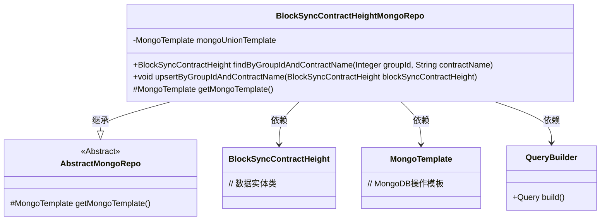
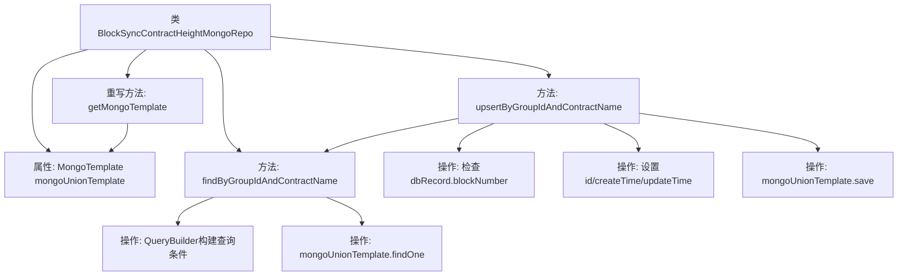

# 基础信息

|      |      |
|------|------|
| 名称 | BlockSyncContractHeightMongoRepo |
| 编码语言 | .java |
| 代码路径 | WeFe/common/java/common-data-mongodb/src/main/java/com/welab/wefe/common/data/mongodb/repo/BlockSyncContractHeightMongoRepo.java |
| 包名 | com.welab.wefe.common.data.mongodb.repo |
| 依赖项 | ['com.welab.wefe.common.data.mongodb.entity.union.BlockSyncContractHeight', 'com.welab.wefe.common.data.mongodb.util.QueryBuilder', 'org.springframework.beans.factory.annotation.Autowired', 'org.springframework.data.mongodb.core.MongoTemplate', 'org.springframework.data.mongodb.core.query.Query', 'org.springframework.stereotype.Repository'] |
| 概述说明 | 这是一个MongoDB仓库类，用于管理区块同步合约高度数据。提供按组ID和合约名称查询功能，支持更新或插入记录，确保数据最新且不重复。继承自抽象Mongo仓库类，使用MongoTemplate操作数据库。 |

# 说明

该代码定义了一个名为BlockSyncContractHeightMongoRepo的MongoDB仓库类，继承自AbstractMongoRepo。它使用MongoTemplate进行数据库操作，包含两个主要方法：findByGroupIdAndContractName用于根据groupId和contractName查询记录，upsertByGroupIdAndContractName用于更新或插入记录，仅在新区块号大于现有记录时才更新数据。类中还重写了getMongoTemplate方法以返回注入的mongoUnionTemplate实例。

# 类列表 Class Summary

| 名称   | 类型  | 说明 |
|-------|------|-------------|
| BlockSyncContractHeightMongoRepo | class | BlockSyncContractHeightMongoRepo类通过MongoDB存储和查询区块同步合约高度信息，提供按groupId和contractName查询及更新功能，确保数据唯一性和时效性。 |

## 类 BlockSyncContractHeightMongoRepo

|      |      |
|------|------|
| 访问范围 | @Repository;public |
| 类型 | class |
| 名称 | BlockSyncContractHeightMongoRepo |
| 说明 | BlockSyncContractHeightMongoRepo类通过MongoDB存储和查询区块同步合约高度信息，提供按groupId和contractName查询及更新功能，确保数据唯一性和时效性。 |

### UML类图

类图描述：该图展示了BlockSyncContractHeightMongoRepo类继承自AbstractMongoRepo抽象类，并依赖MongoTemplate、QueryBuilder等组件实现MongoDB数据访问功能。主要包含按groupId和contractName查询记录的方法，以及带版本控制的upsert操作，体现了Spring Data MongoDB的典型仓库模式实现。

### 内部方法调用关系图

该流程图展示了BlockSyncContractHeightMongoRepo类的核心结构和逻辑流程。类通过mongoUnionTemplate与MongoDB交互，提供根据groupId和contractName查询记录的方法，以及带条件检查的更新插入(upsert)功能。upsert操作会先查询现有记录，比较区块高度后决定是否更新，最后统一保存数据。整个过程体现了对MongoDB操作的封装和业务逻辑控制。

### 字段列表 Field List

| 名称  | 类型  | 说明 |
|-------|-------|------|
| mongoUnionTemplate | MongoTemplate | 自动注入MongoDB操作模板mongoUnionTemplate。 |

### 方法列表

| 名称  | 类型  | 说明 |
|-------|-------|------|
| findByGroupIdAndContractName | BlockSyncContractHeight | 根据groupId和contractName查询BlockSyncContractHeight记录。使用MongoDB模板执行查询并返回单个结果。 |
| upsertByGroupIdAndContractName | void | 方法根据groupId和contractName更新或插入记录。若存在且区块号更大则跳过，否则更新ID和时间后保存。 |
| getMongoTemplate | MongoTemplate | 覆盖getMongoTemplate方法，返回mongoUnionTemplate实例。 |

