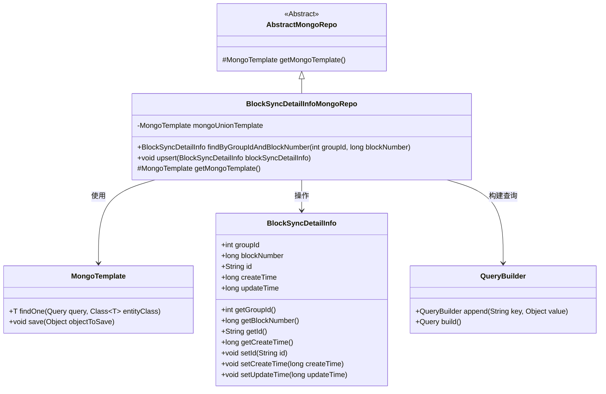
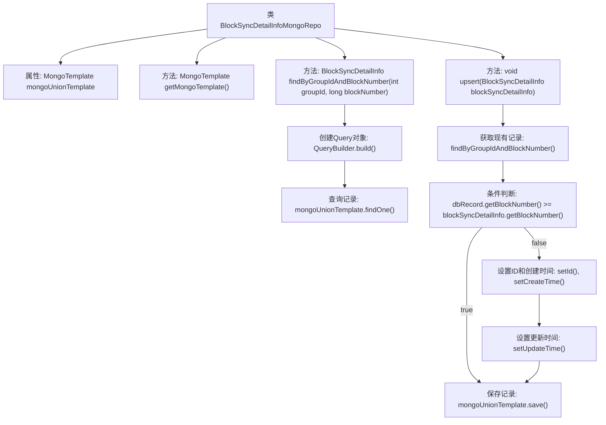

# 基础信息

|      |      |
|------|------|
| 名称 | BlockSyncDetailInfoMongoRepo |
| 编码语言 | .java |
| 代码路径 | WeFe/common/java/common-data-mongodb/src/main/java/com/welab/wefe/common/data/mongodb/repo/BlockSyncDetailInfoMongoRepo.java |
| 包名 | com.welab.wefe.common.data.mongodb.repo |
| 依赖项 | ['com.welab.wefe.common.data.mongodb.entity.union.BlockSyncDetailInfo', 'com.welab.wefe.common.data.mongodb.util.QueryBuilder', 'org.springframework.beans.factory.annotation.Autowired', 'org.springframework.data.mongodb.core.MongoTemplate', 'org.springframework.data.mongodb.core.query.Query', 'org.springframework.stereotype.Repository'] |
| 概述说明 | 这是一个MongoDB存储库类，用于管理区块同步详情信息。它继承自AbstractMongoRepo，使用MongoTemplate操作数据库。主要功能包括按组ID和区块号查询记录，以及插入或更新记录（当区块号更大时更新）。 |

# 说明

该代码定义了一个名为BlockSyncDetailInfoMongoRepo的MongoDB仓库类，继承自AbstractMongoRepo。它通过@Repository注解标识为Spring管理的仓库组件，并自动装配了MongoTemplate实例mongoUnionTemplate。类中重写了getMongoTemplate方法返回该模板。提供了两个核心方法：findByGroupIdAndBlockNumber根据groupId和blockNumber查询单个记录；upsert方法实现记录的新增或更新逻辑，会先检查是否存在相同条件的记录，若存在且版本较旧则更新，否则跳过，最后统一设置更新时间并保存。整个类专注于区块同步明细信息的持久化操作。

# 类列表 Class Summary

| 名称   | 类型  | 说明 |
|-------|------|-------------|
| BlockSyncDetailInfoMongoRepo | class | 这是一个MongoDB仓库类，用于管理区块同步详情信息。它继承自AbstractMongoRepo，使用mongoUnionTemplate操作数据库。提供按groupId和blockNumber查询的方法，以及更新或插入记录的upsert方法。 |

## 类 BlockSyncDetailInfoMongoRepo

|      |      |
|------|------|
| 访问范围 | @Repository;public |
| 类型 | class |
| 名称 | BlockSyncDetailInfoMongoRepo |
| 说明 | 这是一个MongoDB仓库类，用于管理区块同步详情信息。它继承自AbstractMongoRepo，使用mongoUnionTemplate操作数据库。提供按groupId和blockNumber查询的方法，以及更新或插入记录的upsert方法。 |

### UML类图

这段代码展示了一个MongoDB仓库类`BlockSyncDetailInfoMongoRepo`，继承自抽象类`AbstractMongoRepo`，主要用于操作`BlockSyncDetailInfo`实体数据。类中包含两个核心方法：`findByGroupIdAndBlockNumber`用于按条件查询记录，`upsert`实现存在则更新、不存在则插入的逻辑。通过`MongoTemplate`与MongoDB交互，使用`QueryBuilder`构建查询条件。整体设计体现了Spring Data MongoDB的典型仓库模式。

### 内部方法调用关系图

这段代码是一个MongoDB仓库类，主要实现了区块同步详细信息的存储和更新功能。流程图展示了类结构和核心方法调用关系，重点描述了upsert方法的逻辑流程：先查询现有记录，通过区块号比较决定是否更新，最后设置时间戳并保存数据。整个过程体现了条件更新和防重复处理的业务逻辑。

### 字段列表 Field List

| 名称  | 类型  | 说明 |
|-------|-------|------|
| mongoUnionTemplate | MongoTemplate | 自动注入MongoDB操作模板mongoUnionTemplate。 |

### 方法列表

| 名称  | 类型  | 说明 |
|-------|-------|------|
| getMongoTemplate | MongoTemplate | 重写方法返回MongoUnionTemplate实例。 |
| findByGroupIdAndBlockNumber | BlockSyncDetailInfo | 根据groupId和blockNumber查询BlockSyncDetailInfo，使用MongoDB模板执行查询并返回结果。 |
| upsert | void | 该方法实现区块同步信息的更新或插入操作。首先查询数据库记录，若存在且区块号更大则跳过；否则更新记录ID和时间戳后保存到数据库。 |

