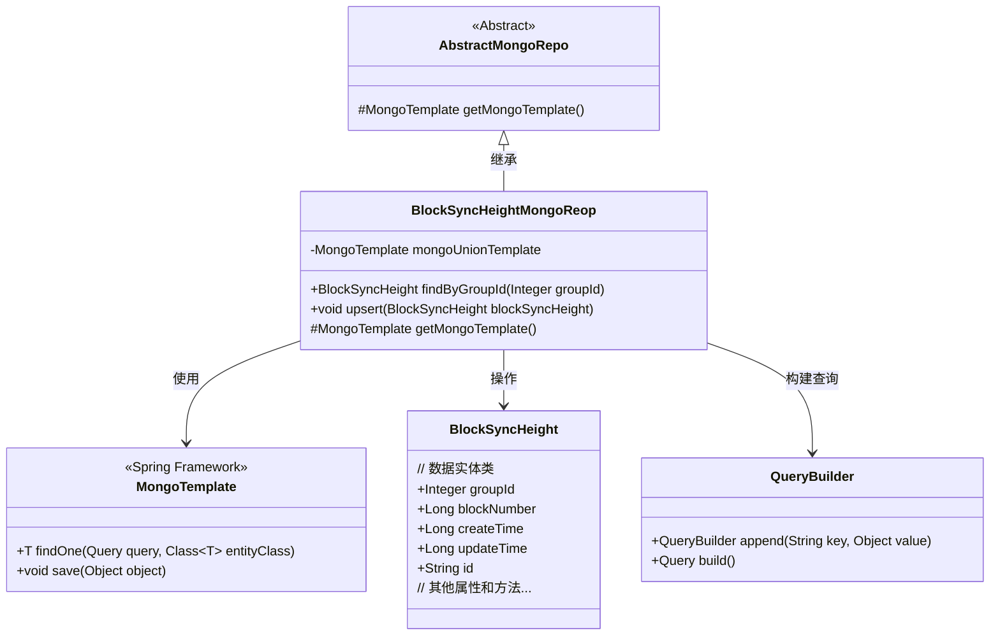
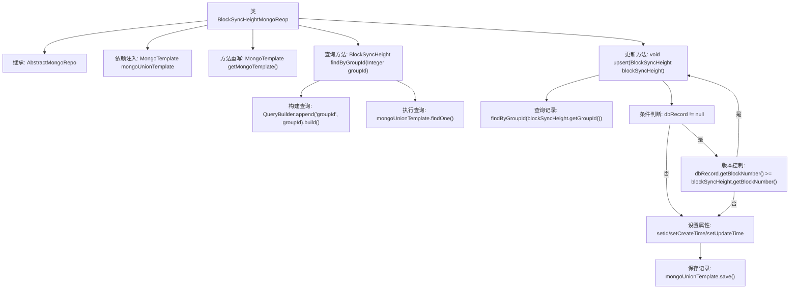

# 基础信息

|      |      |
|------|------|
| 名称 | BlockSyncHeightMongoReop |
| 编码语言 | .java |
| 代码路径 | WeFe/common/java/common-data-mongodb/src/main/java/com/welab/wefe/common/data/mongodb/repo/BlockSyncHeightMongoReop.java |
| 包名 | com.welab.wefe.common.data.mongodb.repo |
| 依赖项 | ['com.welab.wefe.common.data.mongodb.entity.union.BlockSyncHeight', 'com.welab.wefe.common.data.mongodb.util.QueryBuilder', 'org.springframework.beans.factory.annotation.Autowired', 'org.springframework.data.mongodb.core.MongoTemplate', 'org.springframework.data.mongodb.core.query.Query', 'org.springframework.stereotype.Repository'] |
| 概述说明 | 这是一个MongoDB存储库类，用于管理区块同步高度数据。提供根据groupId查询和更新插入功能，确保数据不重复且更新最新时间戳。 |

# 说明

这是一个名为BlockSyncHeightMongoReop的MongoDB仓库类，继承自AbstractMongoRepo。它使用@Repository注解标注，并通过@Autowired注入MongoTemplate实例mongoUnionTemplate。类中重写了getMongoTemplate方法返回该实例。提供了两个核心方法：findByGroupId根据groupId查询BlockSyncHeight记录；upsert方法实现记录的新增或更新逻辑，会先检查记录是否存在及区块高度是否更大，再决定是否更新，最后统一保存并设置更新时间。整个类专注于处理区块同步高度的持久化操作。

# 类列表 Class Summary

| 名称   | 类型  | 说明 |
|-------|------|-------------|
| BlockSyncHeightMongoReop | class | 这是一个MongoDB仓库类，用于管理区块同步高度数据。包含根据groupId查询记录和更新插入记录的方法，确保数据一致性和时间戳更新。 |

## 类 BlockSyncHeightMongoReop

|      |      |
|------|------|
| 访问范围 | @Repository;public |
| 类型 | class |
| 名称 | BlockSyncHeightMongoReop |
| 说明 | 这是一个MongoDB仓库类，用于管理区块同步高度数据。包含根据groupId查询记录和更新插入记录的方法，确保数据一致性和时间戳更新。 |

### UML类图

这段代码展示了一个基于MongoDB的区块同步高度仓库实现。BlockSyncHeightMongoReop继承自AbstractMongoRepo，通过MongoTemplate操作BlockSyncHeight实体数据，提供按groupId查询和upsert（存在则更新/不存在则插入）功能。类图中清晰地显示了继承关系、依赖关系和核心方法，体现了Spring Data MongoDB的典型使用模式。upsert方法包含业务逻辑校验，确保只更新更大的blockNumber。

### 内部方法调用关系图

这段代码是Spring Data MongoDB的Repository实现类，主要处理区块同步高度的CRUD操作。核心流程包括：1)通过groupId查询记录；2)实现upsert逻辑，当记录存在且版本较新时跳过更新，否则设置时间戳并保存。流程图展示了从依赖注入到条件更新的完整调用链，特别突出了版本控制的业务逻辑分支。

### 字段列表 Field List

| 名称  | 类型  | 说明 |
|-------|-------|------|
| mongoUnionTemplate | MongoTemplate | 使用@Autowired自动注入MongoTemplate实例mongoUnionTemplate。 |

### 方法列表

| 名称  | 类型  | 说明 |
|-------|-------|------|
| getMongoTemplate | MongoTemplate | 方法重写，返回mongoUnionTemplate实例。 |
| findByGroupId | BlockSyncHeight | 该方法通过groupId查询MongoDB中的BlockSyncHeight记录，使用QueryBuilder构建查询条件并返回匹配结果。 |
| upsert | void | 该方法用于更新或插入区块同步高度记录。若记录存在且区块号更大则跳过，否则更新记录ID和时间后保存。 |

