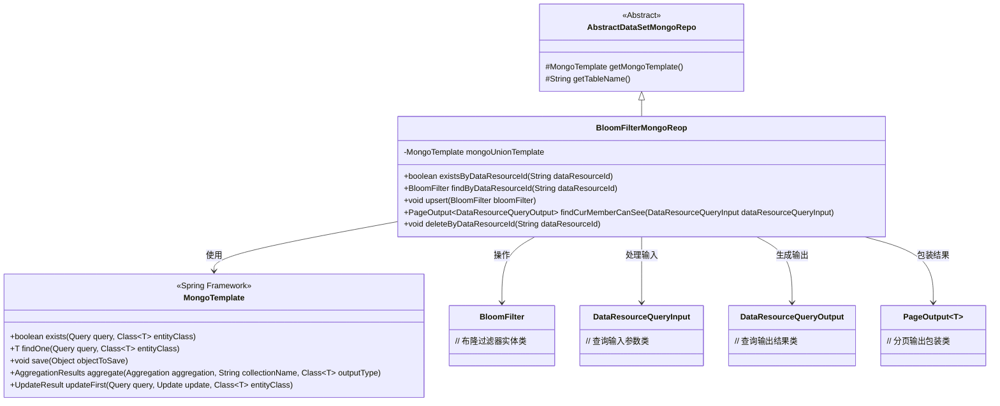
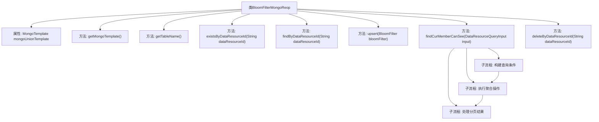
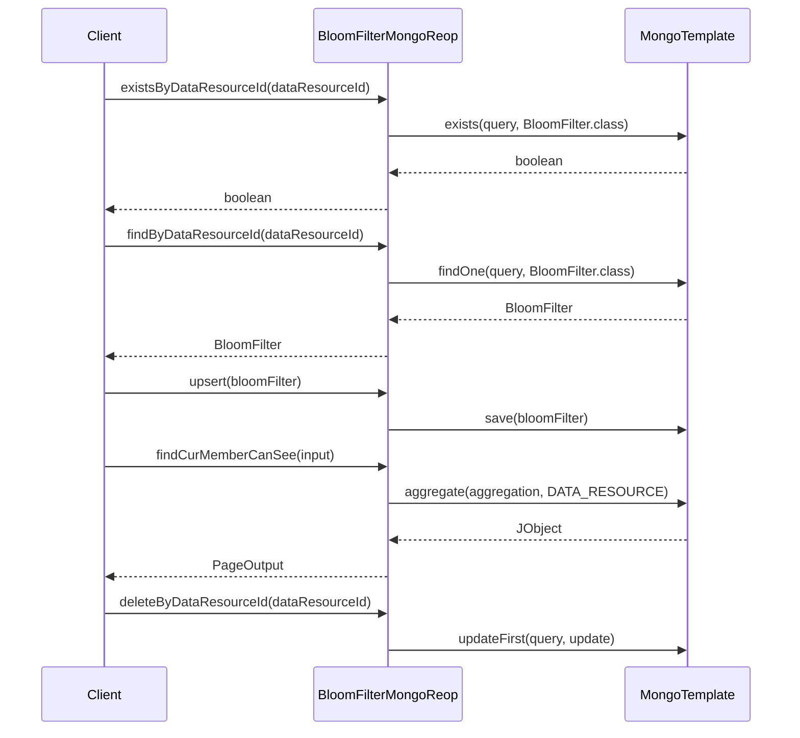

# 基础信息

|      |      |
|------|------|
| 名称 | BloomFilterMongoReop |
| 编码语言 | .java |
| 代码路径 | WeFe/common/java/common-data-mongodb/src/main/java/com/welab/wefe/common/data/mongodb/repo/BloomFilterMongoReop.java |
| 包名 | com.welab.wefe.common.data.mongodb.repo |
| 依赖项 | ['com.welab.wefe.common.data.mongodb.constant.MongodbTable', 'com.welab.wefe.common.data.mongodb.dto.PageOutput', 'com.welab.wefe.common.data.mongodb.dto.dataresource.DataResourceQueryInput', 'com.welab.wefe.common.data.mongodb.dto.dataresource.DataResourceQueryOutput', 'com.welab.wefe.common.data.mongodb.dto.dataset.DataSetQueryOutput', 'com.welab.wefe.common.data.mongodb.entity.union.BloomFilter', 'com.welab.wefe.common.data.mongodb.util.AddFieldsOperation', 'com.welab.wefe.common.data.mongodb.util.QueryBuilder', 'com.welab.wefe.common.data.mongodb.util.UpdateBuilder', 'com.welab.wefe.common.util.JObject', 'org.apache.commons.lang3.StringUtils', 'org.springframework.beans.factory.annotation.Autowired', 'org.springframework.data.domain.Sort', 'org.springframework.data.mongodb.core.MongoTemplate', 'org.springframework.data.mongodb.core.aggregation', 'org.springframework.data.mongodb.core.query.Criteria', 'org.springframework.data.mongodb.core.query.Query', 'org.springframework.data.mongodb.core.query.Update', 'org.springframework.stereotype.Repository', 'java.util.HashMap', 'java.util.List', 'java.util.Map'] |
| 概述说明 | BloomFilterMongoRepo类继承AbstractDataSetMongoRepo，使用MongoTemplate操作MongoDB表Union.BLOOM_FILTER。提供existsByDataResourceId、findByDataResourceId、upsert、deleteByDataResourceId等方法操作BloomFilter数据，以及findCurMemberCanSee方法查询当前成员可见的BloomFilter分页数据。 |

# 说明

BloomFilterMongoReop类继承AbstractDataSetMongoRepo，使用MongoTemplate操作MongoDB。主要功能包括：通过dataResourceId检查是否存在记录、查询记录、插入或更新记录。findCurMemberCanSee方法实现复杂查询，通过聚合操作关联多个表，支持分页、排序和条件过滤。deleteByDataResourceId方法逻辑删除指定记录。表名定义为MongodbTable.Union.BLOOM_FILTER。

# 类列表 Class Summary

| 名称   | 类型  | 说明 |
|-------|------|-------------|
| BloomFilterMongoReop | class | BloomFilterMongoReop类继承AbstractDataSetMongoRepo，使用MongoTemplate操作MongoDB表Union.BLOOM_FILTER。提供existsByDataResourceId、findByDataResourceId、upsert、deleteByDataResourceId等方法操作布隆过滤器数据，以及findCurMemberCanSee方法查询当前成员可见的数据资源分页结果。 |

## 类 BloomFilterMongoReop

|      |      |
|------|------|
| 访问范围 | @Repository;public |
| 类型 | class |
| 名称 | BloomFilterMongoReop |
| 说明 | BloomFilterMongoReop类继承AbstractDataSetMongoRepo，使用MongoTemplate操作MongoDB表Union.BLOOM_FILTER。提供existsByDataResourceId、findByDataResourceId、upsert、deleteByDataResourceId等方法操作布隆过滤器数据，以及findCurMemberCanSee方法查询当前成员可见的数据资源分页结果。 |

### UML类图

这段代码实现了一个基于MongoDB的布隆过滤器仓库类BloomFilterMongoReop，继承自AbstractDataSetMongoRepo。主要功能包括：通过dataResourceId检查布隆过滤器是否存在、查找布隆过滤器、保存/更新布隆过滤器、分页查询当前用户可见的布隆过滤器数据，以及根据dataResourceId删除记录。该类通过MongoTemplate与MongoDB交互，使用了聚合查询、条件匹配、分页等复杂操作，并处理了数据权限控制逻辑（包括公开级别和成员可见性）。

### 内部方法调用关系图

这段代码实现了一个基于MongoDB的布隆过滤器仓库类，主要功能包括：检查数据资源ID是否存在、按ID查询布隆过滤器、保存/更新布隆过滤器、查询当前用户可见的数据资源分页列表，以及按ID删除记录。其中findCurMemberCanSee方法实现了复杂的聚合查询，包含多表关联、条件筛选、分页和排序等功能。所有数据库操作都通过MongoTemplate完成，代码结构清晰，职责单一。

### 字段列表 Field List

| 名称  | 类型  | 说明 |
|-------|-------|------|
| mongoUnionTemplate | MongoTemplate | 使用@Autowired自动注入名为mongoUnionTemplate的MongoTemplate实例。 |

### 方法列表

| 名称  | 类型  | 说明 |
|-------|-------|------|
| findByDataResourceId | BloomFilter | 根据数据资源ID查询布隆过滤器，若ID为空返回null，否则构建查询条件并返回MongoDB中的结果。 |
| getTableName | String | 代码重写父类方法，返回MongodbTable.Union.BLOOM_FILTER作为表名。 |
| existsByDataResourceId | boolean | 检查指定dataResourceId是否存在，非空时查询MongoDB并返回是否存在结果。 |
| getMongoTemplate | MongoTemplate | 该方法重写父类方法，返回名为mongoUnionTemplate的MongoTemplate实例。 |
| upsert | void | 该方法用于将布隆过滤器对象保存或更新到MongoDB数据库，使用mongoUnionTemplate的save操作实现。 |
| findCurMemberCanSee | PageOutput<DataResourceQueryOutput> | 该方法通过MongoDB聚合查询，根据输入条件筛选当前用户可见的数据资源，包括关联查询、分页和排序处理，最终返回分页结果。 |
| deleteByDataResourceId | void | 该方法根据dataResourceId删除数据资源，通过构建查询条件并将状态更新为1，使用mongoUnionTemplate执行更新操作。 |

