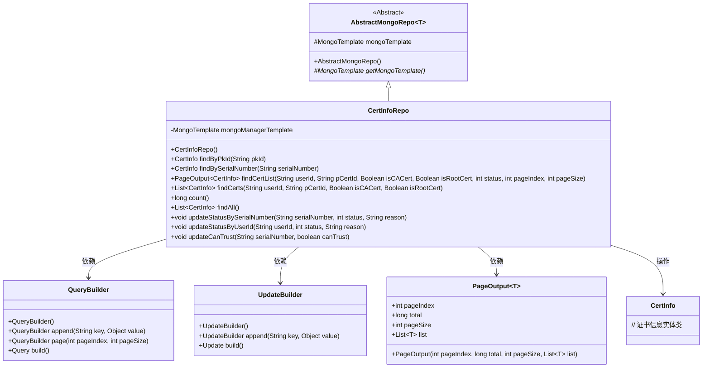
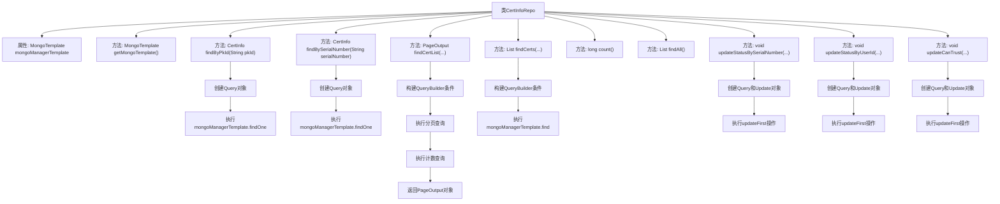

# 基础信息

|      |      |
|------|------|
| 名称 | CertInfoRepo |
| 编码语言 | .java |
| 代码路径 | WeFe/common/java/common-data-mongodb/src/main/java/com/welab/wefe/common/data/mongodb/repo/CertInfoRepo.java |
| 包名 | com.welab.wefe.common.data.mongodb.repo |
| 依赖项 | ['java.util.List', 'org.apache.commons.lang3.StringUtils', 'org.springframework.beans.factory.annotation.Autowired', 'org.springframework.data.mongodb.core.MongoTemplate', 'org.springframework.data.mongodb.core.query.Query', 'org.springframework.data.mongodb.core.query.Update', 'org.springframework.stereotype.Repository', 'com.welab.wefe.common.data.mongodb.dto.PageOutput', 'com.welab.wefe.common.data.mongodb.entity.manager.CertInfo', 'com.welab.wefe.common.data.mongodb.util.QueryBuilder', 'com.welab.wefe.common.data.mongodb.util.UpdateBuilder'] |
| 概述说明 | CertInfoRepo类继承AbstractMongoRepo，通过MongoTemplate操作CertInfo数据，提供按pkId、序列号查询，分页查询，批量查询及更新状态、信任状态等功能。 |

# 说明

CertInfoRepo是一个基于MongoDB的仓库类，继承自AbstractMongoRepo，用于管理CertInfo实体的数据访问。它通过MongoTemplate进行数据库操作，提供了多种查询和更新方法。包括根据主键ID或序列号查找证书、分页查询证书列表、根据用户ID或父证书ID等条件查询证书集合、统计证书数量、获取所有证书。还支持根据序列号或用户ID更新证书状态及原因、根据序列号更新证书的可信状态。所有更新操作都会自动记录更新时间戳。

# 类列表 Class Summary

| 名称   | 类型  | 说明 |
|-------|------|-------------|
| CertInfoRepo | class | CertInfoRepo类继承AbstractMongoRepo，使用MongoTemplate操作数据库。提供按pkId、序列号查询证书，分页查询证书列表，批量查询证书，更新证书状态和信任状态等功能。 |

## 类 CertInfoRepo

|      |      |
|------|------|
| 访问范围 | @Repository;public |
| 类型 | class |
| 名称 | CertInfoRepo |
| 说明 | CertInfoRepo类继承AbstractMongoRepo，使用MongoTemplate操作数据库。提供按pkId、序列号查询证书，分页查询证书列表，批量查询证书，更新证书状态和信任状态等功能。 |

### UML类图

类图描述：该图展示了CertInfoRepo类继承自AbstractMongoRepo泛型类，实现了对CertInfo实体的MongoDB操作。核心依赖包括QueryBuilder（构建查询条件）、UpdateBuilder（构建更新操作）和PageOutput（分页输出）。类中提供了多种查询方法（如按主键、序列号查询）和更新方法（如更新状态、信任标志），体现了完整的证书信息CRUD功能。

### 内部方法调用关系图

这段代码是CertInfoRepo类的Mermaid流程图，展示了该类与MongoDB交互的核心方法。CertInfoRepo继承自AbstractMongoRepo，通过@Repository注解标识为数据访问层组件。流程图详细描述了各个查询方法（如findByPkId、findBySerialNumber）和更新方法（如updateStatusBySerialNumber）的内部调用流程，包括Query对象的创建、MongoTemplate方法的调用以及返回结果的处理过程。特别展示了条件查询构建、分页处理和批量更新等典型MongoDB操作场景。

### 字段列表 Field List

| 名称  | 类型  | 说明 |
|-------|-------|------|
| mongoManagerTemplate | MongoTemplate | 使用@Autowired自动注入MongoTemplate实例，变量名为mongoManagerTemplate。 |

### 方法列表

| 名称  | 类型  | 说明 |
|-------|-------|------|
| updateStatusBySerialNumber | void | 该方法通过序列号更新状态，设置状态值、原因及当前时间，最后执行MongoDB更新操作。 |
| findCerts | List<CertInfo> | 根据用户ID、父证书ID、是否CA证书和根证书查询证书列表，返回符合条件的证书信息集合。 |
| findAll | List<CertInfo> | 查询所有证书信息并返回列表。 |
| findBySerialNumber | CertInfo | 根据序列号查询证书信息，使用MongoDB模板执行查询并返回结果。 |
| findCertList | PageOutput<CertInfo> | 查询证书列表方法，根据用户ID、父证书ID、CA证书标志、根证书标志和状态等条件筛选，返回分页结果。 |
| findByPkId | CertInfo | 根据主键ID查询证书信息，使用MongoDB模板执行查询操作。 |
| getMongoTemplate | MongoTemplate | 这是一个Java方法重写，返回MongoDB操作模板mongoManagerTemplate。 |
| updateStatusByUserId | void | 更新用户状态方法：根据用户ID修改状态、原因及时间，使用MongoDB操作。 |
| updateCanTrust | void | 更新证书信任状态的方法，根据序列号设置canTrust字段并记录更新时间，使用MongoDB操作。 |
| count | long | 统计CertInfo类在MongoDB中的总记录数。 |

