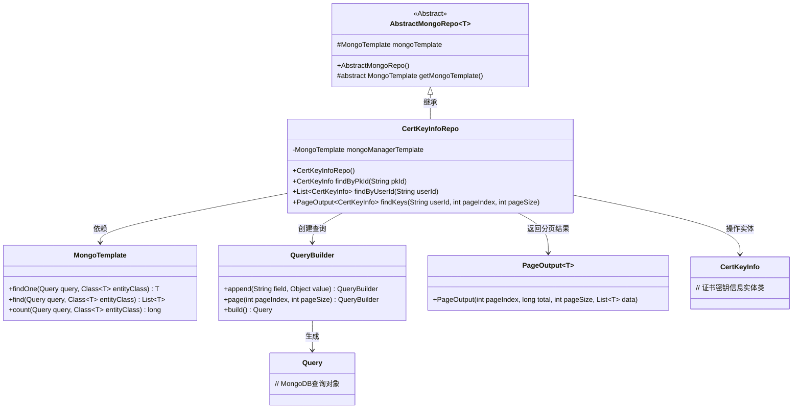
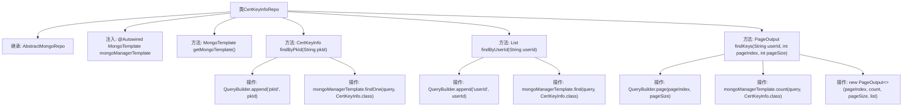

# 基础信息

|      |      |
|------|------|
| 名称 | CertKeyInfoRepo |
| 编码语言 | .java |
| 代码路径 | WeFe/common/java/common-data-mongodb/src/main/java/com/welab/wefe/common/data/mongodb/repo/CertKeyInfoRepo.java |
| 包名 | com.welab.wefe.common.data.mongodb.repo |
| 依赖项 | ['java.util.List', 'org.apache.commons.lang3.StringUtils', 'org.springframework.beans.factory.annotation.Autowired', 'org.springframework.data.mongodb.core.MongoTemplate', 'org.springframework.data.mongodb.core.query.Query', 'org.springframework.stereotype.Repository', 'com.welab.wefe.common.data.mongodb.dto.PageOutput', 'com.welab.wefe.common.data.mongodb.entity.manager.CertKeyInfo', 'com.welab.wefe.common.data.mongodb.util.QueryBuilder'] |
| 概述说明 | CertKeyInfoRepo是MongoDB仓库类，提供按pkId查询单条记录、按userId查询列表及分页查询功能，继承AbstractMongoRepo并使用MongoTemplate操作数据。 |

# 说明

这是一个名为CertKeyInfoRepo的MongoDB仓库类，继承自AbstractMongoRepo。它使用MongoTemplate进行数据库操作，包含三个主要方法：通过pkId查询单个CertKeyInfo记录，通过userId查询符合条件的CertKeyInfo列表，以及支持分页查询CertKeyInfo的方法。分页查询可根据userId筛选，并返回包含总数和分页数据的PageOutput对象。

# 类列表 Class Summary

| 名称   | 类型  | 说明 |
|-------|------|-------------|
| CertKeyInfoRepo | class | CertKeyInfoRepo是MongoDB仓库类，提供按pkId查询单条记录、按userId查询列表及分页查询功能，继承AbstractMongoRepo并使用MongoTemplate操作数据。 |

## 类 CertKeyInfoRepo

|      |      |
|------|------|
| 访问范围 | @Repository;public |
| 类型 | class |
| 名称 | CertKeyInfoRepo |
| 说明 | CertKeyInfoRepo是MongoDB仓库类，提供按pkId查询单条记录、按userId查询列表及分页查询功能，继承AbstractMongoRepo并使用MongoTemplate操作数据。 |

### UML类图

这段代码描述了一个基于MongoDB的证书密钥信息仓库类CertKeyInfoRepo，继承自抽象泛型类AbstractMongoRepo。该类通过MongoTemplate执行数据库操作，提供了三种查询方式：按主键ID查询单个记录、按用户ID查询列表、以及带分页的复合查询。QueryBuilder用于构建查询条件，PageOutput封装分页结果。整体设计体现了Spring Data MongoDB的典型使用模式，通过模板方法模式抽象基础操作，同时支持灵活的条件查询和分页功能。

### 内部方法调用关系图

该流程图展示了CertKeyInfoRepo类的结构和主要方法调用关系。该类继承自AbstractMongoRepo，通过@Autowired注入MongoTemplate实例，并实现了四个核心方法：getMongoTemplate()返回模板实例，findByPkId()通过主键查询单个文档，findByUserId()查询用户关联文档列表，findKeys()实现分页查询并返回包含总数和分页信息的PageOutput对象。每个方法都展示了其内部对QueryBuilder和MongoTemplate的操作流程。

### 字段列表 Field List

| 名称  | 类型  | 说明 |
|-------|-------|------|
| mongoManagerTemplate | MongoTemplate | 自动注入MongoDB操作模板mongoManagerTemplate。 |

### 方法列表

| 名称  | 类型  | 说明 |
|-------|-------|------|
| getMongoTemplate | MongoTemplate | 重写方法返回MongoManagerTemplate实例。 |
| findKeys | PageOutput<CertKeyInfo> | 该方法根据用户ID分页查询证书密钥信息，返回包含列表和总数的分页结果。使用MongoDB模板构建查询条件，支持空用户ID查询。 |
| findByPkId | CertKeyInfo | 根据主键ID查询证书密钥信息，使用MongoDB模板执行查询并返回结果。 |
| findByUserId | List<CertKeyInfo> | 根据用户ID查询证书密钥信息列表，使用MongoDB模板执行查询并返回结果。 |

