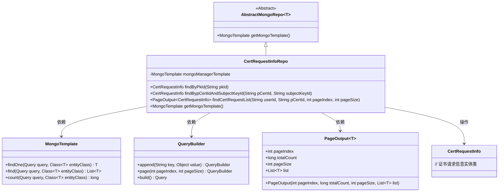
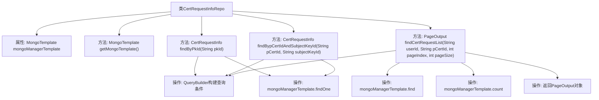

# 基础信息

|      |      |
|------|------|
| 名称 | CertRequestInfoRepo |
| 编码语言 | .java |
| 代码路径 | WeFe/common/java/common-data-mongodb/src/main/java/com/welab/wefe/common/data/mongodb/repo/CertRequestInfoRepo.java |
| 包名 | com.welab.wefe.common.data.mongodb.repo |
| 依赖项 | ['java.util.List', 'org.apache.commons.lang3.StringUtils', 'org.springframework.beans.factory.annotation.Autowired', 'org.springframework.data.mongodb.core.MongoTemplate', 'org.springframework.data.mongodb.core.query.Query', 'org.springframework.stereotype.Repository', 'com.welab.wefe.common.data.mongodb.dto.PageOutput', 'com.welab.wefe.common.data.mongodb.entity.manager.CertRequestInfo', 'com.welab.wefe.common.data.mongodb.util.QueryBuilder'] |
| 概述说明 | CertRequestInfoRepo是MongoDB仓库类，提供按pkId、pCertId和subjectKeyId查询证书请求信息的方法，支持分页查询列表。 |

# 说明

该代码定义了一个名为CertRequestInfoRepo的MongoDB仓库类，继承自AbstractMongoRepo。它通过@Repository注解标识为Spring组件，并自动装配了MongoTemplate实例。类中实现了三个核心查询方法：通过主键ID查询单条记录、根据父证书ID和主题密钥ID联合查询单条记录，以及支持分页的条件查询方法。分页查询可筛选用户ID和父证书ID，返回包含分页信息和结果列表的PageOutput对象。所有查询均通过QueryBuilder构建查询条件，并利用MongoTemplate执行操作。

# 类列表 Class Summary

| 名称   | 类型  | 说明 |
|-------|------|-------------|
| CertRequestInfoRepo | class | CertRequestInfoRepo是MongoDB仓库类，提供按pkId、pCertId和subjectKeyId查询证书请求信息的方法，支持分页查询列表。 |

## 类 CertRequestInfoRepo

|      |      |
|------|------|
| 访问范围 | @Repository;public |
| 类型 | class |
| 名称 | CertRequestInfoRepo |
| 说明 | CertRequestInfoRepo是MongoDB仓库类，提供按pkId、pCertId和subjectKeyId查询证书请求信息的方法，支持分页查询列表。 |

### UML类图

该类图展示了CertRequestInfoRepo继承自AbstractMongoRepo，通过MongoTemplate操作MongoDB数据库，主要功能包括按主键查询证书请求信息、联合查询证书请求信息以及分页查询证书请求列表。QueryBuilder用于构建查询条件，PageOutput用于封装分页结果。整体结构清晰体现了Spring Data MongoDB的典型仓库模式实现。

### 内部方法调用关系图

该流程图展示了CertRequestInfoRepo类的结构和主要方法调用关系。类继承AbstractMongoRepo并注入MongoTemplate，包含四个核心方法：getMongoTemplate()获取模板实例，findByPkId()通过主键查询单个文档，findBypCertIdAndSubjectKeyId()通过双条件查询，以及findCertRequestList()实现带分页的多条件查询。所有查询方法均通过QueryBuilder构建查询条件后调用MongoTemplate执行操作，分页查询会组合查询结果和总数统计返回PageOutput对象。

### 字段列表 Field List

| 名称  | 类型  | 说明 |
|-------|-------|------|
| mongoManagerTemplate | MongoTemplate | 使用@Autowired自动注入MongoTemplate实例，变量名为mongoManagerTemplate。 |

### 方法列表

| 名称  | 类型  | 说明 |
|-------|-------|------|
| findBypCertIdAndSubjectKeyId | CertRequestInfo | 该方法通过父证书ID和主题密钥ID查询证书请求信息，使用MongoDB模板执行查询并返回结果。 |
| findByPkId | CertRequestInfo | 通过pkId查询CertRequestInfo，使用MongoDB的QueryBuilder构建查询条件，返回匹配的单条记录。 |
| getMongoTemplate | MongoTemplate | 重写方法返回MongoManagerTemplate实例。 |
| findCertRequestList | PageOutput<CertRequestInfo> | 该方法根据用户ID和证书ID查询证书请求列表，支持分页，返回包含结果列表和总数的分页对象。 |

