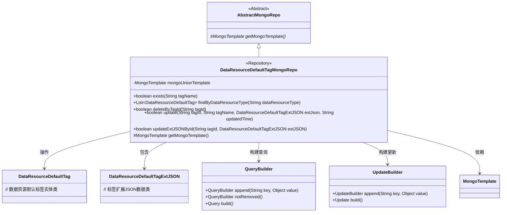
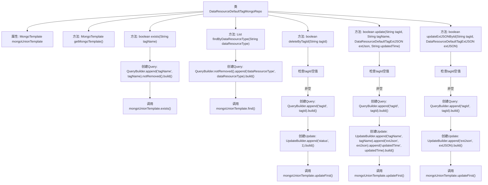

# 基础信息

|      |      |
|------|------|
| 名称 | DataResourceDefaultTagMongoRepo |
| 编码语言 | .java |
| 代码路径 | WeFe/common/java/common-data-mongodb/src/main/java/com/welab/wefe/common/data/mongodb/repo/DataResourceDefaultTagMongoRepo.java |
| 包名 | com.welab.wefe.common.data.mongodb.repo |
| 依赖项 | ['com.mongodb.client.result.UpdateResult', 'com.welab.wefe.common.data.mongodb.entity.union.DataResourceDefaultTag', 'com.welab.wefe.common.data.mongodb.entity.union.ext.DataResourceDefaultTagExtJSON', 'com.welab.wefe.common.data.mongodb.util.QueryBuilder', 'com.welab.wefe.common.data.mongodb.util.UpdateBuilder', 'org.apache.commons.lang3.StringUtils', 'org.springframework.beans.factory.annotation.Autowired', 'org.springframework.data.mongodb.core.MongoTemplate', 'org.springframework.data.mongodb.core.query.Query', 'org.springframework.data.mongodb.core.query.Update', 'org.springframework.stereotype.Repository', 'java.util.List'] |
| 概述说明 | DataResourceDefaultTagMongoRepo类继承AbstractMongoRepo，使用MongoTemplate操作MongoDB，提供exists、findByDataResourceType、deleteByTagId、update和updateExtJSONById等方法，用于查询、删除和更新DataResourceDefaultTag数据。 |

# 说明

这是一个名为DataResourceDefaultTagMongoRepo的MongoDB数据访问类，继承自AbstractMongoRepo。它使用MongoTemplate进行数据库操作，主要功能包括：检查标签名是否存在、按资源类型查询标签、删除标签（逻辑删除）、更新标签信息（名称、扩展JSON和更新时间）以及单独更新标签的扩展JSON。所有操作都包含非空校验，并针对DataResourceDefaultTag类进行操作。

# 类列表 Class Summary

| 名称   | 类型  | 说明 |
|-------|------|-------------|
| DataResourceDefaultTagMongoRepo | class | DataResourceDefaultTagMongoRepo类继承AbstractMongoRepo，提供标签存在检查、按类型查询、删除、更新及扩展JSON更新功能，使用MongoTemplate操作数据库。 |

## 类 DataResourceDefaultTagMongoRepo

|      |      |
|------|------|
| 访问范围 | @Repository;public |
| 类型 | class |
| 名称 | DataResourceDefaultTagMongoRepo |
| 说明 | DataResourceDefaultTagMongoRepo类继承AbstractMongoRepo，提供标签存在检查、按类型查询、删除、更新及扩展JSON更新功能，使用MongoTemplate操作数据库。 |

### UML类图

这段代码展示了一个MongoDB仓库类`DataResourceDefaultTagMongoRepo`，继承自抽象类`AbstractMongoRepo`，主要用于对`DataResourceDefaultTag`实体进行CRUD操作。类中通过`QueryBuilder`和`UpdateBuilder`构建查询和更新条件，利用`MongoTemplate`执行数据库操作。主要功能包括检查标签是否存在、按资源类型查找标签、删除/更新标签等，所有方法都包含参数校验和状态检查。

### 内部方法调用关系图

该流程图展示了DataResourceDefaultTagMongoRepo类的完整结构，包含5个核心方法：exists()用于检查标签存在性，findByDataResourceType()按类型查询标签，deleteByTagId()软删除标签，update()更新标签全字段，updateExtJSONById()仅更新扩展JSON。所有数据库操作均通过mongoUnionTemplate执行，关键步骤包含Query构建、空值校验和Update操作，体现了对MongoDB的原子性操作封装。

### 字段列表 Field List

| 名称  | 类型  | 说明 |
|-------|-------|------|
| mongoUnionTemplate | MongoTemplate | 使用@Autowired自动注入MongoTemplate实例mongoUnionTemplate。 |

### 方法列表

| 名称  | 类型  | 说明 |
|-------|-------|------|
| findByDataResourceType | List<DataResourceDefaultTag> | 该方法通过MongoDB查询未删除且符合指定类型的DataResourceDefaultTag数据，返回结果列表。 |
| getMongoTemplate | MongoTemplate | 重写getMongoTemplate方法，返回mongoUnionTemplate实例。 |
| deleteByTagId | boolean | 该方法通过标签ID删除数据，先检查ID有效性，再构建查询和更新条件，最后执行MongoDB更新操作并返回是否成功。 |
| exists | boolean | 检查指定标签名是否存在，查询未删除的标签并返回结果。 |
| update | boolean | 该方法根据tagId更新MongoDB中的标签信息，包括tagName、extJson和updatedTime字段。若tagId为空则返回false，否则执行更新并返回操作是否成功。 |
| updateExtJSONById | boolean | 该方法通过tagId更新MongoDB中的extJSON字段，先校验tagId非空，然后构建查询和更新条件，执行更新操作并返回是否成功。 |

