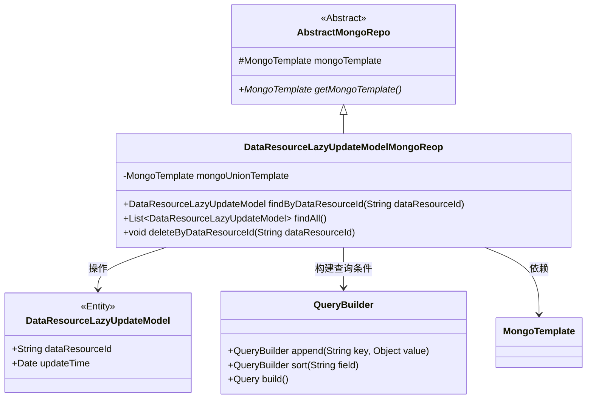
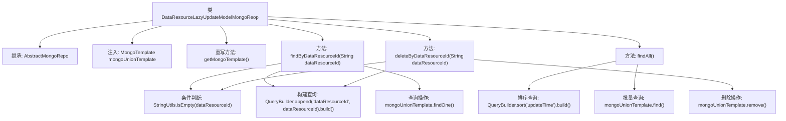

# 基础信息

|      |      |
|------|------|
| 名称 | DataResourceLazyUpdateModelMongoReop |
| 编码语言 | .java |
| 代码路径 | WeFe/common/java/common-data-mongodb/src/main/java/com/welab/wefe/common/data/mongodb/repo/DataResourceLazyUpdateModelMongoReop.java |
| 包名 | com.welab.wefe.common.data.mongodb.repo |
| 依赖项 | ['com.welab.wefe.common.data.mongodb.entity.union.DataResourceLazyUpdateModel', 'com.welab.wefe.common.data.mongodb.util.QueryBuilder', 'org.apache.commons.lang3.StringUtils', 'org.springframework.beans.factory.annotation.Autowired', 'org.springframework.data.mongodb.core.MongoTemplate', 'org.springframework.data.mongodb.core.query.Query', 'org.springframework.stereotype.Repository', 'java.util.List'] |
| 概述说明 | 这是一个MongoDB仓库类，继承自AbstractMongoRepo，使用MongoTemplate操作数据库。包含按ID查询、查询全部和按ID删除方法。 |

# 说明

该代码定义了一个名为DataResourceLazyUpdateModelMongoReop的MongoDB仓库类，继承自AbstractMongoRepo。它通过@Autowired注入了MongoTemplate实例mongoUnionTemplate，并重写了getMongoTemplate方法返回该实例。类中提供了三个核心方法：findByDataResourceId根据dataResourceId查询单个记录，findAll返回按updateTime排序的所有记录，deleteByDataResourceId根据dataResourceId删除记录。所有方法都使用QueryBuilder构建查询条件，并通过mongoUnionTemplate执行操作。空值检查确保了方法的健壮性。

# 类列表 Class Summary

| 名称   | 类型  | 说明 |
|-------|------|-------------|
| DataResourceLazyUpdateModelMongoReop | class | DataResourceLazyUpdateModelMongoReop类继承AbstractMongoRepo，使用MongoTemplate操作MongoDB，提供按ID查询、查询全部和按ID删除功能。 |

## 类 DataResourceLazyUpdateModelMongoReop

|      |      |
|------|------|
| 访问范围 | @Repository;public |
| 类型 | class |
| 名称 | DataResourceLazyUpdateModelMongoReop |
| 说明 | DataResourceLazyUpdateModelMongoReop类继承AbstractMongoRepo，使用MongoTemplate操作MongoDB，提供按ID查询、查询全部和按ID删除功能。 |

### UML类图

该类图展示了DataResourceLazyUpdateModelMongoReop继承自AbstractMongoRepo，并依赖MongoTemplate进行数据库操作。它包含三个主要方法：按ID查询、查询全部和按ID删除数据资源懒更新模型。QueryBuilder用于构建查询条件，DataResourceLazyUpdateModel是操作的实体类。类图清晰地呈现了继承关系和依赖关系，体现了该仓库类对MongoDB的基本CRUD操作能力。

### 内部方法调用关系图

该流程图展示了MongoDB仓库类的核心结构，包含数据查询、批量获取和删除操作。通过继承AbstractMongoRepo基类并注入MongoTemplate实现数据库操作，其中findByDataResourceId和deleteByDataResourceId方法会先校验参数有效性，再构建特定条件的查询对象执行操作。findAll方法则通过排序构造器获取按更新时间排序的全部记录，体现了对MongoDB查询API的封装和条件处理逻辑。

### 字段列表 Field List

| 名称  | 类型  | 说明 |
|-------|-------|------|
| mongoUnionTemplate | MongoTemplate | 使用@Autowired自动注入MongoTemplate实例mongoUnionTemplate。 |

### 方法列表

| 名称  | 类型  | 说明 |
|-------|-------|------|
| deleteByDataResourceId | void | 删除指定数据资源ID的记录，若ID为空则不处理，使用MongoDB模板执行删除操作。 |
| findByDataResourceId | DataResourceLazyUpdateModel | 根据数据资源ID查询懒更新模型，若ID为空返回null，否则通过MongoDB查询匹配记录。 |
| findAll | List<DataResourceLazyUpdateModel> | 查询并按更新时间排序返回所有DataResourceLazyUpdateModel数据。 |
| getMongoTemplate | MongoTemplate | 重写方法返回MongoUnionTemplate实例。 |

