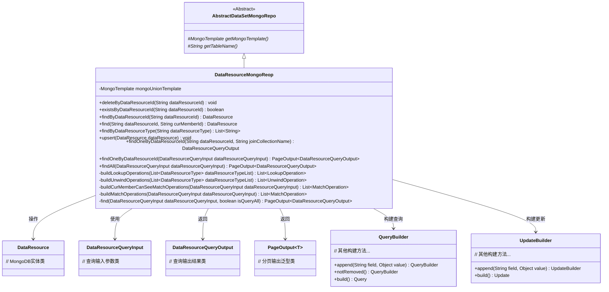

# 基础信息

|      |      |
|------|------|
| 名称 | DataResourceMongoReop |
| 编码语言 | .java |
| 代码路径 | WeFe/common/java/common-data-mongodb/src/main/java/com/welab/wefe/common/data/mongodb/repo/DataResourceMongoReop.java |
| 包名 | com.welab.wefe.common.data.mongodb.repo |
| 依赖项 | ['com.welab.wefe.common.data.mongodb.constant.MongodbTable', 'com.welab.wefe.common.data.mongodb.dto.PageOutput', 'com.welab.wefe.common.data.mongodb.dto.dataresource.DataResourceQueryInput', 'com.welab.wefe.common.data.mongodb.dto.dataresource.DataResourceQueryOutput', 'com.welab.wefe.common.data.mongodb.entity.union.DataResource', 'com.welab.wefe.common.data.mongodb.util.AddFieldsOperation', 'com.welab.wefe.common.data.mongodb.util.QueryBuilder', 'com.welab.wefe.common.data.mongodb.util.UpdateBuilder', 'com.welab.wefe.common.util.JObject', 'com.welab.wefe.common.util.StringUtil', 'com.welab.wefe.common.wefe.enums.DataResourceType', 'org.apache.commons.collections4.CollectionUtils', 'org.apache.commons.lang3.StringUtils', 'org.springframework.beans.factory.annotation.Autowired', 'org.springframework.data.domain.Sort', 'org.springframework.data.mongodb.core.MongoTemplate', 'org.springframework.data.mongodb.core.aggregation', 'org.springframework.data.mongodb.core.query.Criteria', 'org.springframework.data.mongodb.core.query.Query', 'org.springframework.data.mongodb.core.query.Update', 'org.springframework.stereotype.Repository', 'java.util', 'java.util.stream.Collectors'] |
| 概述说明 | DataResourceMongoRepo类是一个MongoDB数据访问层，提供对数据资源的增删改查操作，包括按ID查询、删除、存在性检查、联合查询及分页功能。 |

# 说明

DataResourceMongoReop类是一个MongoDB数据访问层组件，继承自AbstractDataSetMongoRepo。它通过MongoTemplate操作MongodbTable.Union.DATA_RESOURCE表，提供对数据资源的基本CRUD操作和复杂查询功能。主要功能包括：按dataResourceId删除、查询存在性、查找单个资源、按类型查找标签列表、保存/更新资源。还支持多表关联查询（如图片数据集、表格数据集等），通过聚合管道实现分页查询、条件过滤和结果统计。查询逻辑包含权限控制，可校验当前用户可见性。类中封装了构建查询条件、关联表操作和结果处理的私有方法。

# 类列表 Class Summary

| 名称   | 类型  | 说明 |
|-------|------|-------------|
| DataResourceMongoReop | class | DataResourceMongoRepo类是一个MongoDB数据访问层组件，提供对数据资源的增删改查操作，包括按ID查询、删除、存在性检查、联合查询及分页功能。 |

## 类 DataResourceMongoReop

|      |      |
|------|------|
| 访问范围 | @Repository;public |
| 类型 | class |
| 名称 | DataResourceMongoReop |
| 说明 | DataResourceMongoRepo类是一个MongoDB数据访问层组件，提供对数据资源的增删改查操作，包括按ID查询、删除、存在性检查、联合查询及分页功能。 |

### UML类图

这段代码实现了一个MongoDB数据资源仓库类，继承自抽象基类AbstractDataSetMongoRepo。主要功能包括对DataResource实体的CRUD操作、复杂聚合查询以及分页处理。通过QueryBuilder和UpdateBuilder构建查询条件，支持多种查询场景（如按ID查询、按类型查询、联合查询等）。特别设计了权限控制逻辑（buildCurMemberCanSeeMatchOperations）和分页处理机制（PageOutput），通过MongoTemplate执行底层数据库操作。类图展示了核心类之间的关系，包括继承、依赖和泛型使用。

### 内部方法调用关系图

```mermaid
graph TD
    A["类DataResourceMongoReop"]
    B["属性: MongoTemplate mongoUnionTemplate"]
    C["方法: MongoTemplate getMongoTemplate()"]
    D["方法: String getTableName()"]
    E["方法: void deleteByDataResourceId(String)"]
    F["方法: boolean existsByDataResourceId(String)"]
    G["方法: DataResource findByDataResourceId(String)"]
    H["方法: DataResource find(String, String)"]
    I["方法: List<String> findByDataResourceType(String)"]
    J["方法: void upsert(DataResource)"]
    K["方法: DataResourceQueryOutput findOneByDataResourceId(String, String)"]
    L["方法: PageOutput<DataResourceQueryOutput> findOneByDataResourceId(DataResourceQueryInput)"]
    M["方法: PageOutput<DataResourceQueryOutput> findAll(DataResourceQueryInput)"]
    N["方法: PageOutput<DataResourceQueryOutput> find(DataResourceQueryInput, boolean)"]
    O["私有方法: List<LookupOperation> buildLookupOperations(List<DataResourceType>)"]
    P["私有方法: List<UnwindOperation> buildUnwindOperations(List<DataResourceType>)"]
    Q["私有方法: List<MatchOperation> buildCurMemberCanSeeMatchOperations(DataResourceQueryInput)"]
    R["私有方法: List<MatchOperation> buildMatchOperations(DataResourceQueryInput)"]

    A --> B
    A --> C
    A --> D
    A --> E
    A --> F
    A --> G
    A --> H
    A --> I
    A --> J
    A --> K
    A --> L
    A --> M
    A --> N
    N --> O
    N --> P
    N --> Q
    N --> R
    L --> N
    M --> N
    K --> O
    K --> P
    K --> Q
```

这段代码定义了一个MongoDB数据访问类DataResourceMongoReop，继承自AbstractDataSetMongoRepo。主要功能包括对数据资源的增删改查操作，支持通过dataResourceId查询、存在性检查、删除标记更新、联合查询等。核心方法通过MongoTemplate执行数据库操作，包含多个私有方法用于构建聚合查询的各个阶段（Lookup、Unwind、Match等）。类中实现了复杂查询逻辑，包括分页处理、多表关联查询和权限控制，特别关注数据资源的状态管理和成员可见性控制。

### 字段列表 Field List

| 名称  | 类型  | 说明 |
|-------|-------|------|
| mongoUnionTemplate | MongoTemplate | 自动注入MongoTemplate实例，命名为mongoUnionTemplate。 |

### 方法列表

| 名称  | 类型  | 说明 |
|-------|-------|------|
| findByDataResourceId | DataResource | 根据dataResourceId查询数据资源，若ID为空返回null，否则构建查询条件并返回MongoDB中未删除的匹配结果。 |
| find | DataResource | 方法通过ID和成员ID查询数据资源，若ID为空返回null，否则构建查询条件并返回MongoDB结果。 |
| buildLookupOperations | List<LookupOperation> | 该方法构建MongoDB的Lookup操作列表，首先添加成员表关联，然后根据输入的数据资源类型列表（默认包含图片、表格和布隆过滤器）动态添加对应表的关联查询，关联字段为data_resource_id，结果集别名转为下划线格式。 |
| buildUnwindOperations | List<UnwindOperation> | 构建解构操作列表，默认解构member字段。若数据资源类型列表为空，默认处理ImageDataSet、TableDataSet和BloomFilter。根据类型生成对应字段名并解构，返回操作列表。 |
| buildCurMemberCanSeeMatchOperations | List<MatchOperation> | 构建当前用户可见的数据资源匹配操作列表，包括资源类型、名称、标签等条件筛选，并检查公开级别和成员权限，支持图片数据集和表格数据集的特定查询条件。 |
| getTableName | String | 该方法重写父类方法，返回MongodbTable.Union.DATA_RESOURCE作为表名。 |
| getMongoTemplate | MongoTemplate | 覆盖getMongoTemplate方法，返回mongoUnionTemplate实例。 |
| upsert | void | 该方法使用mongoUnionTemplate保存或更新数据资源对象。 |
| buildMatchOperations | List<MatchOperation> | 构建匹配操作列表，处理数据资源查询输入，包括状态、名称、标签等条件，根据资源类型添加不同匹配操作，返回匹配操作列表。 |
| existsByDataResourceId | boolean | 检查指定ID的数据资源是否存在。若ID为空返回false，否则查询MongoDB中未删除的匹配记录并返回是否存在结果。 |
| findByDataResourceType | List<String> | 该方法通过MongoDB查询指定类型的数据资源，排除_id字段并包含tags字段，最终返回所有资源的标签列表。 |
| deleteByDataResourceId | void | 根据dataResourceId查询并更新MongoDB数据状态为1。 |
| findOneByDataResourceId | DataResourceQueryOutput | 方法通过MongoDB聚合查询，根据dataResourceId和joinCollectionName关联数据，返回DataResourceQueryOutput结果。包含数据关联、条件筛选和字段处理。 |
| findOneByDataResourceId | PageOutput<DataResourceQueryOutput> | 根据输入参数查询数据资源，返回单条结果的分页输出。 |
| findAll | PageOutput<DataResourceQueryOutput> | 该方法根据输入条件查询数据资源，返回分页结果。内部调用find方法并设置参数为true。 |
| find | PageOutput<DataResourceQueryOutput> | 该方法根据输入参数查询数据资源，构建聚合操作并分页返回结果。包含关联查询、筛选、排序和统计总数功能，支持全量或权限过滤查询。 |

