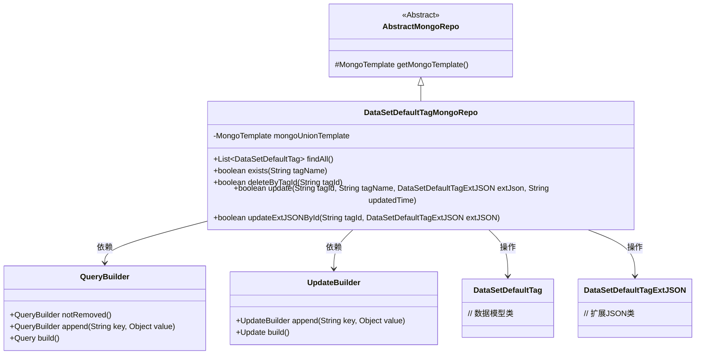
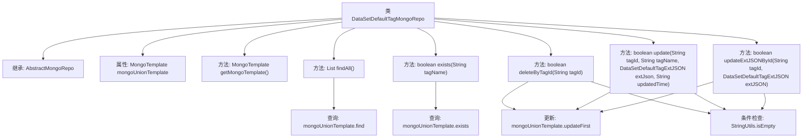

# 基础信息

|      |      |
|------|------|
| 名称 | DataSetDefaultTagMongoRepo |
| 编码语言 | .java |
| 代码路径 | WeFe/common/java/common-data-mongodb/src/main/java/com/welab/wefe/common/data/mongodb/repo/DataSetDefaultTagMongoRepo.java |
| 包名 | com.welab.wefe.common.data.mongodb.repo |
| 依赖项 | ['com.mongodb.client.result.UpdateResult', 'com.welab.wefe.common.data.mongodb.entity.union.DataSetDefaultTag', 'com.welab.wefe.common.data.mongodb.entity.union.MemberAuthType', 'com.welab.wefe.common.data.mongodb.entity.union.ext.DataSetDefaultTagExtJSON', 'com.welab.wefe.common.data.mongodb.util.QueryBuilder', 'com.welab.wefe.common.data.mongodb.util.UpdateBuilder', 'org.apache.commons.lang3.StringUtils', 'org.springframework.beans.factory.annotation.Autowired', 'org.springframework.data.mongodb.core.MongoTemplate', 'org.springframework.data.mongodb.core.query.Query', 'org.springframework.data.mongodb.core.query.Update', 'org.springframework.stereotype.Repository', 'java.util.List'] |
| 概述说明 | 数据集默认标签MongoDB仓库类，提供查询、存在检查、删除、更新标签及扩展JSON功能。 |

# 说明

这是一个名为DataSetDefaultTagMongoRepo的MongoDB数据访问类，继承自AbstractMongoRepo。它使用MongoTemplate进行数据库操作，主要功能包括：查询所有未删除的DataSetDefaultTag记录；检查指定tagName是否存在；通过tagId删除记录（标记为已删除状态）；更新记录的tagName、extJson和updatedTime字段；以及单独更新记录的extJson字段。所有更新操作都会返回是否成功的布尔值。

# 类列表 Class Summary

| 名称   | 类型  | 说明 |
|-------|------|-------------|
| DataSetDefaultTagMongoRepo | class | DataSetDefaultTagMongoRepo类继承AbstractMongoRepo，使用MongoTemplate操作数据集默认标签。提供查询所有标签、检查标签存在、删除标签、更新标签信息及扩展JSON等功能。 |

## 类 DataSetDefaultTagMongoRepo

|      |      |
|------|------|
| 访问范围 | @Repository;public |
| 类型 | class |
| 名称 | DataSetDefaultTagMongoRepo |
| 说明 | DataSetDefaultTagMongoRepo类继承AbstractMongoRepo，使用MongoTemplate操作数据集默认标签。提供查询所有标签、检查标签存在、删除标签、更新标签信息及扩展JSON等功能。 |

### UML类图

类图描述：该图展示了DataSetDefaultTagMongoRepo类继承自AbstractMongoRepo，并依赖QueryBuilder和UpdateBuilder来构建查询和更新操作。它通过MongoTemplate与MongoDB交互，主要操作DataSetDefaultTag实体及其扩展JSON数据。类中实现了CRUD相关方法，包括查询、存在性检查、删除和更新等操作，所有方法都返回操作结果状态。

### 内部方法调用关系图

这段代码定义了一个名为DataSetDefaultTagMongoRepo的MongoDB仓库类，继承自AbstractMongoRepo。该类提供了对DataSetDefaultTag集合的基本CRUD操作，包括查询所有记录、检查记录是否存在、删除记录（逻辑删除）、更新记录和更新扩展JSON字段。所有数据库操作都通过mongoUnionTemplate执行，并在执行更新操作前会进行参数有效性检查。方法主要围绕tagId和tagName两个关键字段展开操作，使用QueryBuilder和UpdateBuilder构建查询和更新条件。

### 字段列表 Field List

| 名称  | 类型  | 说明 |
|-------|-------|------|
| mongoUnionTemplate | MongoTemplate | 使用@Autowired自动注入MongoTemplate实例mongoUnionTemplate。 |

### 方法列表

| 名称  | 类型  | 说明 |
|-------|-------|------|
| deleteByTagId | boolean | 该方法通过标签ID删除数据，先检查ID是否为空，非空则构建查询和更新条件，将状态设为1，返回操作是否成功。 |
| findAll | List<DataSetDefaultTag> | 查询未删除的默认数据集标签列表。 |
| exists | boolean | 检查指定标签名是否存在，查询未删除标签并返回布尔结果。 |
| getMongoTemplate | MongoTemplate | 重写getMongoTemplate方法，返回mongoUnionTemplate实例。 |
| update | boolean | 更新标签信息方法：检查tagId非空后，构建查询和更新条件，通过MongoDB更新指定标签的名称、扩展JSON和更新时间，返回操作是否成功。 |
| updateExtJSONById | boolean | 方法根据tagId更新MongoDB中的extJSON字段，返回操作是否成功。参数校验失败或更新失败返回false。 |

