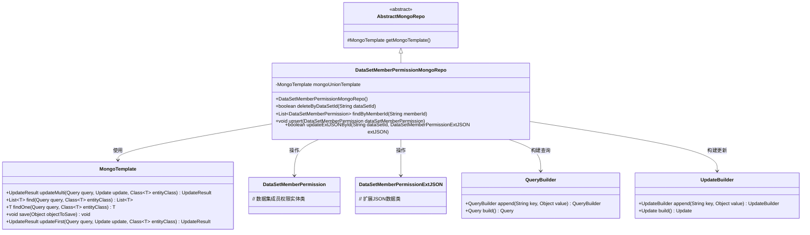
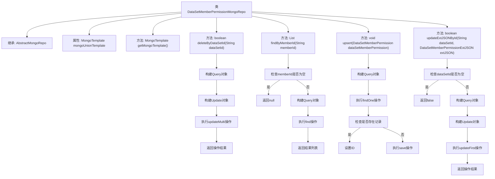

# 基础信息

|      |      |
|------|------|
| 名称 | DataSetMemberPermissionMongoRepo |
| 编码语言 | .java |
| 代码路径 | WeFe/common/java/common-data-mongodb/src/main/java/com/welab/wefe/common/data/mongodb/repo/DataSetMemberPermissionMongoRepo.java |
| 包名 | com.welab.wefe.common.data.mongodb.repo |
| 依赖项 | ['com.mongodb.client.result.UpdateResult', 'com.welab.wefe.common.data.mongodb.entity.union.DataSetMemberPermission', 'com.welab.wefe.common.data.mongodb.entity.union.ext.DataSetMemberPermissionExtJSON', 'com.welab.wefe.common.data.mongodb.util.QueryBuilder', 'com.welab.wefe.common.data.mongodb.util.UpdateBuilder', 'org.apache.commons.lang3.StringUtils', 'org.springframework.beans.factory.annotation.Autowired', 'org.springframework.data.mongodb.core.MongoTemplate', 'org.springframework.data.mongodb.core.query.Query', 'org.springframework.data.mongodb.core.query.Update', 'org.springframework.stereotype.Repository', 'java.util.List'] |
| 概述说明 | 数据集成员权限Mongo仓库类，提供删除、查询、更新及插入功能，使用MongoTemplate操作数据库。 |

# 说明

这是一个名为DataSetMemberPermissionMongoRepo的MongoDB仓库类，继承自AbstractMongoRepo。它使用MongoTemplate进行数据库操作，主要功能包括：根据数据集ID删除记录并更新状态，根据成员ID查询权限列表，插入或更新权限记录，以及根据数据集ID更新扩展JSON数据。所有操作都针对DataSetMemberPermission类进行。

# 类列表 Class Summary

| 名称   | 类型  | 说明 |
|-------|------|-------------|
| DataSetMemberPermissionMongoRepo | class | DataSetMemberPermissionMongoRepo类继承AbstractMongoRepo，使用MongoTemplate操作数据库。提供删除、查询、更新和插入功能，包括按dataSetId删除、按memberId查询、upsert操作及更新extJSON。 |

## 类 DataSetMemberPermissionMongoRepo

|      |      |
|------|------|
| 访问范围 | @Repository;public |
| 类型 | class |
| 名称 | DataSetMemberPermissionMongoRepo |
| 说明 | DataSetMemberPermissionMongoRepo类继承AbstractMongoRepo，使用MongoTemplate操作数据库。提供删除、查询、更新和插入功能，包括按dataSetId删除、按memberId查询、upsert操作及更新extJSON。 |

### UML类图

该类图展示了DataSetMemberPermissionMongoRepo继承自AbstractMongoRepo，并通过MongoTemplate操作DataSetMemberPermission和DataSetMemberPermissionExtJSON实体类。主要功能包括按数据集ID删除记录、按成员ID查询、数据插入/更新操作，以及更新扩展JSON字段。QueryBuilder和UpdateBuilder辅助类用于构建MongoDB查询和更新条件。整体结构体现了Spring Data MongoDB的典型仓库模式实现，包含CRUD操作和自定义查询方法。

### 内部方法调用关系图

这段代码是一个MongoDB数据访问层的实现类，主要用于处理DataSetMemberPermission实体的CRUD操作。类中包含了删除、查询、插入/更新和更新扩展JSON等核心方法，每个方法都通过MongoTemplate与数据库交互。流程图清晰地展示了类结构、继承关系以及每个方法的内部逻辑流程，包括参数检查、查询构建、数据库操作和结果返回等关键步骤。

### 字段列表 Field List

| 名称  | 类型  | 说明 |
|-------|-------|------|
| mongoUnionTemplate | MongoTemplate | 使用@Autowired自动注入名为mongoUnionTemplate的MongoTemplate实例。 |

### 方法列表

| 名称  | 类型  | 说明 |
|-------|-------|------|
| upsert | void | 该方法用于更新或插入数据集成员权限。先查询是否存在相同ID的记录，若存在则保留原ID，最后保存到数据库。 |
| findByMemberId | List<DataSetMemberPermission> | 根据成员ID查询数据集权限列表，若ID为空返回null，否则通过MongoDB查询并返回结果。 |
| getMongoTemplate | MongoTemplate | 重写getMongoTemplate方法，返回mongoUnionTemplate实例。 |
| deleteByDataSetId | boolean | 该方法通过数据集ID删除数据，使用MongoDB更新操作将状态设为1，返回操作是否成功。 |
| updateExtJSONById | boolean | 方法updateExtJSONById通过dataSetId更新MongoDB中的DataSetMemberPermission记录，检查ID非空后构建查询和更新操作，返回更新是否成功。 |

