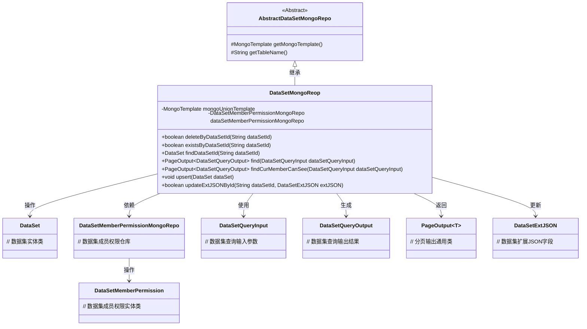

# 基础信息

|      |      |
|------|------|
| 名称 | DataSetMongoReop |
| 编码语言 | .java |
| 代码路径 | WeFe/common/java/common-data-mongodb/src/main/java/com/welab/wefe/common/data/mongodb/repo/DataSetMongoReop.java |
| 包名 | com.welab.wefe.common.data.mongodb.repo |
| 依赖项 | ['com.mongodb.client.result.UpdateResult', 'com.welab.wefe.common.data.mongodb.constant.MongodbTable', 'com.welab.wefe.common.data.mongodb.dto.PageOutput', 'com.welab.wefe.common.data.mongodb.dto.dataset.DataSetQueryInput', 'com.welab.wefe.common.data.mongodb.dto.dataset.DataSetQueryOutput', 'com.welab.wefe.common.data.mongodb.entity.union.DataSet', 'com.welab.wefe.common.data.mongodb.entity.union.DataSetMemberPermission', 'com.welab.wefe.common.data.mongodb.entity.union.ext.DataSetExtJSON', 'com.welab.wefe.common.data.mongodb.util.AddFieldsOperation', 'com.welab.wefe.common.data.mongodb.util.QueryBuilder', 'com.welab.wefe.common.data.mongodb.util.UpdateBuilder', 'org.apache.commons.lang3.StringUtils', 'org.springframework.beans.factory.annotation.Autowired', 'org.springframework.data.mongodb.core.MongoTemplate', 'org.springframework.data.mongodb.core.aggregation', 'org.springframework.data.mongodb.core.query.Criteria', 'org.springframework.data.mongodb.core.query.Query', 'org.springframework.data.mongodb.core.query.Update', 'org.springframework.stereotype.Repository', 'java.util.HashMap', 'java.util.List', 'java.util.Map', 'java.util.stream.Collectors'] |
| 概述说明 | DataSetMongoRepo类继承AbstractDataSetMongoRepo，提供数据集CRUD操作，包括按ID查询、删除、更新及分页查询可见数据集，使用MongoTemplate操作MongoDB。 |

# 说明

DataSetMongoReop类是一个MongoDB数据访问层组件，继承自AbstractDataSetMongoRepo。它通过MongoTemplate操作数据集，主要功能包括：按ID删除数据集、检查数据集是否存在、查询数据集、分页查询可见数据集、更新数据集扩展JSON等。类中实现了复杂的分页查询逻辑，支持多条件筛选和关联查询，并处理了数据集权限控制。所有操作都通过MongoDB的查询构建器和聚合框架实现，确保数据操作的灵活性和高效性。

# 类列表 Class Summary

| 名称   | 类型  | 说明 |
|-------|------|-------------|
| DataSetMongoReop | class | 数据集MongoDB仓库类，提供数据集增删改查功能，支持条件查询、分页及权限控制，使用MongoTemplate操作数据库。 |

## 类 DataSetMongoReop

|      |      |
|------|------|
| 访问范围 | @Repository;public |
| 类型 | class |
| 名称 | DataSetMongoReop |
| 说明 | 数据集MongoDB仓库类，提供数据集增删改查功能，支持条件查询、分页及权限控制，使用MongoTemplate操作数据库。 |

### UML类图

这段代码展示了一个基于MongoDB的数据集仓库实现类DataSetMongoReop，继承自抽象类AbstractDataSetMongoRepo。主要功能包括数据集CRUD操作、分页查询（支持普通查询和成员可见性过滤查询）、扩展字段更新等。通过Autowired注入MongoTemplate和权限仓库，实现了与MongoDB的交互逻辑，包含丰富的查询条件构建和聚合操作。类图清晰地反映了继承关系、依赖关系和核心实体类之间的交互。

### 内部方法调用关系图

```mermaid
graph TD
    A["类DataSetMongoReop"]
    B["属性: MongoTemplate mongoUnionTemplate"]
    C["属性: DataSetMemberPermissionMongoRepo dataSetMemberPermissionMongoRepo"]
    D["方法: getMongoTemplate()"]
    E["方法: getTableName()"]
    F["方法: deleteByDataSetId(String dataSetId)"]
    G["方法: existsByDataSetId(String dataSetId)"]
    H["方法: findDataSetId(String dataSetId)"]
    I["方法: find(DataSetQueryInput dataSetQueryInput)"]
    J["方法: findCurMemberCanSee(DataSetQueryInput dataSetQueryInput)"]
    K["方法: upsert(DataSet dataSet)"]
    L["方法: updateExtJSONById(String dataSetId, DataSetExtJSON extJSON)"]

    A --> B
    A --> C
    A --> D
    A --> E
    A --> F
    A --> G
    A --> H
    A --> I
    A --> J
    A --> K
    A --> L

    F --> F1["检查dataSetId是否为空"]
    F --> F2["构建Query对象"]
    F --> F3["构建Update对象"]
    F --> F4["执行updateFirst操作"]
    F --> F5["返回操作结果"]

    G --> G1["检查dataSetId是否为空"]
    G --> G2["构建Query对象"]
    G --> G3["执行exists操作"]
    G --> G4["返回查询结果"]

    H --> H1["检查dataSetId是否为空"]
    H --> H2["构建Query对象"]
    H --> H3["执行findOne操作"]
    H --> H4["返回查询结果"]

    I --> I1["构建LookupOperation"]
    I --> I2["构建Criteria对象"]
    I --> I3["执行Aggregation操作"]
    I --> I4["计算总数"]
    I --> I5["执行分页查询"]
    I --> I6["返回PageOutput"]

    J --> J1["构建LookupOperation"]
    J --> J2["查询权限列表"]
    J --> J3["构建Criteria对象"]
    J --> J4["执行Aggregation操作"]
    J --> J5["计算总数"]
    J --> J6["执行分页查询"]
    J --> J7["返回PageOutput"]

    K --> K1["查询现有数据集"]
    K --> K2["设置ID"]
    K --> K3["执行save操作"]

    L --> L1["检查dataSetId是否为空"]
    L --> L2["构建Query对象"]
    L --> L3["构建Update对象"]
    L --> L4["执行updateFirst操作"]
    L --> L5["返回操作结果"]
```

这段代码定义了一个名为DataSetMongoReop的MongoDB数据访问类，继承自AbstractDataSetMongoRepo。该类提供了对数据集的各种操作，包括增删改查和复杂查询功能。主要方法包括删除数据集、检查数据集是否存在、查找数据集、分页查询数据集、更新数据集等。其中find和findCurMemberCanSee方法实现了复杂的聚合查询功能，支持分页和条件过滤。类中使用了MongoTemplate来执行MongoDB操作，并通过Autowired注入了其他必要的组件。

### 字段列表 Field List

| 名称  | 类型  | 说明 |
|-------|-------|------|
| dataSetMemberPermissionMongoRepo | DataSetMemberPermissionMongoRepo | 使用@Autowired自动注入DataSetMemberPermissionMongoRepo实例。 |
| mongoUnionTemplate | MongoTemplate | 使用@Autowired自动注入MongoTemplate实例mongoUnionTemplate。 |

### 方法列表

| 名称  | 类型  | 说明 |
|-------|-------|------|
| findCurMemberCanSee | PageOutput<DataSetQueryOutput> | 查询当前用户可见数据集，包含权限检查、条件筛选、分页处理，返回数据集列表及总数。 |
| getMongoTemplate | MongoTemplate | 重写getMongoTemplate方法，返回mongoUnionTemplate实例。 |
| findDataSetId | DataSet | 方法通过数据集ID查询数据集，若ID为空返回null，否则构建查询条件并返回MongoDB中匹配的非删除数据集。 |
| getTableName | String | 该方法重写父类方法，返回MongodbTable.Union.DATASET作为表名。 |
| existsByDataSetId | boolean | 检查指定ID的数据集是否存在，若ID为空返回false，否则查询MongoDB并返回结果。 |
| deleteByDataSetId | boolean | Java方法：根据dataSetId删除数据，先校验非空，再构建查询和更新条件，最后执行MongoDB更新操作并返回是否成功。 |
| find | PageOutput<DataSetQueryOutput> | 该方法通过MongoDB聚合查询数据集，包含条件筛选、联表查询、分页处理，返回分页结果。 |
| upsert | void | 方法upsert用于插入或更新DataSet：若存在相同ID则更新，否则新增。最终保存到MongoDB。 |
| updateExtJSONById | boolean | 该方法通过数据集ID更新MongoDB中的扩展JSON数据。先检查ID有效性，无效则返回false。有效则构建查询和更新操作，执行更新并返回操作是否成功。 |

