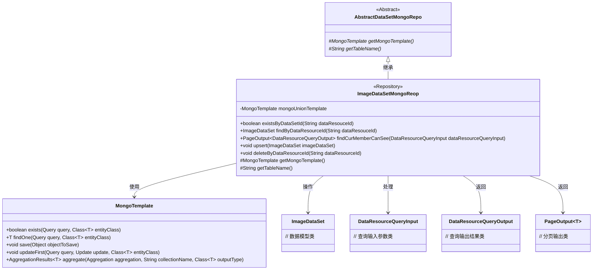
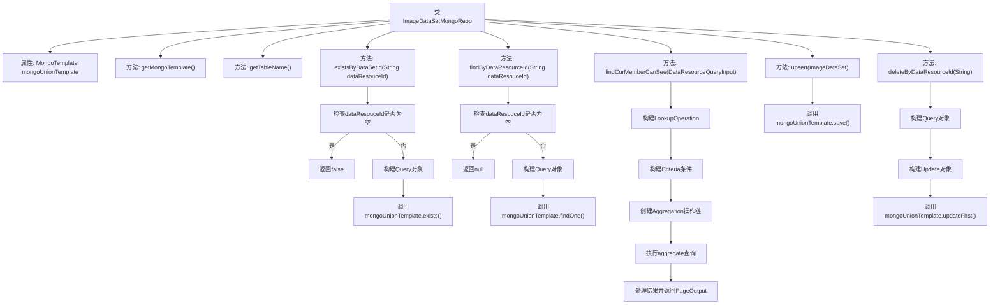

# 基础信息

|      |      |
|------|------|
| 名称 | ImageDataSetMongoReop |
| 编码语言 | .java |
| 代码路径 | WeFe/common/java/common-data-mongodb/src/main/java/com/welab/wefe/common/data/mongodb/repo/ImageDataSetMongoReop.java |
| 包名 | com.welab.wefe.common.data.mongodb.repo |
| 依赖项 | ['com.welab.wefe.common.data.mongodb.constant.MongodbTable', 'com.welab.wefe.common.data.mongodb.dto.PageOutput', 'com.welab.wefe.common.data.mongodb.dto.dataresource.DataResourceQueryInput', 'com.welab.wefe.common.data.mongodb.dto.dataresource.DataResourceQueryOutput', 'com.welab.wefe.common.data.mongodb.dto.dataset.DataSetQueryOutput', 'com.welab.wefe.common.data.mongodb.entity.union.ImageDataSet', 'com.welab.wefe.common.data.mongodb.util.AddFieldsOperation', 'com.welab.wefe.common.data.mongodb.util.QueryBuilder', 'com.welab.wefe.common.data.mongodb.util.UpdateBuilder', 'com.welab.wefe.common.util.JObject', 'org.apache.commons.lang3.StringUtils', 'org.springframework.beans.factory.annotation.Autowired', 'org.springframework.data.domain.Sort', 'org.springframework.data.mongodb.core.MongoTemplate', 'org.springframework.data.mongodb.core.aggregation', 'org.springframework.data.mongodb.core.query.Criteria', 'org.springframework.data.mongodb.core.query.Query', 'org.springframework.data.mongodb.core.query.Update', 'org.springframework.stereotype.Repository', 'java.util.HashMap', 'java.util.List', 'java.util.Map'] |
| 概述说明 | ImageDataSetMongoReop类继承AbstractDataSetMongoRepo，使用MongoTemplate操作MongoDB。提供existsByDataSetId、findByDataResourceId方法查询数据，findCurMemberCanSee方法分页查询当前用户可见数据集，支持条件筛选和聚合操作。包含upsert保存数据和deleteByDataResourceId逻辑删除功能。 |

# 说明

该代码定义了一个名为ImageDataSetMongoReop的MongoDB仓库类，继承自AbstractDataSetMongoRepo。主要功能包括：通过dataResourceId检查数据是否存在、查询数据、分页查询当前用户可见的图像数据集、保存或更新数据以及逻辑删除数据。类中使用了MongoTemplate进行数据库操作，包含复杂的聚合查询，涉及多表关联、条件筛选、分页和排序等功能。查询逻辑考虑了公开级别、成员权限等多种条件，并返回分页结果。

# 类列表 Class Summary

| 名称   | 类型  | 说明 |
|-------|------|-------------|
| ImageDataSetMongoReop | class | ImageDataSetMongoRepo类继承AbstractDataSetMongoRepo，使用MongoTemplate操作MongoDB。提供existsByDataSetId、findByDataResourceId方法检查/查询数据，findCurMemberCanSee方法分页查询可见数据集，支持增删改操作。 |

## 类 ImageDataSetMongoReop

|      |      |
|------|------|
| 访问范围 | @Repository;public |
| 类型 | class |
| 名称 | ImageDataSetMongoReop |
| 说明 | ImageDataSetMongoRepo类继承AbstractDataSetMongoRepo，使用MongoTemplate操作MongoDB。提供existsByDataSetId、findByDataResourceId方法检查/查询数据，findCurMemberCanSee方法分页查询可见数据集，支持增删改操作。 |

### UML类图

这段代码定义了一个名为`ImageDataSetMongoReop`的MongoDB仓库类，继承自抽象类`AbstractDataSetMongoRepo`。该类提供了对图像数据集(ImageDataSet)的CRUD操作，包括检查存在性、按ID查询、分页查询可见数据集、更新插入和逻辑删除等功能。核心功能通过`MongoTemplate`实现，其中`findCurMemberCanSee`方法实现了复杂的聚合查询，包含多表关联、条件筛选、分页和排序等操作。类图中清晰地展示了继承关系、依赖关系和主要方法签名。

### 内部方法调用关系图

这段代码是ImageDataSetMongoReop类的实现，继承自AbstractDataSetMongoRepo，主要用于处理与图像数据集相关的MongoDB操作。包含检查数据集是否存在、按ID查询数据集、查询当前用户可见数据集、插入/更新数据集和删除数据集等功能。其中findCurMemberCanSee方法实现了复杂的聚合查询，包含多表关联、条件筛选、分页和排序等功能，是该类的核心方法。所有数据库操作都通过mongoUnionTemplate完成，体现了对MongoDB的封装和抽象。

### 字段列表 Field List

| 名称  | 类型  | 说明 |
|-------|-------|------|
| mongoUnionTemplate | MongoTemplate | 使用@Autowired自动注入MongoTemplate实例mongoUnionTemplate。 |

### 方法列表

| 名称  | 类型  | 说明 |
|-------|-------|------|
| upsert | void | 方法upsert保存或更新ImageDataSet对象到MongoDB数据库。 |
| deleteByDataResourceId | void | 该方法根据dataResourceId删除数据资源，通过构建查询条件更新对应记录的status为1，使用MongoDB模板执行更新操作。 |
| getMongoTemplate | MongoTemplate | 重写getMongoTemplate方法，返回mongoUnionTemplate实例。 |
| findByDataResourceId | ImageDataSet | 根据数据资源ID查询图像数据集，若ID为空返回null，否则通过MongoDB查询匹配结果。 |
| getTableName | String | 方法重写，返回Mongodb表名IMAGE_DATASET。 |
| existsByDataSetId | boolean | 检查指定ID的数据集是否存在。若ID为空返回false，否则查询MongoDB并返回是否存在。 |
| findCurMemberCanSee | PageOutput<DataResourceQueryOutput> | 方法findCurMemberCanSee查询当前用户可见数据资源，通过聚合操作关联数据集和成员表，筛选公开或指定成员可见的数据，支持分页和排序，返回分页结果。 |

