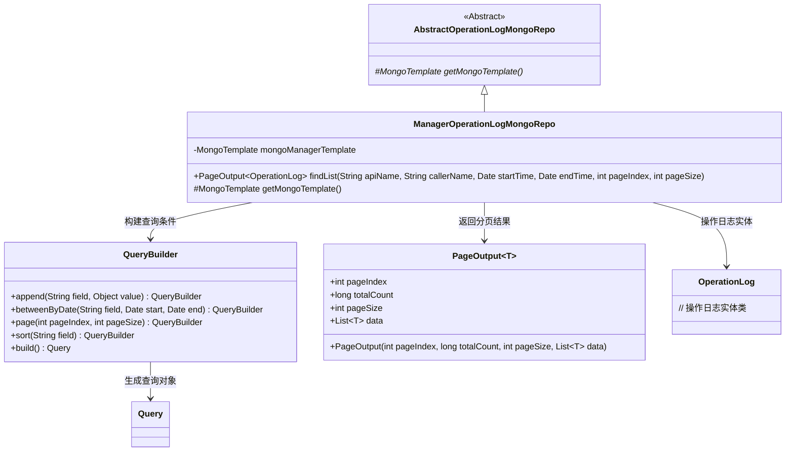
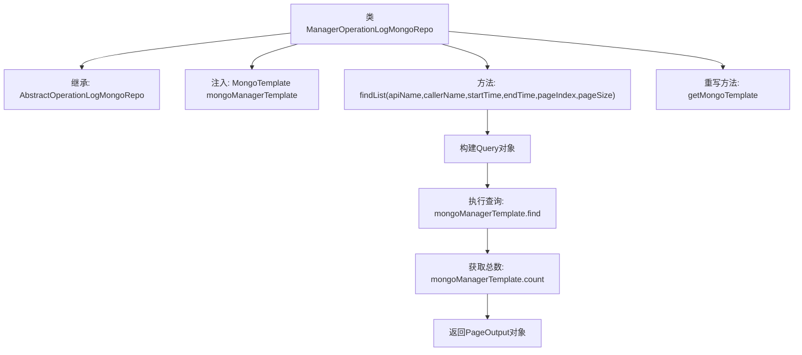

# 基础信息

|      |      |
|------|------|
| 名称 | ManagerOperationLogMongoRepo |
| 编码语言 | .java |
| 代码路径 | WeFe/common/java/common-data-mongodb/src/main/java/com/welab/wefe/common/data/mongodb/repo/ManagerOperationLogMongoRepo.java |
| 包名 | com.welab.wefe.common.data.mongodb.repo |
| 依赖项 | ['com.welab.wefe.common.data.mongodb.dto.PageOutput', 'com.welab.wefe.common.data.mongodb.entity.common.OperationLog', 'com.welab.wefe.common.data.mongodb.util.QueryBuilder', 'org.springframework.beans.factory.annotation.Autowired', 'org.springframework.data.mongodb.core.MongoTemplate', 'org.springframework.data.mongodb.core.query.Query', 'org.springframework.stereotype.Repository', 'java.util.Date', 'java.util.List'] |
| 概述说明 | ManagerOperationLogMongoRepo类继承AbstractOperationLogMongoRepo，使用MongoTemplate查询操作日志，支持按条件分页查询并返回结果列表和总数。 |

# 说明

这是一个名为ManagerOperationLogMongoRepo的MongoDB仓库类，继承自AbstractOperationLogMongoRepo。它使用@Repository注解标记为Spring管理的仓库组件。类中注入了名为mongoManagerTemplate的MongoTemplate实例用于数据库操作。主要提供了findList方法，支持按api名称、调用者名称和时间范围查询操作日志，并实现分页和按请求时间排序功能。查询结果封装为PageOutput对象返回，包含分页信息和数据列表。类还重写了getMongoTemplate方法以返回注入的mongoManagerTemplate实例。

# 类列表 Class Summary

| 名称   | 类型  | 说明 |
|-------|------|-------------|
| ManagerOperationLogMongoRepo | class | ManagerOperationLogMongoRepo类继承AbstractOperationLogMongoRepo，使用MongoTemplate查询操作日志，支持按条件分页检索并返回结果列表和总数。 |

## 类 ManagerOperationLogMongoRepo

|      |      |
|------|------|
| 访问范围 | @Repository;public |
| 类型 | class |
| 名称 | ManagerOperationLogMongoRepo |
| 说明 | ManagerOperationLogMongoRepo类继承AbstractOperationLogMongoRepo，使用MongoTemplate查询操作日志，支持按条件分页检索并返回结果列表和总数。 |

### UML类图

这段代码展示了一个基于MongoDB的操作日志仓库实现。ManagerOperationLogMongoRepo继承自抽象类AbstractOperationLogMongoRepo，通过QueryBuilder构建复杂查询条件，使用MongoTemplate执行分页查询并返回PageOutput结果。类图中清晰地展示了继承关系、依赖关系和泛型使用，其中QueryBuilder负责构建查询条件，PageOutput封装分页结果，OperationLog是存储的实体类型。整个设计遵循了Repository模式，提供了灵活的操作日志查询能力。

### 内部方法调用关系图

该流程图展示了ManagerOperationLogMongoRepo类的核心结构和执行流程。类继承自AbstractOperationLogMongoRepo，通过注入的mongoManagerTemplate执行MongoDB操作。主要方法findList通过QueryBuilder构建查询条件，分页获取OperationLog数据并返回包装结果。重写方法getMongoTemplate提供模板实例访问。整个流程清晰展现了从查询构建到结果返回的数据处理链路。

### 字段列表 Field List

| 名称  | 类型  | 说明 |
|-------|-------|------|
| mongoManagerTemplate | MongoTemplate | 使用@Autowired自动注入MongoTemplate实例，变量名为mongoManagerTemplate。 |

### 方法列表

| 名称  | 类型  | 说明 |
|-------|-------|------|
| findList | PageOutput<OperationLog> | 方法根据条件查询操作日志列表，支持分页和排序，返回分页结果。 |
| getMongoTemplate | MongoTemplate | 重写getMongoTemplate方法，返回mongoManagerTemplate实例。 |

