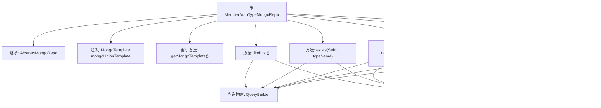

# 基础信息

|      |      |
|------|------|
| 名称 | MemberAuthTypeMongoRepo |
| 编码语言 | .java |
| 代码路径 | WeFe/common/java/common-data-mongodb/src/main/java/com/welab/wefe/common/data/mongodb/repo/MemberAuthTypeMongoRepo.java |
| 包名 | com.welab.wefe.common.data.mongodb.repo |
| 依赖项 | ['com.mongodb.client.result.UpdateResult', 'com.welab.wefe.common.data.mongodb.entity.union.MemberAuthType', 'com.welab.wefe.common.data.mongodb.entity.union.ext.MemberAuthTypeExtJSON', 'com.welab.wefe.common.data.mongodb.util.QueryBuilder', 'com.welab.wefe.common.data.mongodb.util.UpdateBuilder', 'org.apache.commons.lang3.StringUtils', 'org.springframework.beans.factory.annotation.Autowired', 'org.springframework.data.mongodb.core.MongoTemplate', 'org.springframework.data.mongodb.core.query.Query', 'org.springframework.data.mongodb.core.query.Update', 'org.springframework.stereotype.Repository', 'java.util.List'] |
| 概述说明 | MemberAuthTypeMongoRepo类继承AbstractMongoRepo，使用MongoTemplate操作数据库，提供查询、存在性检查、删除、更新及扩展JSON更新功能。 |

# 说明

这是一个名为MemberAuthTypeMongoRepo的MongoDB数据访问类，继承自AbstractMongoRepo。它使用MongoTemplate进行数据库操作，主要功能包括查询未删除的MemberAuthType列表、检查指定类型名称是否存在、根据类型ID删除记录、更新类型名称和修改时间、以及更新扩展JSON数据。所有操作都通过QueryBuilder和UpdateBuilder构建查询和更新条件，并返回操作是否成功的布尔值。

# 类列表 Class Summary

| 名称   | 类型  | 说明 |
|-------|------|-------------|
| MemberAuthTypeMongoRepo | class | MemberAuthTypeMongoRepo类继承AbstractMongoRepo，提供成员认证类型的MongoDB操作，包括查询、存在检查、删除、更新及扩展JSON更新功能。 |

## 类 MemberAuthTypeMongoRepo

|      |      |
|------|------|
| 访问范围 | @Repository;public |
| 类型 | class |
| 名称 | MemberAuthTypeMongoRepo |
| 说明 | MemberAuthTypeMongoRepo类继承AbstractMongoRepo，提供成员认证类型的MongoDB操作，包括查询、存在检查、删除、更新及扩展JSON更新功能。 |

### UML类图

类图描述：该图展示了一个MongoDB存储库类`MemberAuthTypeMongoRepo`的结构，它继承自抽象基类`AbstractMongoRepo`，并包含对`MemberAuthType`实体的CRUD操作。通过`QueryBuilder`和`UpdateBuilder`辅助类构建查询条件，使用`MongoTemplate`执行数据库操作。类图中清晰地体现了继承关系、工具类依赖和实体类关联。

### 内部方法调用关系图

这段代码是一个Spring Data MongoDB的Repository实现类，用于管理MemberAuthType类型的数据。它提供了基本的CRUD操作，包括查询列表、检查存在性、删除、更新和更新扩展JSON字段。所有方法都通过QueryBuilder和UpdateBuilder构建查询条件，并最终通过mongoUnionTemplate执行数据库操作。类继承自AbstractMongoRepo，并重写了getMongoTemplate方法以返回注入的mongoUnionTemplate实例。每个方法都包含必要的参数校验和数据库操作，返回操作结果状态。

### 字段列表 Field List

| 名称  | 类型  | 说明 |
|-------|-------|------|
| mongoUnionTemplate | MongoTemplate | 使用@Autowired自动注入名为mongoUnionTemplate的MongoTemplate实例。 |

### 方法列表

| 名称  | 类型  | 说明 |
|-------|-------|------|
| deleteByTypeId | boolean | 该方法根据typeId删除数据，先检查typeId是否为空，为空则返回false。非空时构建查询和更新条件，将匹配记录的status设为1，返回操作是否成功。 |
| findList | List<MemberAuthType> | 查询未删除的MemberAuthType列表，使用MongoDB模板构建查询条件并返回结果。 |
| getMongoTemplate | MongoTemplate | 重写getMongoTemplate方法，返回mongoUnionTemplate实例。 |
| exists | boolean | 检查指定类型名是否存在且未被删除的成员授权记录。 |
| update | boolean | 方法根据typeId更新MongoDB中MemberAuthType类的typeName和updatedTime字段，若typeId为空则返回false，否则返回更新操作是否成功。 |
| updateExtJSONById | boolean | 方法updateExtJSONById根据typeId更新MongoDB中的extJson字段，返回操作是否成功。参数校验失败返回false。 |

