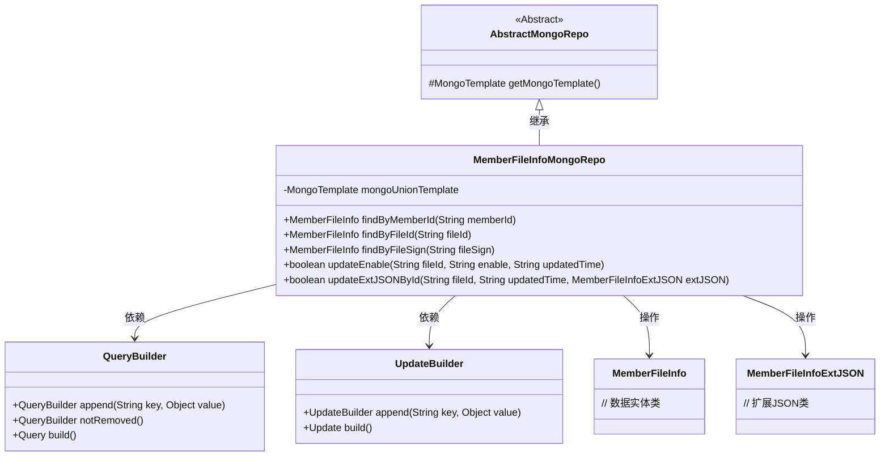
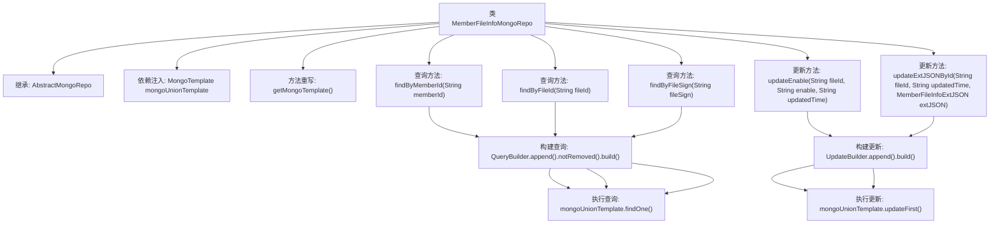

# 基础信息

|      |      |
|------|------|
| 名称 | MemberFileInfoMongoRepo |
| 编码语言 | .java |
| 代码路径 | WeFe/common/java/common-data-mongodb/src/main/java/com/welab/wefe/common/data/mongodb/repo/MemberFileInfoMongoRepo.java |
| 包名 | com.welab.wefe.common.data.mongodb.repo |
| 依赖项 | ['com.mongodb.client.result.UpdateResult', 'com.welab.wefe.common.data.mongodb.entity.union.MemberFileInfo', 'com.welab.wefe.common.data.mongodb.entity.union.ext.MemberFileInfoExtJSON', 'com.welab.wefe.common.data.mongodb.util.QueryBuilder', 'com.welab.wefe.common.data.mongodb.util.UpdateBuilder', 'org.apache.commons.lang3.StringUtils', 'org.springframework.beans.factory.annotation.Autowired', 'org.springframework.data.mongodb.core.MongoTemplate', 'org.springframework.data.mongodb.core.query.Query', 'org.springframework.data.mongodb.core.query.Update', 'org.springframework.stereotype.Repository'] |
| 概述说明 | MemberFileInfoMongoRepo类继承AbstractMongoRepo，使用MongoTemplate操作MongoDB，提供按memberId、fileId、fileSign查询MemberFileInfo的方法，以及更新enable和extJson字段的功能。 |

# 说明

这是一个名为MemberFileInfoMongoRepo的MongoDB仓库类，继承自AbstractMongoRepo。它使用MongoTemplate进行数据库操作，包含多个查询和更新方法。主要功能包括：通过memberId、fileId或fileSign查询MemberFileInfo记录；更新记录的enable状态和updatedTime字段；以及更新记录的extJson扩展信息和updatedTime字段。所有查询都排除了被标记为删除的记录。

# 类列表 Class Summary

| 名称   | 类型  | 说明 |
|-------|------|-------------|
| MemberFileInfoMongoRepo | class | MemberFileInfoMongoRepo类继承AbstractMongoRepo，使用MongoTemplate操作数据库，提供按memberId、fileId、fileSign查询MemberFileInfo的方法，以及更新enable和extJson字段的功能。 |

## 类 MemberFileInfoMongoRepo

|      |      |
|------|------|
| 访问范围 | @Repository;public |
| 类型 | class |
| 名称 | MemberFileInfoMongoRepo |
| 说明 | MemberFileInfoMongoRepo类继承AbstractMongoRepo，使用MongoTemplate操作数据库，提供按memberId、fileId、fileSign查询MemberFileInfo的方法，以及更新enable和extJson字段的功能。 |

### UML类图

类图描述：该图展示了MemberFileInfoMongoRepo类继承自AbstractMongoRepo，并通过MongoTemplate操作MongoDB数据库。它使用QueryBuilder构建查询条件，UpdateBuilder构建更新操作，主要针对MemberFileInfo实体类进行CRUD操作，包含按memberId/fileId/fileSign查询，以及更新enable状态和extJSON扩展数据的功能。所有数据库操作都通过mongoUnionTemplate执行。

### 内部方法调用关系图

这段代码是一个MongoDB的Repository类，用于管理MemberFileInfo实体的数据库操作。它提供了通过memberId、fileId和fileSign查询记录的方法，以及更新记录enable状态和extJSON字段的方法。所有查询都使用QueryBuilder构建查询条件并排除已删除记录，更新操作则使用UpdateBuilder构建更新内容并返回操作是否成功的布尔值。类继承自AbstractMongoRepo并通过重写getMongoTemplate()方法指定了使用的MongoTemplate实例。

### 字段列表 Field List

| 名称  | 类型  | 说明 |
|-------|-------|------|
| mongoUnionTemplate | MongoTemplate | 使用@Autowired自动注入名为mongoUnionTemplate的MongoTemplate实例。 |

### 方法列表

| 名称  | 类型  | 说明 |
|-------|-------|------|
| findByFileId | MemberFileInfo | 方法通过fileId查询未删除的MemberFileInfo记录，使用MongoDB模板和QueryBuilder构建查询条件。 |
| getMongoTemplate | MongoTemplate | 重写getMongoTemplate方法，返回mongoUnionTemplate实例。 |
| findByMemberId | MemberFileInfo | 通过memberId查询未删除的MemberFileInfo记录。使用MongoDB的QueryBuilder构建查询条件。 |
| findByFileSign | MemberFileInfo | 通过文件标识查询未删除的会员文件信息，使用MongoDB模板执行查询。 |
| updateEnable | boolean | 方法updateEnable根据fileId更新文档的enable和updatedTime字段，若fileId为空返回false，否则执行更新并返回操作是否成功。 |
| updateExtJSONById | boolean | 方法根据fileId更新MongoDB中的extJson和updatedTime字段，若fileId为空则返回false，否则返回更新操作是否成功。 |

