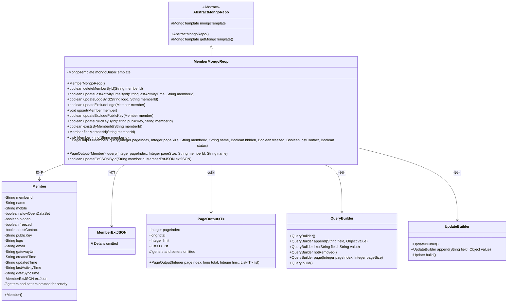

# 基础信息

|      |      |
|------|------|
| 名称 | MemberMongoReop |
| 编码语言 | .java |
| 代码路径 | WeFe/common/java/common-data-mongodb/src/main/java/com/welab/wefe/common/data/mongodb/repo/MemberMongoReop.java |
| 包名 | com.welab.wefe.common.data.mongodb.repo |
| 依赖项 | ['com.mongodb.client.result.UpdateResult', 'com.welab.wefe.common.data.mongodb.dto.PageOutput', 'com.welab.wefe.common.data.mongodb.entity.union.Member', 'com.welab.wefe.common.data.mongodb.entity.union.ext.MemberExtJSON', 'com.welab.wefe.common.data.mongodb.util.QueryBuilder', 'com.welab.wefe.common.data.mongodb.util.UpdateBuilder', 'org.apache.commons.lang3.StringUtils', 'org.springframework.beans.factory.annotation.Autowired', 'org.springframework.data.mongodb.core.MongoTemplate', 'org.springframework.data.mongodb.core.query.Query', 'org.springframework.data.mongodb.core.query.Update', 'org.springframework.stereotype.Repository', 'java.util.ArrayList', 'java.util.List'] |
| 概述说明 | MemberMongoRepo类继承AbstractMongoRepo，使用MongoTemplate操作MongoDB。提供成员增删改查功能，包括按ID删除、更新活动时间、logo、公钥等字段，以及分页查询和存在性检查。 |

# 说明

该代码定义了一个名为MemberMongoRepo的MongoDB仓库类，继承自AbstractMongoRepo。它使用MongoTemplate进行数据库操作，主要包含成员数据的增删改查功能。关键方法包括：根据ID删除成员、更新最后活动时间、更新logo、更新除logo外的成员信息、更新除公钥外的成员信息、更新公钥、检查成员是否存在、根据ID查找成员、分页查询成员列表以及更新扩展JSON数据等。所有更新操作都返回操作是否成功的布尔值。查询方法支持条件筛选和分页功能。

# 类列表 Class Summary

| 名称   | 类型  | 说明 |
|-------|------|-------------|
| MemberMongoReop | class | MemberMongoRepo类继承AbstractMongoRepo，使用MongoTemplate操作MongoDB，提供成员增删改查功能，包括更新状态、活动时间、logo等字段，支持分页查询和条件筛选。 |

## 类 MemberMongoReop

|      |      |
|------|------|
| 访问范围 | @Repository;public |
| 类型 | class |
| 名称 | MemberMongoReop |
| 说明 | MemberMongoRepo类继承AbstractMongoRepo，使用MongoTemplate操作MongoDB，提供成员增删改查功能，包括更新状态、活动时间、logo等字段，支持分页查询和条件筛选。 |

### UML类图

这段代码展示了一个MongoDB仓库类`MemberMongoReop`，继承自`AbstractMongoRepo`，提供了对`Member`实体的CRUD操作。类中使用了`QueryBuilder`和`UpdateBuilder`来构建查询和更新条件，通过`MongoTemplate`执行数据库操作。主要功能包括成员信息的增删改查、分页查询、条件更新等，处理了各种边界情况如空值检查和状态更新。类图清晰地展示了各组件之间的关系和依赖。

### 内部方法调用关系图

```mermaid
graph TD
    A["类MemberMongoRepo"]
    B["属性: MongoTemplate mongoUnionTemplate"]
    C["方法: getMongoTemplate()"]
    D["方法: deleteMemberById(memberId)"]
    E["方法: updateLastActivityTimeById(lastActivityTime, memberId)"]
    F["方法: updateLogoById(logo, memberId)"]
    G["方法: updateExcludeLogo(member)"]
    H["方法: upsert(member)"]
    I["方法: updateExcludePublicKey(member)"]
    J["方法: updatePublicKeyById(publicKey, memberId)"]
    K["方法: existsByMemberId(memberId)"]
    L["方法: findMemberId(memberId)"]
    M["方法: find(memberId)"]
    N["方法: query(pageIndex, pageSize, memberId, name...)"]
    O["方法: updateExtJSONById(memberId, extJSON)"]

    A --> B
    A --> C
    A --> D
    A --> E
    A --> F
    A --> G
    A --> H
    A --> I
    A --> J
    A --> K
    A --> L
    A --> M
    A --> N
    A --> O
```

这段代码是MemberMongoRepo类的Mermaid流程图，展示了类结构和主要方法。该类继承自AbstractMongoRepo，使用@Repository注解，通过MongoTemplate操作MongoDB数据库。核心功能包括成员数据的增删改查，如删除成员、更新活动时间、更新logo、排除特定字段的更新操作等。所有方法都遵循相似的流程：参数校验→构建查询条件→执行数据库操作→返回结果。特别注意对memberId的空值检查和使用QueryBuilder构建复杂查询条件。

### 字段列表 Field List

| 名称  | 类型  | 说明 |
|-------|-------|------|
| mongoUnionTemplate | MongoTemplate | 使用@Autowired自动注入MongoTemplate实例mongoUnionTemplate。 |

### 方法列表

| 名称  | 类型  | 说明 |
|-------|-------|------|
| upsert | void | 方法upsert用于插入或更新会员数据：检查会员ID非空后查询数据库，若存在则保留原ID，最后保存数据。 |
| updateLogoById | boolean | 方法updateLogoById根据memberId更新用户logo。先检查memberId非空，再构建查询和更新条件，最后执行MongoDB更新操作并返回是否成功。 |
| updateExcludePublicKey | boolean | 该方法根据member对象更新数据库记录，包含成员ID、姓名、手机号等字段，返回操作是否成功。 |
| deleteMemberById | boolean | 方法根据memberId删除成员：检查ID非空后，构建查询和更新条件，将成员状态设为1，返回操作是否成功。 |
| query | PageOutput<Member> | 这是一个Java方法，用于分页查询会员信息，接受页码、页大小、会员ID和名称作为参数，并调用重载方法进行查询。 |
| updateExcludeLogo | boolean | 方法updateExcludeLogo更新会员信息，检查参数后构建查询和更新条件，执行MongoDB更新操作并返回结果。 |
| updatePulicKeyById | boolean | 方法根据memberId更新公钥，若memberId为空返回false，否则执行MongoDB更新操作并返回是否成功。 |
| find | List<Member> | 根据memberId查询Member列表，非空时查单个成员，否则查询所有未删除成员。返回结果列表。 |
| updateLastActivityTimeById | boolean | 根据成员ID更新最后活动时间，若ID为空返回false，否则执行MongoDB更新操作并返回是否成功。 |
| existsByMemberId | boolean | 检查会员ID是否存在：若ID为空返回false，否则查询MongoDB中未删除的会员记录并返回是否存在结果。 |
| query | PageOutput<Member> | 查询成员信息方法，支持分页和条件筛选，包括状态、隐藏、冻结、失联等，返回分页结果。 |
| findMemberId | Member | 查找会员ID对应会员信息，若ID为空返回null，否则通过MongoDB查询未删除的会员数据并返回。 |
| getMongoTemplate | MongoTemplate | 重写getMongoTemplate方法，返回mongoUnionTemplate实例。 |
| updateExtJSONById | boolean | 更新MongoDB中指定memberId的extJSON字段，返回操作是否成功。参数校验失败或操作未确认则返回false。 |

