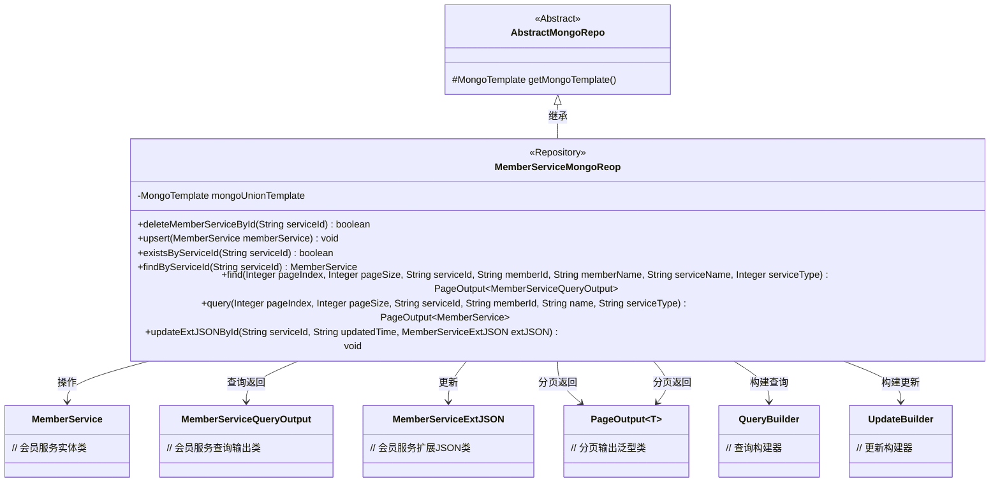

# 基础信息

|      |      |
|------|------|
| 名称 | MemberServiceMongoReop |
| 编码语言 | .java |
| 代码路径 | WeFe/common/java/common-data-mongodb/src/main/java/com/welab/wefe/common/data/mongodb/repo/MemberServiceMongoReop.java |
| 包名 | com.welab.wefe.common.data.mongodb.repo |
| 依赖项 | ['com.mongodb.client.result.UpdateResult', 'com.welab.wefe.common.data.mongodb.constant.MongodbTable', 'com.welab.wefe.common.data.mongodb.dto.PageOutput', 'com.welab.wefe.common.data.mongodb.dto.member.MemberServiceQueryOutput', 'com.welab.wefe.common.data.mongodb.entity.union.MemberFileInfo', 'com.welab.wefe.common.data.mongodb.entity.union.MemberService', 'com.welab.wefe.common.data.mongodb.entity.union.ext.MemberServiceExtJSON', 'com.welab.wefe.common.data.mongodb.util.AddFieldsOperation', 'com.welab.wefe.common.data.mongodb.util.QueryBuilder', 'com.welab.wefe.common.data.mongodb.util.UpdateBuilder', 'org.apache.commons.lang3.StringUtils', 'org.springframework.beans.factory.annotation.Autowired', 'org.springframework.data.domain.Sort', 'org.springframework.data.mongodb.core.MongoTemplate', 'org.springframework.data.mongodb.core.aggregation', 'org.springframework.data.mongodb.core.query.Criteria', 'org.springframework.data.mongodb.core.query.Query', 'org.springframework.data.mongodb.core.query.Update', 'org.springframework.stereotype.Repository', 'java.util.HashMap', 'java.util.List', 'java.util.Map'] |
| 概述说明 | MemberServiceMongoReop类继承AbstractMongoRepo，使用MongoTemplate操作MongoDB。提供成员服务增删改查功能，包括按ID删除、更新、查询及分页查询，支持条件筛选和聚合操作。 |

# 说明

该代码描述了一个名为MemberServiceMongoReop的MongoDB仓库类，继承自AbstractMongoRepo。主要功能包括：通过serviceId删除、查询、检查存在性及更新会员服务数据；支持分页查询会员服务信息，包含关联查询会员名称；提供基于条件的分页查询及更新扩展JSON数据的功能。所有操作均通过自动注入的mongoUnionTemplate实现，并包含详细的查询构建与聚合操作。

# 类列表 Class Summary

| 名称   | 类型  | 说明 |
|-------|------|-------------|
| MemberServiceMongoReop | class | MongoDB会员服务仓库类，提供增删改查及分页查询功能，包含条件筛选和聚合操作。 |

## 类 MemberServiceMongoReop

|      |      |
|------|------|
| 访问范围 | @Repository;public |
| 类型 | class |
| 名称 | MemberServiceMongoReop |
| 说明 | MongoDB会员服务仓库类，提供增删改查及分页查询功能，包含条件筛选和聚合操作。 |

### UML类图

类图描述：该图展示了基于MongoDB的会员服务仓库类`MemberServiceMongoReop`的结构，它继承自抽象类`AbstractMongoRepo`，通过`MongoTemplate`操作`MemberService`实体类，提供CRUD和复杂聚合查询功能。类中包含分页查询返回`PageOutput`泛型类，以及与查询构建器`QueryBuilder`、更新构建器`UpdateBuilder`的依赖关系，实现了会员服务的完整数据访问层功能。

### 内部方法调用关系图

```mermaid
graph TD
    A["类MemberServiceMongoReop"]
    B["属性: MongoTemplate mongoUnionTemplate"]
    C["方法: getMongoTemplate()"]
    D["方法: deleteMemberServiceById(serviceId)"]
    E["方法: upsert(memberService)"]
    F["方法: existsByServiceId(serviceId)"]
    G["方法: findByServiceId(serviceId)"]
    H["方法: find(pageIndex,pageSize,...)"]
    I["方法: query(pageIndex,pageSize,...)"]
    J["方法: updateExtJSONById(serviceId,...)"]

    A --> B
    A --> C
    A --> D
    A --> E
    A --> F
    A --> G
    A --> H
    A --> I
    A --> J

    D --> K["QueryBuilder构建查询"]
    D --> L["UpdateBuilder构建更新"]
    D --> M["mongoUnionTemplate.updateFirst"]
    D --> N["返回updateResult.wasAcknowledged()"]

    E --> O["mongoUnionTemplate.save"]

    F --> P["检查serviceId空值"]
    F --> Q["QueryBuilder构建查询"]
    F --> R["mongoUnionTemplate.exists"]

    G --> S["检查serviceId空值"]
    G --> T["QueryBuilder构建查询"]
    G --> U["mongoUnionTemplate.findOne"]

    H --> V["LookupOperation构建"]
    H --> W["QueryBuilder构建条件"]
    H --> X["Aggregation操作链"]
    H --> Y["分页/排序处理"]
    H --> Z["返回PageOutput"]

    I --> AA["QueryBuilder构建条件"]
    I --> AB["分页/排序处理"]
    I --> AC["返回PageOutput"]

    J --> AD["QueryBuilder构建查询"]
    J --> AE["UpdateBuilder构建更新"]
    J --> AF["mongoUnionTemplate.updateFirst"]
```

这段代码是MongoDB的Repository实现类，主要提供会员服务的CRUD操作。流程图展示了类结构和7个核心方法的调用关系，包括删除服务、保存/更新服务、查询存在性、精确查询、复杂聚合查询、分页查询和扩展JSON更新等方法。所有操作都通过mongoUnionTemplate执行，使用QueryBuilder和UpdateBuilder构建查询条件，其中find方法实现了多表联查和复杂聚合操作。

### 字段列表 Field List

| 名称  | 类型  | 说明 |
|-------|-------|------|
| mongoUnionTemplate | MongoTemplate | 自动注入MongoDB操作模板mongoUnionTemplate。 |

### 方法列表

| 名称  | 类型  | 说明 |
|-------|-------|------|
| find | PageOutput<MemberServiceQueryOutput> | 方法find通过MongoDB聚合查询成员服务数据，支持分页、模糊搜索和多条件筛选，返回分页结果。 |
| query | PageOutput<MemberService> | 查询会员服务分页数据，支持按服务ID、会员ID、名称模糊匹配和服务类型筛选，返回分页结果及总数。 |
| findByServiceId | MemberService | 根据serviceId查询MemberService，若serviceId为空返回null，否则通过MongoDB查询并返回结果。 |
| updateExtJSONById | void | 该方法通过serviceId更新MongoDB中的MemberFileInfo记录，修改extJson和updatedTime字段。使用MongoUnionTemplate执行更新操作。 |
| existsByServiceId | boolean | 检查指定serviceId是否存在：若为空返回false，否则查询MongoDB中MemberService集合是否存在匹配记录。 |
| deleteMemberServiceById | boolean | 该方法通过serviceId删除会员服务，使用MongoDB的updateFirst操作，返回操作是否成功。 |
| getMongoTemplate | MongoTemplate | 覆盖父类方法，返回mongoUnionTemplate实例。 |
| upsert | void | 方法upsert使用mongoUnionTemplate保存memberService对象到数据库。 |

