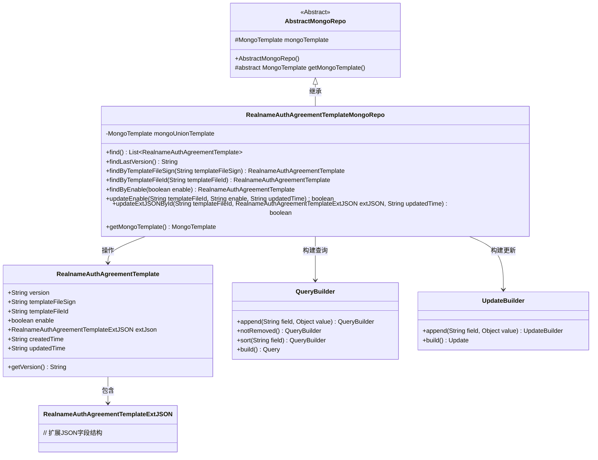

# 基础信息

|      |      |
|------|------|
| 名称 | RealnameAuthAgreementTemplateMongoRepo |
| 编码语言 | .java |
| 代码路径 | WeFe/common/java/common-data-mongodb/src/main/java/com/welab/wefe/common/data/mongodb/repo/RealnameAuthAgreementTemplateMongoRepo.java |
| 包名 | com.welab.wefe.common.data.mongodb.repo |
| 依赖项 | ['com.mongodb.client.result.UpdateResult', 'com.welab.wefe.common.data.mongodb.entity.union.RealnameAuthAgreementTemplate', 'com.welab.wefe.common.data.mongodb.entity.union.ext.RealnameAuthAgreementTemplateExtJSON', 'com.welab.wefe.common.data.mongodb.util.QueryBuilder', 'com.welab.wefe.common.data.mongodb.util.UpdateBuilder', 'org.apache.commons.lang3.StringUtils', 'org.springframework.beans.factory.annotation.Autowired', 'org.springframework.data.mongodb.core.MongoTemplate', 'org.springframework.data.mongodb.core.query.Query', 'org.springframework.data.mongodb.core.query.Update', 'org.springframework.stereotype.Repository', 'java.util.List'] |
| 概述说明 | RealnameAuthAgreementTemplateMongoRepo类用于操作MongoDB中的实名认证协议模板数据，提供查询、更新等功能，包括按版本、文件签名、ID和启用状态查找模板，以及更新启用状态和扩展JSON数据。 |

# 说明

这是一个名为RealnameAuthAgreementTemplateMongoRepo的MongoDB仓库类，继承自AbstractMongoRepo。它使用MongoTemplate进行数据库操作，主要功能包括查询实名认证协议模板数据。提供的方法有：查询所有模板并按创建时间排序、获取最新版本号、通过文件签名或ID查询模板、根据启用状态查询模板、更新模板启用状态和扩展JSON数据。所有更新操作都会记录更新时间，并返回操作是否成功的布尔值。

# 类列表 Class Summary

| 名称   | 类型  | 说明 |
|-------|------|-------------|
| RealnameAuthAgreementTemplateMongoRepo | class | RealnameAuthAgreementTemplateMongoRepo类用于操作MongoDB中的实名认证协议模板数据，提供查询、更新等功能，包括按条件查找模板、获取最新版本、更新启用状态和扩展JSON等操作。 |

## 类 RealnameAuthAgreementTemplateMongoRepo

|      |      |
|------|------|
| 访问范围 | @Repository;public |
| 类型 | class |
| 名称 | RealnameAuthAgreementTemplateMongoRepo |
| 说明 | RealnameAuthAgreementTemplateMongoRepo类用于操作MongoDB中的实名认证协议模板数据，提供查询、更新等功能，包括按条件查找模板、获取最新版本、更新启用状态和扩展JSON等操作。 |

### UML类图

这段代码展示了一个MongoDB仓库实现类RealnameAuthAgreementTemplateMongoRepo，继承自AbstractMongoRepo，主要用于操作实名认证协议模板数据。类图清晰地呈现了核心类之间的关系：仓库类通过QueryBuilder和UpdateBuilder构建查询和更新条件，操作RealnameAuthAgreementTemplate实体类，其中实体类包含扩展字段结构RealnameAuthAgreementTemplateExtJSON。该实现提供了模板查询、版本获取、条件更新等功能，体现了典型的数据访问层设计模式。

### 内部方法调用关系图

```mermaid
graph TD
    A["类RealnameAuthAgreementTemplateMongoRepo"]
    B["属性: MongoTemplate mongoUnionTemplate"]
    C["方法: List<RealnameAuthAgreementTemplate> find()"]
    D["方法: String findLastVersion()"]
    E["方法: RealnameAuthAgreementTemplate findByTemplateFileSign()"]
    F["方法: RealnameAuthAgreementTemplate findByTemplateFileId()"]
    G["方法: RealnameAuthAgreementTemplate findByEnable()"]
    H["方法: boolean updateEnable()"]
    I["方法: boolean updateExtJSONById()"]
    J["重写方法: MongoTemplate getMongoTemplate()"]

    A --> B
    A --> C
    A --> D
    A --> E
    A --> F
    A --> G
    A --> H
    A --> I
    A --> J

    C --> C1["QueryBuilder.sort('createdTime')"]
    D --> D1["QueryBuilder.sort('createdTime')"]
    D --> D2["检查null返回version"]
    E --> E1["QueryBuilder.append('templateFileSign')"]
    F --> F1["QueryBuilder.append('templateFileId')"]
    G --> G1["QueryBuilder.append('enable')"]
    H --> H1["参数校验"]
    H --> H2["QueryBuilder.append('templateFileId')"]
    H --> H3["UpdateBuilder设置字段"]
    I --> I1["参数校验"]
    I --> I2["QueryBuilder.append('templateFileId')"]
    I --> I3["UpdateBuilder设置extJson"]
```

该流程图展示了RealnameAuthAgreementTemplateMongoRepo类的完整结构，包含8个核心方法和1个属性。所有方法都通过QueryBuilder构造查询条件，其中find()和findLastVersion()按创建时间排序查询，其他方法通过不同字段精确查询。更新操作updateEnable()和updateExtJSONById()包含参数校验和UpdateBuilder构建更新逻辑，最终通过mongoUnionTemplate执行数据库操作。继承自AbstractMongoRepo的getMongoTemplate()方法被重写以返回特定模板实例。

### 字段列表 Field List

| 名称  | 类型  | 说明 |
|-------|-------|------|
| mongoUnionTemplate | MongoTemplate | 自动注入MongoDB操作模板mongoUnionTemplate。 |

### 方法列表

| 名称  | 类型  | 说明 |
|-------|-------|------|
| updateEnable | boolean | 方法updateEnable根据templateFileId更新enable和updatedTime字段，若templateFileId为空则返回false，否则执行MongoDB更新操作并返回是否成功。 |
| find | List<RealnameAuthAgreementTemplate> | 查询实名认证协议模板列表，按创建时间排序返回结果。 |
| findByEnable | RealnameAuthAgreementTemplate | 根据enable参数查询未删除的实名认证协议模板，返回匹配结果。 |
| updateExtJSONById | boolean | 方法通过模板ID更新MongoDB中的扩展JSON和更新时间，返回操作是否成功。参数校验失败返回false。 |
| findByTemplateFileId | RealnameAuthAgreementTemplate | 通过模板文件ID查询未删除的实名认证协议模板，使用MongoDB查询。 |
| findByTemplateFileSign | RealnameAuthAgreementTemplate | 该方法通过MongoDB查询，根据templateFileSign参数查找未删除的实名认证协议模板记录。 |
| findLastVersion | String | 该方法从MongoDB查询最新实名认证协议模板，按创建时间排序返回第一条记录的版本号，若无记录则返回null。 |
| getMongoTemplate | MongoTemplate | 重写getMongoTemplate方法，返回mongoUnionTemplate实例。 |

