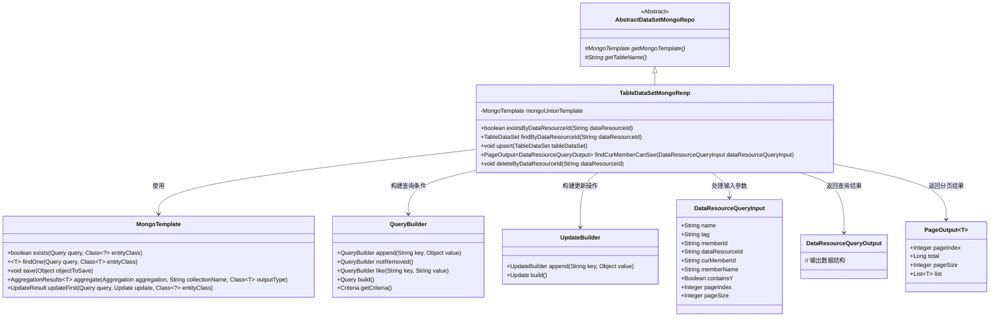
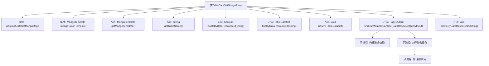

# 基础信息

|      |      |
|------|------|
| 名称 | TableDataSetMongoReop |
| 编码语言 | .java |
| 代码路径 | WeFe/common/java/common-data-mongodb/src/main/java/com/welab/wefe/common/data/mongodb/repo/TableDataSetMongoReop.java |
| 包名 | com.welab.wefe.common.data.mongodb.repo |
| 依赖项 | ['com.welab.wefe.common.data.mongodb.constant.MongodbTable', 'com.welab.wefe.common.data.mongodb.dto.PageOutput', 'com.welab.wefe.common.data.mongodb.dto.dataresource.DataResourceQueryInput', 'com.welab.wefe.common.data.mongodb.dto.dataresource.DataResourceQueryOutput', 'com.welab.wefe.common.data.mongodb.dto.dataset.DataSetQueryOutput', 'com.welab.wefe.common.data.mongodb.entity.union.TableDataSet', 'com.welab.wefe.common.data.mongodb.util.AddFieldsOperation', 'com.welab.wefe.common.data.mongodb.util.QueryBuilder', 'com.welab.wefe.common.data.mongodb.util.UpdateBuilder', 'com.welab.wefe.common.util.JObject', 'org.apache.commons.lang3.StringUtils', 'org.springframework.beans.factory.annotation.Autowired', 'org.springframework.data.domain.Sort', 'org.springframework.data.mongodb.core.MongoTemplate', 'org.springframework.data.mongodb.core.aggregation', 'org.springframework.data.mongodb.core.query.Criteria', 'org.springframework.data.mongodb.core.query.Query', 'org.springframework.data.mongodb.core.query.Update', 'org.springframework.stereotype.Repository', 'java.util.HashMap', 'java.util.List', 'java.util.Map'] |
| 概述说明 | TableDataSetMongoReop类继承AbstractDataSetMongoRepo，使用MongoTemplate操作MongoDB。提供existsByDataResourceId、findByDataResourceId、upsert等方法操作表数据集。findCurMemberCanSee方法通过聚合查询实现分页获取当前用户可见数据，支持条件筛选和排序。deleteByDataResourceId方法逻辑删除数据。 |

# 说明

这是一个名为TableDataSetMongoReop的MongoDB数据访问类，继承自AbstractDataSetMongoRepo。它使用MongoTemplate进行数据库操作，主要操作MongodbTable.Union.TABLE_DATASET表。类中实现了多种数据操作方法：检查数据资源ID是否存在(existsByDataResourceId)、根据ID查询数据(findByDataResourceId)、插入或更新数据(upsert)、删除数据(deleteByDataResourceId)。最复杂的方法是findCurMemberCanSee，它通过聚合查询实现分页获取当前用户可见的数据集，包含多表关联、条件筛选、分页和排序功能。查询条件包括名称、标签、成员ID等，并考虑了数据公开级别和授权成员列表。

# 类列表 Class Summary

| 名称   | 类型  | 说明 |
|-------|------|-------------|
| TableDataSetMongoReop | class | TableDataSetMongoRepo类继承AbstractDataSetMongoRepo，使用MongoTemplate操作MongoDB。提供existsByDataResourceId、findByDataResourceId、upsert、findCurMemberCanSee和deleteByDataResourceId方法，用于查询、更新和删除表数据集。findCurMemberCanSee方法实现复杂聚合查询，支持分页和条件筛选。 |

## 类 TableDataSetMongoReop

|      |      |
|------|------|
| 访问范围 | @Repository;public |
| 类型 | class |
| 名称 | TableDataSetMongoReop |
| 说明 | TableDataSetMongoRepo类继承AbstractDataSetMongoRepo，使用MongoTemplate操作MongoDB。提供existsByDataResourceId、findByDataResourceId、upsert、findCurMemberCanSee和deleteByDataResourceId方法，用于查询、更新和删除表数据集。findCurMemberCanSee方法实现复杂聚合查询，支持分页和条件筛选。 |

### UML类图

该类图展示了TableDataSetMongoReop继承自AbstractDataSetMongoRepo，并依赖MongoTemplate进行数据库操作。主要功能包括数据存在性检查、查询、更新和分页查询等。通过QueryBuilder和UpdateBuilder构建查询和更新条件，处理DataResourceQueryInput参数并返回DataResourceQueryOutput结果或分页的PageOutput。整体设计体现了对MongoDB操作的封装和复杂查询的支持。

### 内部方法调用关系图

这段代码是一个MongoDB数据访问层的实现类，主要用于对表数据集(TableDataSet)进行CRUD操作。核心功能包括：通过数据资源ID检查存在性、查询数据、批量更新插入(upsert)、分页查询当前用户可见数据、以及逻辑删除操作。其中最复杂的是findCurMemberCanSee方法，它通过多阶段聚合查询实现跨表关联(MEMBER/DATA_RESOURCE)、条件过滤、分页和排序功能，最终返回分页结果。所有数据库操作都通过mongoUnionTemplate执行，并包含数据有效性校验和逻辑删除处理。

### 字段列表 Field List

| 名称  | 类型  | 说明 |
|-------|-------|------|
| mongoUnionTemplate | MongoTemplate | 使用@Autowired自动注入名为mongoUnionTemplate的MongoTemplate实例。 |

### 方法列表

| 名称  | 类型  | 说明 |
|-------|-------|------|
| existsByDataResourceId | boolean | 检查指定数据资源ID是否存在。若ID为空返回false，否则查询MongoDB中未删除的对应记录并返回是否存在结果。 |
| findByDataResourceId | TableDataSet | 根据数据资源ID查询表数据集，若ID为空返回null，否则构建查询条件并返回MongoDB中的匹配结果。 |
| getMongoTemplate | MongoTemplate | 重写getMongoTemplate方法，返回mongoUnionTemplate实例。 |
| getTableName | String | 重写方法返回Mongodb数据集表名Union.TABLE_DATASET。 |
| upsert | void | Java方法：使用MongoDB模板保存或更新表数据集。 |
| findCurMemberCanSee | PageOutput<DataResourceQueryOutput> | 该方法通过MongoDB聚合查询，根据输入条件筛选当前用户可见的数据资源，返回分页结果。包含数据集关联、成员关联、条件匹配、分页和排序处理。 |
| deleteByDataResourceId | void | 该方法通过dataResourceId查询并更新MongoDB记录，将status字段设为1。使用MongoUnionTemplate执行操作。 |

