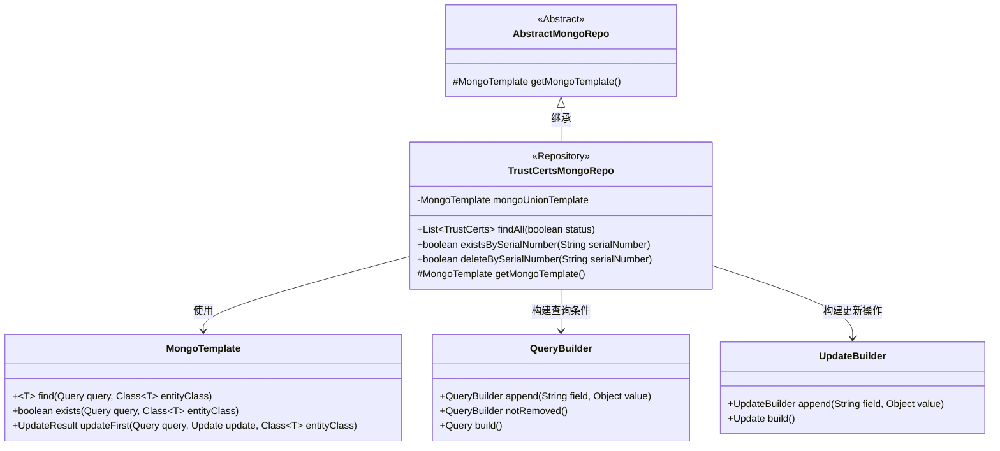
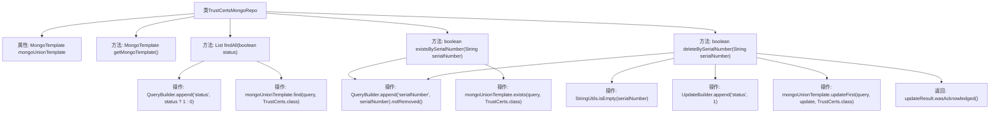

# 基础信息

|      |      |
|------|------|
| 名称 | TrustCertsMongoRepo |
| 编码语言 | .java |
| 代码路径 | WeFe/common/java/common-data-mongodb/src/main/java/com/welab/wefe/common/data/mongodb/repo/TrustCertsMongoRepo.java |
| 包名 | com.welab.wefe.common.data.mongodb.repo |
| 依赖项 | ['com.mongodb.client.result.UpdateResult', 'com.welab.wefe.common.data.mongodb.entity.union.DataResourceDefaultTag', 'com.welab.wefe.common.data.mongodb.entity.union.TrustCerts', 'com.welab.wefe.common.data.mongodb.entity.union.UnionNode', 'com.welab.wefe.common.data.mongodb.entity.union.ext.UnionNodeExtJSON', 'com.welab.wefe.common.data.mongodb.util.QueryBuilder', 'com.welab.wefe.common.data.mongodb.util.UpdateBuilder', 'org.apache.commons.lang3.StringUtils', 'org.springframework.beans.factory.annotation.Autowired', 'org.springframework.data.mongodb.core.MongoTemplate', 'org.springframework.data.mongodb.core.query.Query', 'org.springframework.data.mongodb.core.query.Update', 'org.springframework.stereotype.Repository', 'java.util.List'] |
| 概述说明 | TrustCertsMongoRepo类继承AbstractMongoRepo，使用MongoTemplate操作数据库。提供查询所有证书、按序列号查询存在性和删除功能。删除通过标记状态实现。 |

# 说明

TrustCertsMongoRepo是一个继承自AbstractMongoRepo的MongoDB仓库类，使用@Repository注解标记。它通过@Autowired注入MongoTemplate实例mongoUnionTemplate，并重写getMongoTemplate方法返回该实例。类中定义了三个核心方法：findAll根据状态参数查询所有TrustCerts记录；existsBySerialNumber检查指定序列号的记录是否存在；deleteBySerialNumber通过更新状态字段实现逻辑删除，返回操作是否成功。所有查询均通过QueryBuilder构建条件，并确保未删除记录。

# 类列表 Class Summary

| 名称   | 类型  | 说明 |
|-------|------|-------------|
| TrustCertsMongoRepo | class | TrustCertsMongoRepo类继承AbstractMongoRepo，使用MongoTemplate操作数据库。包含查询所有证书、按序列号检查存在性及删除功能，通过QueryBuilder构建查询条件。 |

## 类 TrustCertsMongoRepo

|      |      |
|------|------|
| 访问范围 | @Repository;public |
| 类型 | class |
| 名称 | TrustCertsMongoRepo |
| 说明 | TrustCertsMongoRepo类继承AbstractMongoRepo，使用MongoTemplate操作数据库。包含查询所有证书、按序列号检查存在性及删除功能，通过QueryBuilder构建查询条件。 |

### UML类图

这段类图描述了TrustCertsMongoRepo及其相关类的结构。TrustCertsMongoRepo继承自AbstractMongoRepo，并依赖MongoTemplate进行数据库操作。它使用QueryBuilder构建查询条件，使用UpdateBuilder构建更新操作，提供了findAll、existsBySerialNumber和deleteBySerialNumber等方法，用于查询和操作TrustCerts数据。类图清晰地展示了这些类之间的关系和主要方法。

### 内部方法调用关系图

这段代码展示了一个MongoDB仓库类TrustCertsMongoRepo，继承自AbstractMongoRepo，主要功能包括查询所有状态匹配的证书、检查序列号是否存在以及逻辑删除指定序列号的证书。通过@Autowired注入MongoTemplate实例，核心操作包括构建查询条件、执行数据库操作和处理返回结果。流程图清晰地展示了类结构、方法调用关系和数据操作流程，特别是deleteBySerialNumber方法包含空值校验和更新状态的多步操作。

### 字段列表 Field List

| 名称  | 类型  | 说明 |
|-------|-------|------|
| mongoUnionTemplate | MongoTemplate | 使用@Autowired自动注入MongoTemplate实例mongoUnionTemplate。 |

### 方法列表

| 名称  | 类型  | 说明 |
|-------|-------|------|
| existsBySerialNumber | boolean | 检查指定序列号的证书是否存在，查询未删除记录并返回布尔结果。 |
| findAll | List<TrustCerts> | 查询指定状态的TrustCerts列表，使用MongoDB模板根据status参数（1或0）构建查询并返回结果。 |
| getMongoTemplate | MongoTemplate | 重写方法返回MongoDB模板实例mongoUnionTemplate。 |
| deleteBySerialNumber | boolean | 该方法通过序列号删除记录，先检查序列号非空，构建查询和更新条件，执行MongoDB更新操作并返回是否成功。 |

