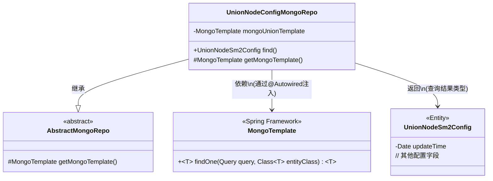
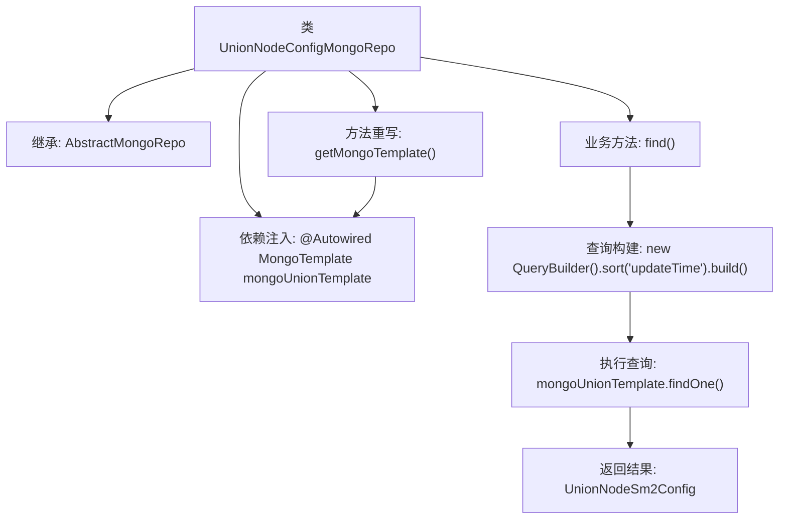

# 基础信息

|      |      |
|------|------|
| 名称 | UnionNodeConfigMongoRepo |
| 编码语言 | .java |
| 代码路径 | WeFe/common/java/common-data-mongodb/src/main/java/com/welab/wefe/common/data/mongodb/repo/UnionNodeConfigMongoRepo.java |
| 包名 | com.welab.wefe.common.data.mongodb.repo |
| 依赖项 | ['com.welab.wefe.common.data.mongodb.entity.union.UnionNodeSm2Config', 'com.welab.wefe.common.data.mongodb.util.QueryBuilder', 'org.springframework.beans.factory.annotation.Autowired', 'org.springframework.data.mongodb.core.MongoTemplate', 'org.springframework.stereotype.Repository'] |
| 概述说明 | UnionNodeConfigMongoRepo是一个MongoDB仓库类，继承AbstractMongoRepo，使用mongoUnionTemplate操作数据库，提供find方法按updateTime排序查询UnionNodeSm2Config。 |

# 说明

这是一个名为UnionNodeConfigMongoRepo的MongoDB仓库类，继承自AbstractMongoRepo基类。它通过@Repository注解标识为Spring管理的仓库组件。类中注入了名为mongoUnionTemplate的MongoTemplate实例，并通过重写getMongoTemplate方法返回该实例。主要提供了find方法，用于查询UnionNodeSm2Config类型的数据，查询时会按updateTime字段排序并返回第一条记录。整个类专注于处理UnionNodeSm2Config实体的MongoDB操作。

# 类列表 Class Summary

| 名称   | 类型  | 说明 |
|-------|------|-------------|
| UnionNodeConfigMongoRepo | class | UnionNodeConfigMongoRepo是一个MongoDB仓库类，继承AbstractMongoRepo，使用mongoUnionTemplate操作数据库，提供find方法按updateTime排序查询UnionNodeSm2Config。 |

## 类 UnionNodeConfigMongoRepo

|      |      |
|------|------|
| 访问范围 | @Repository;public |
| 类型 | class |
| 名称 | UnionNodeConfigMongoRepo |
| 说明 | UnionNodeConfigMongoRepo是一个MongoDB仓库类，继承AbstractMongoRepo，使用mongoUnionTemplate操作数据库，提供find方法按updateTime排序查询UnionNodeSm2Config。 |

### UML类图

这段代码展示了一个Spring Data MongoDB的存储库实现，其中UnionNodeConfigMongoRepo继承自抽象基类AbstractMongoRepo，并通过@Autowired注入MongoTemplate实例。核心功能是通过find()方法查询UnionNodeSm2Config实体，按updateTime排序后返回单个结果。类图清晰地体现了继承关系、依赖注入和返回类型关联，符合MongoDB数据访问层的典型设计模式。

### 内部方法调用关系图

该流程图展示了UnionNodeConfigMongoRepo类的完整结构和工作流程。类继承自AbstractMongoRepo，通过@Autowired注入MongoTemplate实例，重写了父类的getMongoTemplate方法。核心业务方法find()通过QueryBuilder构建排序查询，使用mongoTemplate执行findOne操作并返回UnionNodeSm2Config类型结果。整个流程清晰地呈现了从依赖注入到查询执行的完整调用链，体现了Spring Data MongoDB的典型仓库模式实现。

### 字段列表 Field List

| 名称  | 类型  | 说明 |
|-------|-------|------|
| mongoUnionTemplate | MongoTemplate | 使用@Autowired自动注入MongoTemplate实例mongoUnionTemplate。 |

### 方法列表

| 名称  | 类型  | 说明 |
|-------|-------|------|
| getMongoTemplate | MongoTemplate | 重写getMongoTemplate方法，返回mongoUnionTemplate实例。 |
| find | UnionNodeSm2Config | 查询MongoDB中UnionNodeSm2Config集合，按updateTime排序并返回第一条记录。 |

