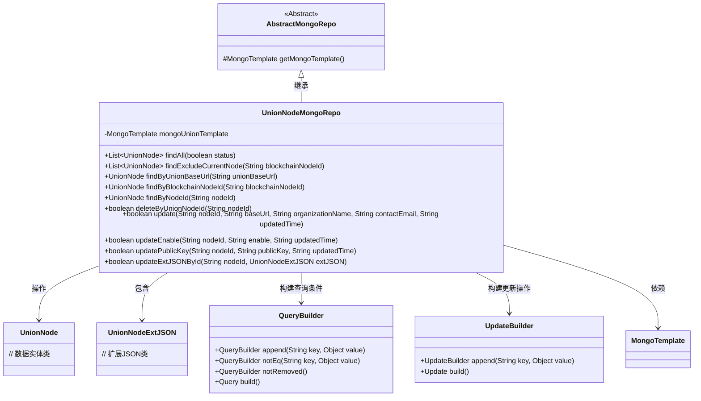

# 基础信息

|      |      |
|------|------|
| 名称 | UnionNodeMongoRepo |
| 编码语言 | .java |
| 代码路径 | WeFe/common/java/common-data-mongodb/src/main/java/com/welab/wefe/common/data/mongodb/repo/UnionNodeMongoRepo.java |
| 包名 | com.welab.wefe.common.data.mongodb.repo |
| 依赖项 | ['com.mongodb.client.result.UpdateResult', 'com.welab.wefe.common.data.mongodb.entity.union.UnionNode', 'com.welab.wefe.common.data.mongodb.entity.union.ext.UnionNodeExtJSON', 'com.welab.wefe.common.data.mongodb.util.QueryBuilder', 'com.welab.wefe.common.data.mongodb.util.UpdateBuilder', 'org.apache.commons.lang3.StringUtils', 'org.springframework.beans.factory.annotation.Autowired', 'org.springframework.data.mongodb.core.MongoTemplate', 'org.springframework.data.mongodb.core.query.Query', 'org.springframework.data.mongodb.core.query.Update', 'org.springframework.stereotype.Repository', 'java.util.List'] |
| 概述说明 | UnionNodeMongoRepo类继承AbstractMongoRepo，提供对UnionNode的CRUD操作，包括按状态、URL、节点ID等查询，以及更新、删除功能。 |

# 说明

UnionNodeMongoRepo是一个继承自AbstractMongoRepo的MongoDB仓库类，用于管理UnionNode实体的数据库操作。它通过注入的MongoTemplate执行查询和更新操作。主要功能包括：根据状态查找所有节点、排除指定节点查询、通过不同属性（如baseUrl、blockchainNodeId、nodeId）查找单个节点。更新操作支持修改节点基础信息、启用状态、公钥和扩展JSON数据。删除操作通过标记状态实现。所有操作均包含非空校验和软删除检查。

# 类列表 Class Summary

| 名称   | 类型  | 说明 |
|-------|------|-------------|
| UnionNodeMongoRepo | class | UnionNodeMongoRepo类继承AbstractMongoRepo，提供对UnionNode的CRUD操作，包括按状态、URL、节点ID等查询，以及更新、删除功能。使用MongoTemplate实现数据访问。 |

## 类 UnionNodeMongoRepo

|      |      |
|------|------|
| 访问范围 | @Repository;public |
| 类型 | class |
| 名称 | UnionNodeMongoRepo |
| 说明 | UnionNodeMongoRepo类继承AbstractMongoRepo，提供对UnionNode的CRUD操作，包括按状态、URL、节点ID等查询，以及更新、删除功能。使用MongoTemplate实现数据访问。 |

### UML类图

这段代码展示了一个MongoDB数据访问层实现类UnionNodeMongoRepo，继承自AbstractMongoRepo抽象类。该类通过MongoTemplate执行CRUD操作，主要管理UnionNode实体及其扩展属性UnionNodeExtJSON。使用QueryBuilder和UpdateBuilder分别构建查询条件和更新操作，包含状态查询、排除特定节点查询、多字段更新等功能。所有数据库操作都包含逻辑删除检查（notRemoved），并返回操作结果状态。类图清晰地展示了各组件间的继承、依赖和关联关系。

### 内部方法调用关系图

```mermaid
graph TD
    A["类UnionNodeMongoRepo"]
    B["属性: MongoTemplate mongoUnionTemplate"]
    C["方法: MongoTemplate getMongoTemplate()"]
    D["方法: List<UnionNode> findAll(boolean status)"]
    E["方法: List<UnionNode> findExcludeCurrentNode(String blockchainNodeId)"]
    F["方法: UnionNode findByUnionBaseUrl(String unionBaseUrl)"]
    G["方法: UnionNode findByBlockchainNodeId(String blockchainNodeId)"]
    H["方法: UnionNode findByNodeId(String nodeId)"]
    I["方法: boolean deleteByUnionNodeId(String nodeId)"]
    J["方法: boolean update(String nodeId, String baseUrl, String organizationName, String contactEmail, String updatedTime)"]
    K["方法: boolean updateEnable(String nodeId, String enable, String updatedTime)"]
    L["方法: boolean updatePublicKey(String nodeId, String publicKey, String updatedTime)"]
    M["方法: boolean updateExtJSONById(String nodeId, UnionNodeExtJSON extJSON)"]

    A --> B
    A --> C
    A --> D
    A --> E
    A --> F
    A --> G
    A --> H
    A --> I
    A --> J
    A --> K
    A --> L
    A --> M
```

这段代码定义了一个名为`UnionNodeMongoRepo`的MongoDB仓库类，继承自`AbstractMongoRepo`，主要用于对`UnionNode`集合进行CRUD操作。类中包含了多个查询和更新方法，如根据状态查询所有节点、排除指定节点的查询、根据URL或ID查询单个节点，以及更新节点信息、公钥、扩展JSON等操作。所有方法都通过`mongoUnionTemplate`执行MongoDB操作，并使用`QueryBuilder`和`UpdateBuilder`构建查询和更新条件。

### 字段列表 Field List

| 名称  | 类型  | 说明 |
|-------|-------|------|
| mongoUnionTemplate | MongoTemplate | 使用@Autowired自动注入名为mongoUnionTemplate的MongoTemplate实例。 |

### 方法列表

| 名称  | 类型  | 说明 |
|-------|-------|------|
| deleteByUnionNodeId | boolean | 该方法通过nodeId删除联合节点，先检查nodeId非空，然后构建查询条件并更新状态为1，最后返回操作是否成功。 |
| findByNodeId | UnionNode | 方法通过nodeId查询未删除的UnionNode，使用MongoDB模板构建查询条件并返回结果。 |
| findByBlockchainNodeId | UnionNode | 该方法通过MongoDB查询指定区块链节点ID的UnionNode对象，排除已标记删除的记录。 |
| findByUnionBaseUrl | UnionNode | 方法通过MongoDB查询指定baseUrl且未删除的UnionNode记录。 |
| findExcludeCurrentNode | List<UnionNode> | 查找排除指定节点的有效联盟节点列表。通过MongoDB查询，筛选非当前节点、未删除且启用的节点。 |
| findAll | List<UnionNode> | 查询MongoDB中状态匹配的UnionNode列表，参数status为真时查1否则查0。 |
| update | boolean | 方法update根据nodeId更新MongoDB记录，包含baseUrl、organizationName、contactEmail和updatedTime字段。若nodeId为空返回false，否则执行更新并返回操作是否成功。 |
| getMongoTemplate | MongoTemplate | 重写getMongoTemplate方法，返回mongoUnionTemplate实例。 |
| updateEnable | boolean | 方法updateEnable根据nodeId更新MongoDB中UnionNode的enable和updatedTime字段，返回操作是否成功。参数非空校验，使用MongoDB模板执行更新。 |
| updatePublicKey | boolean | 更新节点公钥方法：检查nodeId非空后，构建查询和更新条件，通过MongoDB更新指定节点的公钥和更新时间，返回操作是否成功。 |
| updateExtJSONById | boolean | 方法updateExtJSONById通过nodeId更新MongoDB中UnionNode的extJson字段，参数非空时执行更新并返回操作是否成功。 |

