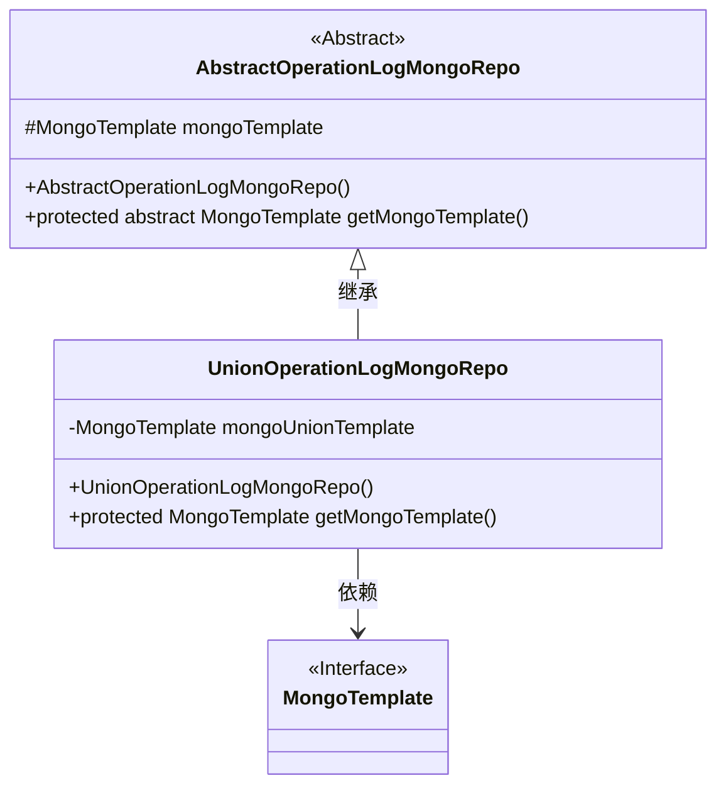
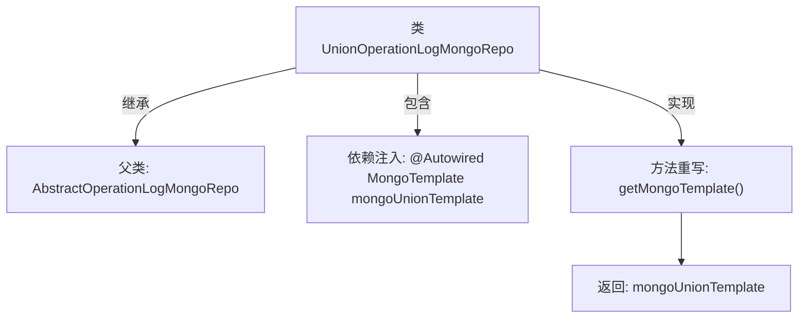

# 基础信息

|      |      |
|------|------|
| 名称 | UnionOperationLogMongoRepo |
| 编码语言 | .java |
| 代码路径 | WeFe/common/java/common-data-mongodb/src/main/java/com/welab/wefe/common/data/mongodb/repo/UnionOperationLogMongoRepo.java |
| 包名 | com.welab.wefe.common.data.mongodb.repo |
| 依赖项 | ['org.springframework.beans.factory.annotation.Autowired', 'org.springframework.data.mongodb.core.MongoTemplate', 'org.springframework.stereotype.Repository'] |
| 概述说明 | UnionOperationLogMongoRepo类继承AbstractOperationLogMongoRepo，通过@Autowired注入mongoUnionTemplate，重写getMongoTemplate方法返回该模板。 |

# 说明

这是一个名为UnionOperationLogMongoRepo的MongoDB仓库类，继承自AbstractOperationLogMongoRepo抽象类。该类使用@Repository注解标识为Spring管理的仓库组件。它通过@Autowired自动注入了一个名为mongoUnionTemplate的MongoTemplate实例，并重写了父类的getMongoTemplate方法，返回这个注入的mongoUnionTemplate实例。这个类主要用于处理联合操作日志相关的MongoDB数据库操作。

# 类列表 Class Summary

| 名称   | 类型  | 说明 |
|-------|------|-------------|
| UnionOperationLogMongoRepo | class | UnionOperationLogMongoRepo类继承AbstractOperationLogMongoRepo，使用@Repository注解，通过@Autowired注入mongoUnionTemplate，重写getMongoTemplate方法返回该模板。 |

## 类 UnionOperationLogMongoRepo

|      |      |
|------|------|
| 访问范围 | @Repository;public |
| 类型 | class |
| 名称 | UnionOperationLogMongoRepo |
| 说明 | UnionOperationLogMongoRepo类继承AbstractOperationLogMongoRepo，使用@Repository注解，通过@Autowired注入mongoUnionTemplate，重写getMongoTemplate方法返回该模板。 |

### UML类图

这段代码展示了一个MongoDB仓储层的实现结构。UnionOperationLogMongoRepo继承自抽象类AbstractOperationLogMongoRepo，并实现了获取MongoTemplate的抽象方法。通过@Autowired注入了名为mongoUnionTemplate的MongoDB操作模板，该模板在子类中覆盖父类方法返回。类图清晰地反映了继承关系和依赖注入模式，符合Spring Data MongoDB的典型仓储实现方式。

### 内部方法调用关系图

这段流程图描述了UnionOperationLogMongoRepo类的结构。该类继承自AbstractOperationLogMongoRepo，通过@Autowired注解注入MongoTemplate类型的mongoUnionTemplate，并重写了父类的getMongoTemplate方法，返回注入的mongoUnionTemplate实例。整个流程展示了类继承、依赖注入和方法重写的关键关系，体现了Spring Data MongoDB中模板模式的典型实现方式。

### 字段列表 Field List

| 名称  | 类型  | 说明 |
|-------|-------|------|
| mongoUnionTemplate | MongoTemplate | 自动注入MongoDB操作模板mongoUnionTemplate。 |

### 方法列表

| 名称  | 类型  | 说明 |
|-------|-------|------|
| getMongoTemplate | MongoTemplate | 重写getMongoTemplate方法，返回mongoUnionTemplate实例。 |

