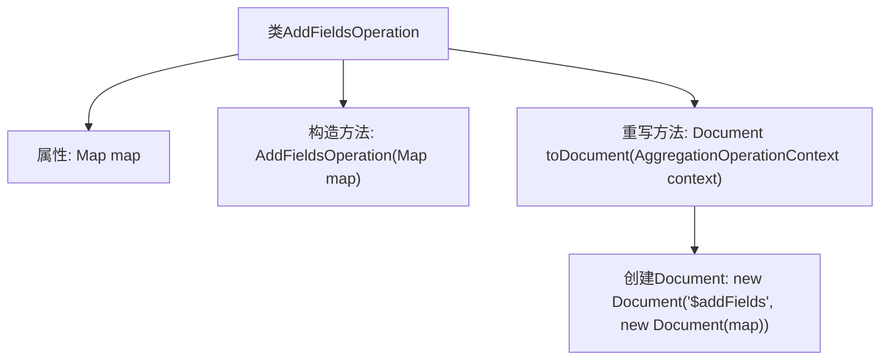

# 基础信息

|      |      |
|------|------|
| 名称 | AddFieldsOperation |
| 编码语言 | .java |
| 代码路径 | WeFe/common/java/common-data-mongodb/src/main/java/com/welab/wefe/common/data/mongodb/util/AddFieldsOperation.java |
| 包名 | com.welab.wefe.common.data.mongodb.util |
| 依赖项 | ['org.bson.Document', 'org.springframework.data.mongodb.core.aggregation.AggregationOperation', 'org.springframework.data.mongodb.core.aggregation.AggregationOperationContext', 'java.util.Map'] |
| 概述说明 | AddFieldsOperation类实现AggregationOperation接口，通过构造函数接收Map参数，并在toDocument方法中生成包含$addFields操作的MongoDB聚合文档。 |

# 说明

这是一个名为AddFieldsOperation的类，实现了AggregationOperation接口。该类用于在聚合操作中添加新字段。它包含一个Map类型的成员变量map，用于存储字段名和对应值。构造函数接收一个Map参数并初始化成员变量。重写的toDocument方法将map转换为MongoDB聚合管道操作符$addFields所需的Document格式，最终返回包含$addFields操作和对应字段映射的Document对象。

# 类列表 Class Summary

| 名称   | 类型  | 说明 |
|-------|------|-------------|
| AddFieldsOperation | class | AddFieldsOperation类实现AggregationOperation接口，通过构造函数接收Map参数，toDocument方法返回包含$addFields操作的MongoDB文档。 |


## 类 AddFieldsOperation

|      |      |
|------|------|
| 访问范围 | public |
| 类型 | class |
| 名称 | AddFieldsOperation |
| 说明 | AddFieldsOperation类实现AggregationOperation接口，通过构造函数接收Map参数，toDocument方法返回包含$addFields操作的MongoDB文档。 |


### UML类图

```mermaid
classDiagram
    class AddFieldsOperation {
        -Map~String, Object~ map
        +AddFieldsOperation(Map~String, Object~ map)
        +Document toDocument(AggregationOperationContext aggregationOperationContext)
    }

    <<Interface>> AggregationOperation {
        +Document toDocument(AggregationOperationContext aggregationOperationContext)
    }

    AddFieldsOperation ..|> AggregationOperation : 实现
```

这段类图展示了AddFieldsOperation类实现了AggregationOperation接口的结构。AddFieldsOperation包含一个私有Map类型字段map，通过构造函数初始化，并实现了接口要求的toDocument方法。该方法的参数为AggregationOperationContext类型，返回值为Document对象。类与接口之间用实线空心三角箭头表示实现关系，符合UML规范。


### 内部方法调用关系图



这段代码流程图展示了AddFieldsOperation类的结构，它是一个实现AggregationOperation接口的类，主要用于在聚合操作中添加新字段。类中包含一个Map类型的属性map，通过构造方法初始化该属性，并重写了toDocument方法，该方法会创建一个包含"$addFields"操作符和map数据的MongoDB文档对象。整个流程清晰地反映了从类构造到生成聚合操作文档的过程。

### 字段列表 Field List

| 名称  | 类型  | 说明 |
|-------|-------|------|
| map | Map<String, Object> | 声明一个名为map的私有变量，类型为Map，键为String，值为Object。 |

### 方法列表

| 名称  | 类型  | 说明 |
|-------|-------|------|
| toDocument | Document | Java方法重写，将map转为MongoDB的$addFields操作文档。 |


