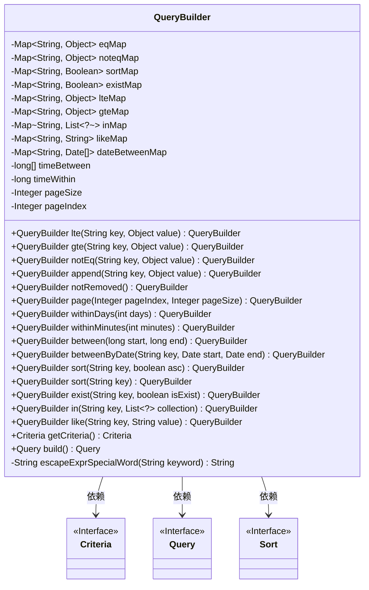
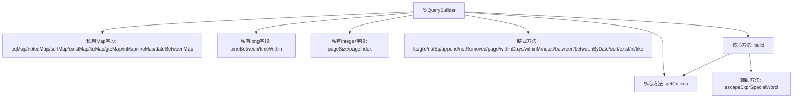

# 基础信息

|      |      |
|------|------|
| 名称 | QueryBuilder |
| 编码语言 | .java |
| 代码路径 | WeFe/common/java/common-data-mongodb/src/main/java/com/welab/wefe/common/data/mongodb/util/QueryBuilder.java |
| 包名 | com.welab.wefe.common.data.mongodb.util |
| 依赖项 | ['org.apache.commons.lang3.StringUtils', 'org.springframework.data.domain.Sort', 'org.springframework.data.mongodb.core.query.Criteria', 'org.springframework.data.mongodb.core.query.Query', 'java.util'] |
| 概述说明 | QueryBuilder类用于构建查询条件，支持等于、不等于、范围、排序、分页等操作，最终生成Criteria和Query对象。 |

# 说明

QueryBuilder是一个用于构建查询条件的工具类，支持多种查询操作符和分页排序功能。它包含多个Map用于存储不同类型的查询条件，如等于、不等于、大于等于、小于等于、存在性检查、模糊匹配、范围查询等。类提供了链式调用的方法，如lte、gte、notEq、append、sort、exist、in、like等，用于设置查询条件。还支持时间范围查询和分页功能，通过page方法设置页码和每页大小。最终通过getCriteria方法生成查询条件，build方法构建完整的查询对象。此外，还包含一个辅助方法escapeExprSpecialWord用于转义特殊字符。

# 类列表 Class Summary

| 名称   | 类型  | 说明 |
|-------|------|-------------|
| QueryBuilder | class | QueryBuilder类用于构建查询条件，支持等于、不等于、范围、排序、分页等操作，最终生成Criteria和Query对象。 |

## 类 QueryBuilder

|      |      |
|------|------|
| 访问范围 | public |
| 类型 | class |
| 名称 | QueryBuilder |
| 说明 | QueryBuilder类用于构建查询条件，支持等于、不等于、范围、排序、分页等操作，最终生成Criteria和Query对象。 |

### UML类图

这段代码定义了一个`QueryBuilder`类，用于构建复杂的查询条件。该类通过多个Map存储不同类型的查询条件（如等于、不等于、范围、排序等），并提供了链式调用的方法来添加这些条件。最终，这些条件会被转换为`Criteria`对象，并构建成`Query`对象返回。类图中展示了`QueryBuilder`的主要成员变量和方法，以及它与`Criteria`、`Query`和`Sort`接口的依赖关系。

### 内部方法调用关系图

该流程图展示了QueryBuilder类的完整结构，包含9个不同类型的Map字段用于存储查询条件，2个时间相关long字段和2个分页控制字段。通过15个链式方法构建查询条件，最终通过build方法生成Query对象，其中依赖getCriteria方法构造查询标准，并调用escapeExprSpecialWord处理特殊字符。所有方法均返回this实现链式调用，支持多种条件组合查询和分页排序功能。

### 字段列表 Field List

| 名称  | 类型  | 说明 |
|-------|-------|------|
| sortMap = new LinkedHashMap<>() | Map<String, Boolean> | 定义一个有序映射变量sortMap，键为字符串，值为布尔类型。 |
| pageIndex | Integer | 私有整型变量pageIndex，用于表示页码索引。 |
| inMap = new LinkedHashMap<>() | Map<String, List<?>> | 定义一个私有LinkedHashMap变量inMap，键为String，值为泛型List。 |
| dateBetweenMap = new LinkedHashMap<>() | Map<String, Date[]> | 私有变量dateBetweenMap，使用LinkedHashMap存储字符串键与日期数组值的映射。 |
| timeBetween = new long[2] | long[] | 声明一个长度为2的long型数组timeBetween，用于存储两个时间间隔值。 |
| timeWithin | long | 私有长整型变量，记录时间间隔。 |
| existMap = new LinkedHashMap<>() | Map<String, Boolean> | 私有LinkedHashMap变量existMap，键为String，值为Boolean。 |
| lteMap = new LinkedHashMap<>() | Map<String, Object> | 声明一个名为lteMap的私有变量，类型为LinkedHashMap，键为String，值为Object。 |
| pageSize | Integer | 私有整型变量，用于定义每页大小。 |
| gteMap = new LinkedHashMap<>() | Map<String, Object> | 创建有序键值映射表，键为字符串，值为对象。 |
| likeMap = new LinkedHashMap<>() | Map<String, String> | 声明一个有序键值对集合likeMap，键值类型均为String。 |
| eqMap = new LinkedHashMap<>() | Map<String, Object> | 私有LinkedHashMap变量eqMap，键为String，值为Object。 |
| noteqMap = new LinkedHashMap<>() | Map<String, Object> | 定义有序键值映射noteqMap，键为字符串，值为对象。 |

### 方法列表

| 名称  | 类型  | 说明 |
|-------|-------|------|
| betweenByDate | QueryBuilder | 该方法用于构建日期范围查询，接收键名、开始和结束日期，将日期对存入映射并返回当前构建器实例。 |
| gte | QueryBuilder | 方法gte在QueryBuilder中，将键值对存入gteMap并返回当前实例。 |
| exist | QueryBuilder | 该方法为QueryBuilder类添加了一个exist方法，接收键名和布尔值参数，存入existMap后返回当前对象实例。 |
| withinMinutes | QueryBuilder | 方法withinMinutes设置查询时间范围为当前时间前推指定分钟数，返回QueryBuilder实例以便链式调用。 |
| notEq | QueryBuilder | 该方法为QueryBuilder类的不等于条件构建方法，接收键值对参数并存入noteqMap，返回当前对象以支持链式调用。 |
| sort | QueryBuilder | 这是一个Java方法，通过指定键对查询结果排序，默认升序。 |
| lte | QueryBuilder | 这是一个QueryBuilder类的方法，用于添加小于等于条件到查询中。方法接收键值对参数，存入lteMap并返回当前对象实例以支持链式调用。 |
| sort | QueryBuilder | 该方法为查询构建器添加排序规则，参数key指定排序字段，asc控制升序或降序，返回当前对象以支持链式调用。 |
| withinDays | QueryBuilder | 方法withinDays设置查询时间范围为当前时间减去指定天数，返回QueryBuilder实例以便链式调用。 |
| between | QueryBuilder | 该方法设置时间范围，接受起始和结束时间参数，更新内部数组并返回当前对象实例。 |
| like | QueryBuilder | 该方法为QueryBuilder类添加like条件，接收键值对参数并存入likeMap，最后返回当前对象以支持链式调用。 |
| getCriteria | Criteria | 该方法构建并返回一个Criteria对象，通过遍历多个Map（eqMap、existMap等）来设置不同条件，包括等于、存在、不等于、范围、模糊匹配等，处理空值和字符串特殊情况，最终返回组合好的查询条件。 |
| build | Query | 构建查询对象，包含条件、排序和分页逻辑。默认分页大小为10，支持升序降序排序。 |
| escapeExprSpecialWord | String | 该函数用于转义字符串中的正则特殊字符，如遇到则添加反斜杠。支持转义字符包括\、$、()、*、+、.、[]、?、^、{}、|等。若输入非空则处理并返回结果。 |
| notRemoved | QueryBuilder | 该方法为QueryBuilder添加条件，筛选状态为0（未移除）的记录，并返回当前对象以支持链式调用。 |
| append | QueryBuilder | 方法append接收键值对，存入eqMap并返回当前QueryBuilder实例，支持链式调用。 |
| in | QueryBuilder | 这是一个Java方法，名为`in`，属于`QueryBuilder`类。它接收一个字符串`key`和一个泛型列表`collection`作为参数，将`key`和`collection`存入`inMap`中，并返回当前`QueryBuilder`实例以支持链式调用。 |
| page | QueryBuilder | 定义分页方法，设置页码和页大小，空或负页码默认为0，返回当前对象。 |

