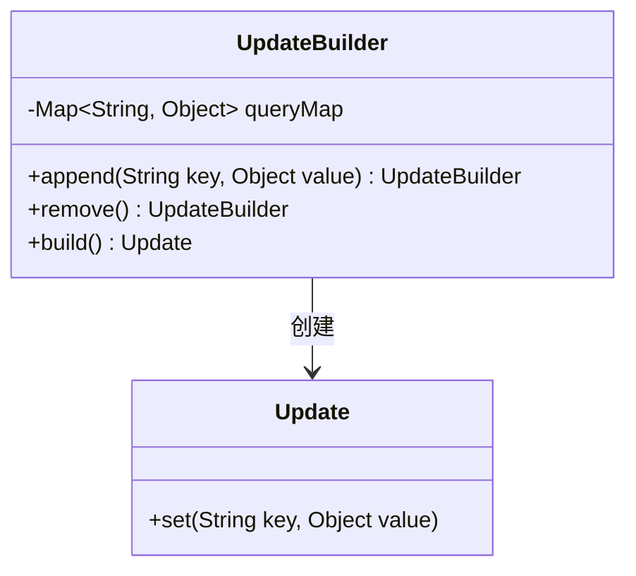
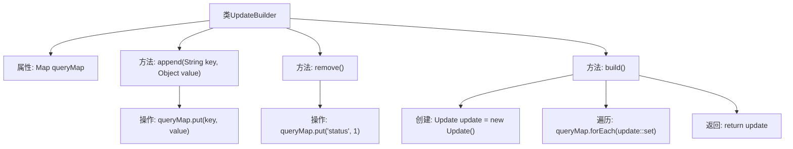

# 基础信息

|      |      |
|------|------|
| 名称 | UpdateBuilder |
| 编码语言 | .java |
| 代码路径 | WeFe/common/java/common-data-mongodb/src/main/java/com/welab/wefe/common/data/mongodb/util/UpdateBuilder.java |
| 包名 | com.welab.wefe.common.data.mongodb.util |
| 依赖项 | ['org.springframework.data.mongodb.core.query.Update', 'java.util.HashMap', 'java.util.Map'] |
| 概述说明 | UpdateBuilder类用于构建更新操作，通过append方法添加键值对，remove方法设置状态为1，build方法生成Update对象并返回。 |

# 说明

UpdateBuilder是一个用于构建更新操作的类，通过内部维护的queryMap存储键值对。提供append方法添加键值对，remove方法设置状态为1，build方法将queryMap内容转换为Update对象并返回。采用链式调用设计，支持连续操作。

# 类列表 Class Summary

| 名称   | 类型  | 说明 |
|-------|------|-------------|
| UpdateBuilder | class | UpdateBuilder类用于构建更新操作，通过append方法添加键值对，remove方法设置状态为1，build方法生成Update对象并返回。 |

## 类 UpdateBuilder

|      |      |
|------|------|
| 访问范围 | public |
| 类型 | class |
| 名称 | UpdateBuilder |
| 说明 | UpdateBuilder类用于构建更新操作，通过append方法添加键值对，remove方法设置状态为1，build方法生成Update对象并返回。 |

### UML类图

这段类图展示了UpdateBuilder和Update两个类的关系。UpdateBuilder是一个构建器模式实现，包含一个私有Map类型成员queryMap用于存储键值对，提供append()和remove()方法修改状态，并通过build()方法创建Update对象。Update类通过set()方法接收构建器的数据。这种设计实现了对象构造与表示的分离，支持链式调用，适用于需要分步骤构建复杂对象的场景。

### 内部方法调用关系图

这段代码流程图展示了UpdateBuilder类的结构和工作流程。该类通过链式调用实现更新操作的构建，核心是通过内部Map存储键值对。append方法添加普通字段，remove方法标记删除状态，build方法最终将Map内容转移到Update对象中。流程图清晰呈现了从字段添加到最终构建Update对象的完整过程，体现了建造者模式的核心思想。

### 字段列表 Field List

| 名称  | 类型  | 说明 |
|-------|-------|------|
| queryMap = new HashMap<>() | Map<String, Object> | 定义一个私有HashMap变量queryMap，键为String类型，值为Object类型。 |

### 方法列表

| 名称  | 类型  | 说明 |
|-------|-------|------|
| append | UpdateBuilder | 方法append接收键值对，存入queryMap并返回当前UpdateBuilder实例，支持链式调用。 |
| remove | UpdateBuilder | UpdateBuilder的remove方法将status设为1并返回自身实例。 |
| build | Update | 该方法创建一个Update对象，遍历queryMap并将键值对设置到update中，最后返回update对象。 |

