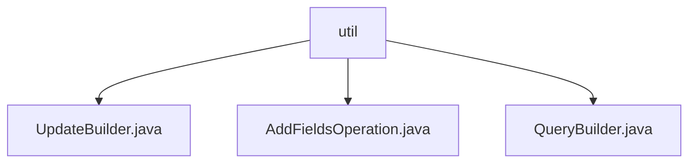

# 基础信息

|      |      |
|------|------|
| 名称 | util |
| 编码语言 | .java |
| 代码路径 | WeFe/common/java/common-data-mongodb/src/main/java/com/welab/wefe/common/data/mongodb/util |
| 包名 | docs.common.java.common-data-mongodb.src.main.java.com.welab.wefe.common.data.mongodb.util |
| 概述说明 | UpdateBuilder类用于构建更新操作，支持链式调用。AddFieldsOperation类实现聚合操作，添加新字段。QueryBuilder类构建查询条件，支持多种操作符和分页排序。 |

# 说明

## 概述  
该模块是MongoDB操作的工具集，核心职责为构建查询条件、更新操作和聚合字段添加。接口规范采用链式调用设计，例如UpdateBuilder支持append/remove/build操作，QueryBuilder提供lte/gte等条件组合。关键数据结构包括QueryBuilder的多条件Map、UpdateBuilder的queryMap以及AddFieldsOperation的字段映射Map。外部依赖仅为MongoDB Java驱动。例如AddFieldsOperation将Map转换为$addFields管道格式。

## 主要业务场景  
模块支持复杂查询构建（如范围筛选+分页）、字段动态更新（类似事件总线模式）和聚合阶段字段注入。典型应用包括：使用QueryBuilder组合多条件查询并分页；通过UpdateBuilder链式设置字段更新状态；在聚合管道中用AddFieldsOperation添加计算字段。API类型涵盖CRUD操作，例如escapeExprSpecialWord处理特殊字符转义。

### 包内部结构视图

该流程图展示了WeFe项目中common-data-mongodb模块下util工具包的类结构关系。util作为父节点包含三个子节点：UpdateBuilder、AddFieldsOperation和QueryBuilder，这三个类文件都属于MongoDB数据库操作工具类，分别用于构建更新操作、添加字段操作和查询操作。这种结构清晰地反映了MongoDB工具类的功能划分。

# 文件列表

| 名称   | 类型  | 说明 |
|-------|------|-------------|
| [UpdateBuilder.java](UpdateBuilder.md) | file | UpdateBuilder类用于构建更新操作，通过append方法添加键值对，remove方法设置状态为1，build方法生成Update对象并返回。 |
| [AddFieldsOperation.java](AddFieldsOperation.md) | file | AddFieldsOperation类实现AggregationOperation接口，通过构造函数接收Map参数，并在toDocument方法中生成包含$addFields操作的MongoDB聚合文档。 |
| [QueryBuilder.java](QueryBuilder.md) | file | QueryBuilder类用于构建查询条件，支持等于、不等于、范围、排序、分页等操作，最终生成Criteria和Query对象。 |

