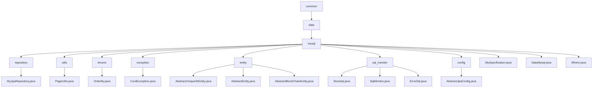

# 基础信息

|      |      |
|------|------|
| 名称 | common |
| 编码语言 | .java |
| 代码路径 | WeFe/common/java/common-data-mysql/src/main/java/com/welab/wefe/common |
| 包名 | docs.common.java.common-data-mysql.src.main.java.com.welab.wefe.common |
| 概述说明 | MyJpaRepository提供分页查询和字符串处理默认方法。PageUtils处理单对象分页。OrderBy枚举定义排序方向。CurdException为自定义异常。实体类继承体系管理通用字段。SQL监控模块捕获慢SQL和错误。抽象JPA配置类创建实体管理器工厂和数据源。MySpecification实现动态查询条件构建。DataMysql为数据库操作基础类。Where类链式构建查询条件。 |

# 说明

## 概述  
该模块是围绕JPA实现的MySQL数据访问层，核心职责是提供标准化CRUD操作与动态查询能力。接口规范包含三层：基础仓库接口（MyJpaRepository扩展JPA原生接口）、条件构建器（Where/MySpecification）和分页工具（PageUtils）。关键数据结构包括分页对象（Pageable）、排序枚举（OrderBy）和条件项（Where.Item）。外部依赖仅JPA和Druid数据源。例如MyJpaRepository通过getPageable方法自动处理分页参数校验。

模块同时实现SQL监控（类似AOP切面）和实体基类继承体系。SQL监控捕获慢查询（阈值100ms）和错误SQL，通过SlowSql/ErrorSql记录统计信息。实体基类（如AbstractUniqueIDEntity）提供全局唯一ID（UUID）和时间戳管理。例如AbstractBlockChainEntity扩展日志时间字段，支持区块链场景。

## 主要业务场景  
模块适用于需要动态查询与标准化数据管理的场景，类似Spring Data JPA增强版。典型流程为：通过Where链式构建条件（如contains模糊匹配），MySpecification生成动态Predicate，MyJpaRepository执行分页查询（如getPageableForAtQuery）。交互模式统一通过方法链组合条件，例如Where.equal().groupBy().build()。

SQL监控通过FilterEventAdapter实现全链路追踪，业务流程包括：执行前计时，判定慢查询/失败后更新统计。实体继承体系支持快速扩展，如区块链实体继承AbstractBlockChainEntity自动获得日志时间字段。完整覆盖从条件构建（支持10+操作符）、分页查询到监控分析的闭环需求。例如PageUtils统一处理单对象分页，CurdException封装业务异常。

### 包内部结构视图

该流程图展示了WeFe项目中common-data-mysql模块的层级结构。从common根目录开始，逐级展开到data、mysql子目录，再细分出repository、utils、enums等子模块。每个子模块包含对应的Java类文件，如repository包含MyJpaRepository.java，utils包含PageUtils.java等。整体结构清晰反映了MySQL数据访问层的组件分类，包括基础工具、异常处理、实体定义和SQL监控等功能模块。

# 文件列表

| 名称   | 类型  | 说明 |
|-------|------|-------------|
| [data](data/_module.md) | package | MyJpaRepository提供分页查询和字符串处理默认方法。PageUtils处理单对象分页。OrderBy枚举定义排序方向。CurdException为自定义异常。实体类继承体系管理通用字段。SQL监控模块捕获慢SQL和错误。抽象JPA配置类创建实体管理器工厂和数据源。MySpecification实现动态查询条件构建。DataMysql为数据库操作基础类。Where类链式构建查询条件。 |

