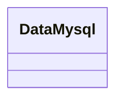

# 基础信息

|      |      |
|------|------|
| 名称 | DataMysql |
| 编码语言 | .java |
| 代码路径 | WeFe/common/java/common-data-mysql/src/main/java/com/welab/wefe/common/data/mysql/DataMysql.java |
| 包名 | com.welab.wefe.common.data.mysql |
| 依赖项 | [] |
| 概述说明 | 类DataMysql用于处理MySQL数据库操作。 |

# 说明

这是一个名为DataMysql的Java公共类定义，用于表示与MySQL数据库相关的数据操作类。该类目前为空实现，未包含任何成员变量或方法，但为后续扩展MySQL数据库连接、查询、更新等操作提供了基础框架结构。作为数据访问层的组成部分，该类通常会被其他业务逻辑类调用以实现数据库交互功能。

# 类列表 Class Summary

| 名称   | 类型  | 说明 |
|-------|------|-------------|
| DataMysql | class | 类DataMysql用于处理MySQL数据库操作。 |

## 类 DataMysql

|      |      |
|------|------|
| 访问范围 | public |
| 类型 | class |
| 名称 | DataMysql |
| 说明 | 类DataMysql用于处理MySQL数据库操作。 |

### UML类图

这段代码定义了一个名为DataMysql的空类，目前没有包含任何属性或方法。从类名推断，它可能与MySQL数据库操作相关，但当前实现仅为框架结构，未体现具体功能。后续可能需要添加数据库连接、查询执行等成员方法，以及连接参数等属性来实现完整的数据访问功能。

### 内部方法调用关系图

这段流程图描述了一个名为DataMysql的空类结构。图中仅包含一个节点表示类声明，没有展示任何属性或方法，因为原始代码中未定义任何类成员。该图准确地反映了代码的当前状态——一个尚未实现任何功能的空类框架，为后续添加数据库操作功能提供了基础结构。

### 字段列表 Field List

| 名称  | 类型  | 说明 |
|-------|-------|------|

### 方法列表

| 名称  | 类型  | 说明 |
|-------|-------|------|

