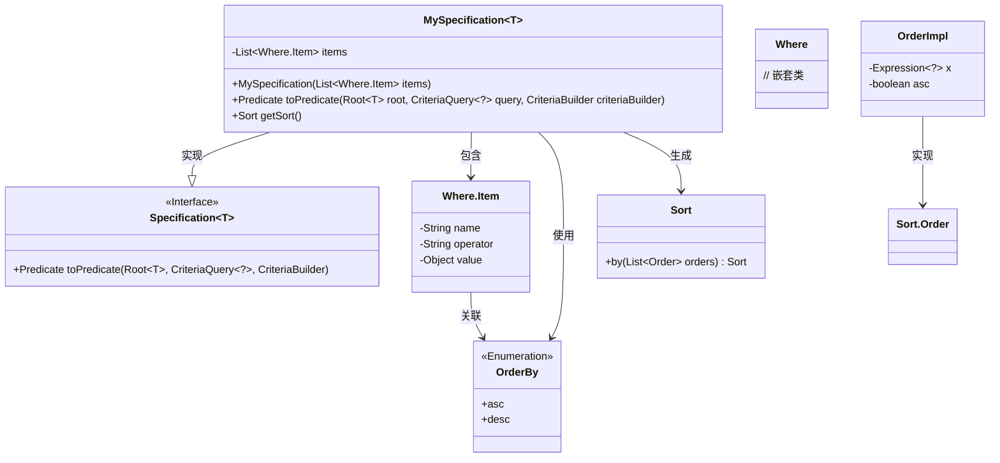
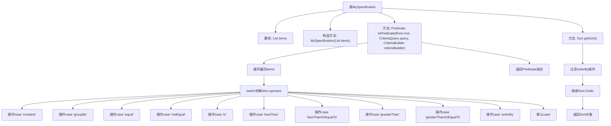

# 基础信息

|      |      |
|------|------|
| 名称 | MySpecification |
| 编码语言 | .java |
| 代码路径 | WeFe/common/java/common-data-mysql/src/main/java/com/welab/wefe/common/data/mysql/MySpecification.java |
| 包名 | com.welab.wefe.common.data.mysql |
| 依赖项 | ['com.welab.wefe.common.data.mysql.enums.OrderBy', 'org.hibernate.query.criteria.internal.OrderImpl', 'org.springframework.data.domain.Sort', 'org.springframework.data.jpa.domain.Specification', 'javax.persistence.criteria', 'java.util.ArrayList', 'java.util.Date', 'java.util.List', 'java.util.stream.Collectors'] |
| 概述说明 | MySpecification类实现Specification接口，根据items列表生成动态查询条件，支持包含、分组、等于、不等于、范围、排序等操作，并转换为JPA Predicate。 |

# 说明

该代码定义了一个泛型类MySpecification，实现了Specification接口，用于构建动态查询条件。类中包含一个Where.Item列表，通过构造函数初始化。主要逻辑在toPredicate方法中，根据不同的操作符（如contains、equal、notEqual、in、lessThan、greaterThan等）生成相应的查询条件，支持字符串模糊匹配、分组、排序等功能。getSort方法用于提取排序信息并生成Sort对象。整体实现了灵活的条件组合与排序功能。

# 类列表 Class Summary

| 名称   | 类型  | 说明 |
|-------|------|-------------|
| MySpecification | class | MySpecification类实现JPA的Specification接口，支持多种查询条件（包含、等于、分组、排序等），通过toPredicate方法构建动态查询谓词，getSort方法返回排序规则。 |

## 类 MySpecification

|      |      |
|------|------|
| 访问范围 | public |
| 类型 | class |
| 名称 | MySpecification |
| 说明 | MySpecification类实现JPA的Specification接口，支持多种查询条件（包含、等于、分组、排序等），通过toPredicate方法构建动态查询谓词，getSort方法返回排序规则。 |

### UML类图

该类图展示了`MySpecification`泛型类实现`Specification`接口的核心结构。该类通过`Where.Item`列表存储查询条件，在`toPredicate`方法中根据操作符类型（如contains/equal/in等）动态构建JPA谓词，并支持分组(groupBy)和排序(orderBy)功能。`getSort`方法则专门处理排序逻辑，将条件转换为Spring Data的`Sort`对象。整体设计实现了灵活的条件组合查询，同时保持与JPA规范及Spring Data的兼容性。

### 内部方法调用关系图

这段代码实现了一个通用的JPA Specification类，用于动态构建查询条件。主要功能包括：1)通过toPredicate方法处理多种查询操作符(如contains/equal/in等)，构建对应的Predicate组合；2)通过getSort方法提取排序条件生成Sort对象。流程图清晰展示了类结构、核心方法逻辑和操作符处理分支，特别是对12种不同查询操作符的处理流程。该设计支持灵活的条件组合，适用于复杂查询场景。

### 字段列表 Field List

| 名称  | 类型  | 说明 |
|-------|-------|------|
| items = new ArrayList<>() | List<Where.Item> | 声明一个私有列表变量items，用于存储Where.Item类型的对象，初始化为空ArrayList。 |

### 方法列表

| 名称  | 类型  | 说明 |
|-------|-------|------|
| toPredicate | Predicate | 代码实现了一个动态条件查询构建器，支持包含、分组、等于、不等于、范围、排序等操作，最终返回组合条件谓词。 |
| getSort | Sort | 该方法通过流处理筛选出操作符为"orderBy"的项，根据枚举值生成升序或降序排序对象，最终返回包含所有排序条件的Sort实例。 |

