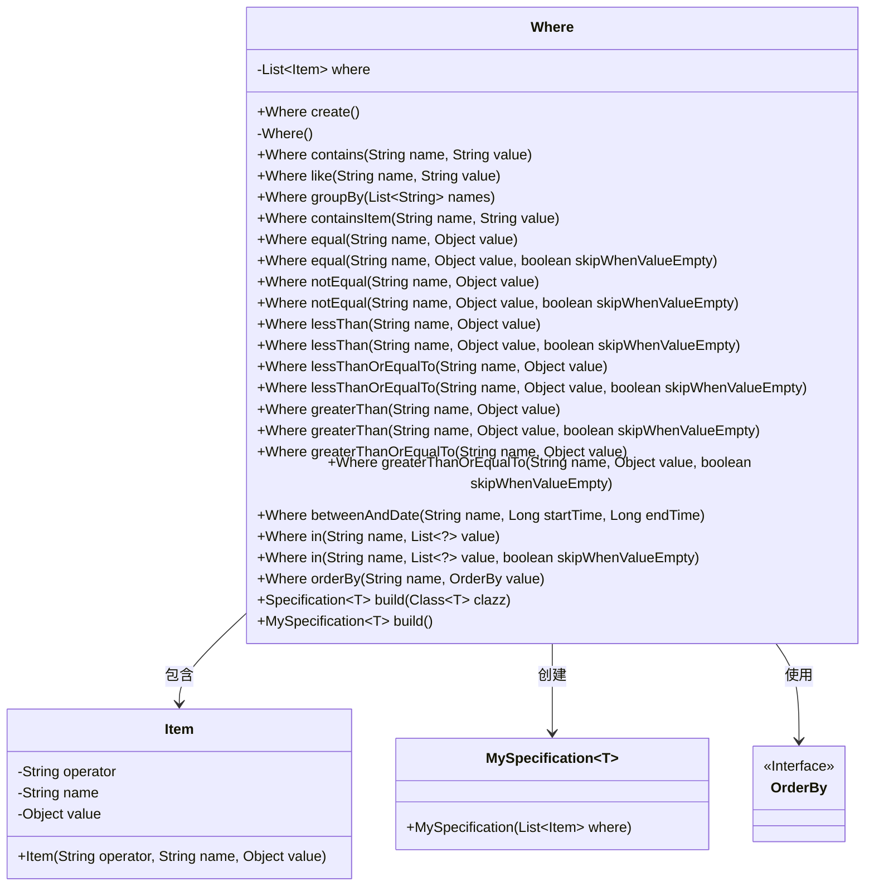

# 基础信息

|      |      |
|------|------|
| 名称 | Where |
| 编码语言 | .java |
| 代码路径 | WeFe/common/java/common-data-mysql/src/main/java/com/welab/wefe/common/data/mysql/Where.java |
| 包名 | com.welab.wefe.common.data.mysql |
| 依赖项 | ['com.welab.wefe.common.data.mysql.enums.OrderBy', 'com.welab.wefe.common.util.StringUtil', 'org.springframework.data.jpa.domain.Specification', 'java.util.ArrayList', 'java.util.Date', 'java.util.List'] |
| 概述说明 | Where类用于构建SQL条件查询，支持包含、等于、不等于、大于、小于、分组、排序等操作，自动跳过空值条件。 |

# 说明

Where类是一个用于构建查询条件的工具类，提供链式调用方法拼接SQL条件。主要功能包括：创建包含、模糊匹配、等于、不等于、小于、小于等于、大于、大于等于、区间日期、分组、排序等条件。支持空值跳过逻辑，条件存储在内部列表，最终通过build方法生成Specification对象。Item内部类封装操作符、字段名和值。

# 类列表 Class Summary

| 名称   | 类型  | 说明 |
|-------|------|-------------|
| Where | class | Where类用于构建动态SQL条件，支持包含、等于、不等于、大于、小于、分组、排序等操作，空值自动跳过，最终生成Specification对象。 |

## 类 Where

|      |      |
|------|------|
| 访问范围 | public |
| 类型 | class |
| 名称 | Where |
| 说明 | Where类用于构建动态SQL条件，支持包含、等于、不等于、大于、小于、分组、排序等操作，空值自动跳过，最终生成Specification对象。 |

### UML类图

这段代码定义了一个`Where`类，用于构建SQL查询条件。它通过链式调用方法（如`equal`、`like`、`in`等）来添加各种查询条件，这些条件被存储在`Item`对象列表中。`Where`类可以生成`MySpecification`对象，用于最终的查询构建。该类支持条件跳过（当值为空时）、多种比较操作以及排序功能，是一个灵活的查询条件构建器。

### 内部方法调用关系图

```mermaid
graph TD
    A["类Where"]
    B["静态方法: create()"]
    C["私有属性: List<Item> where"]
    D["私有构造方法: Where()"]
    E["方法: contains(String name, String value)"]
    F["方法: like(String name, String value)"]
    G["方法: groupBy(List<String> names)"]
    H["方法: containsItem(String name, String value)"]
    I["方法: equal(String name, Object value)"]
    J["方法: notEqual(String name, Object value)"]
    K["方法: lessThan(String name, Object value)"]
    L["方法: lessThanOrEqualTo(String name, Object value)"]
    M["方法: greaterThan(String name, Object value)"]
    N["方法: greaterThanOrEqualTo(String name, Object value)"]
    O["方法: betweenAndDate(String name, Long startTime, Long endTime)"]
    P["方法: in(String name, List<?> value)"]
    Q["方法: orderBy(String name, OrderBy value)"]
    R["方法: build()"]
    S["嵌套类: Item"]

    A --> B
    A --> C
    A --> D
    A --> E
    A --> F
    A --> G
    A --> H
    A --> I
    A --> J
    A --> K
    A --> L
    A --> M
    A --> N
    A --> O
    A --> P
    A --> Q
    A --> R
    A --> S
```

这段代码定义了一个Where类，用于构建SQL查询条件。它提供了多种方法来添加不同类型的查询条件（如equal、like、in等），并支持条件值的空值检查。所有条件存储在Item对象的列表中，最终可通过build方法生成Specification对象。该类采用Builder模式设计，支持链式调用，且包含嵌套的Item类来存储单个查询条件的信息。

### 字段列表 Field List

| 名称  | 类型  | 说明 |
|-------|-------|------|
| where = new ArrayList<>() | List<Item> | 声明一个私有列表变量where，用于存储Item对象，初始化为空ArrayList。 |

### 方法列表

| 名称  | 类型  | 说明 |
|-------|-------|------|
| lessThan | Where | 这是一个Java方法，名为lessThan，用于添加小于条件的查询条件。如果skipWhenValueEmpty为true且value为空或空字符串，则跳过添加条件。否则，将条件添加到where列表中。方法返回当前对象以支持链式调用。 |
| equal | Where | 该方法在满足条件时向where列表添加一个相等条件项。若skipWhenValueEmpty为真且值为空或空字符串，则跳过添加直接返回当前对象。 |
| lessThanOrEqualTo | Where | 方法`lessThanOrEqualTo`用于添加条件：若`value`非空且不为空字符串，则将字段`name`小于等于`value`的条件加入查询。参数`skipWhenValueEmpty`控制是否跳过空值。 |
| lessThanOrEqualTo | Where | 方法 lessThanOrEqualTo 接受名称和值参数，调用同名方法并默认第三个参数为 true，返回 Where 对象。 |
| greaterThanOrEqualTo | Where | 方法`greaterThanOrEqualTo`用于添加大于等于条件到查询中。若`skipWhenValueEmpty`为真且值为空或空字符串，则跳过。否则，将条件加入查询列表并返回当前对象。 |
| groupBy | Where | 方法`groupBy`接收字符串列表`names`，若`names`为空则跳过，否则添加分组条件到`where`中并返回当前对象。 |
| in | Where | 方法`in`接收名称和值列表，调用重载方法并默认启用条件。 |
| betweenAndDate | Where | 方法`betweenAndDate`根据时间范围筛选数据：若`startTime`有效则筛选大于等于该日期的记录，若`endTime`有效则筛选小于等于该日期的记录，最后返回当前对象。 |
| equal | Where | 这是一个公共方法，名为equal，接受字符串name和对象value作为参数，调用另一个equal方法并传入第三个参数true。 |
| like | Where | 方法like用于条件查询，当value非空时，将name和value以like条件加入where集合，返回当前对象。 |
| containsItem | Where | 方法`containsItem`检查`value`非空后，向`where`添加包含指定`name`和`value`的`Item`条件，返回当前对象。 |
| create | Where | 这是一个静态工厂方法，用于创建并返回一个新的Where类实例。方法名为create，无参数。 |
| notEqual | Where | 方法notEqual用于添加不等条件到查询中。若skipWhenValueEmpty为真且值为空或空字符串，则跳过。否则，将条件加入where列表。返回当前对象以支持链式调用。 |
| greaterThanOrEqualTo | Where | 方法greaterThanOrEqualTo接收名称和值参数，调用同名方法并传入第三个参数true。 |
| greaterThan | Where | 方法greaterThan接收名称和值参数，调用同名方法并默认启用条件检查。 |
| lessThan | Where | 方法 lessThan 接受名称和值参数，调用重载方法 lessThan 并传入 true 作为第三个参数。 |
| notEqual | Where | 方法notEqual接收名称和值参数，调用重载方法并默认启用条件检查。 |
| contains | Where | 方法contains检查value非空后，将包含条件加入where列表并返回当前对象。 |
| greaterThan | Where | 方法greaterThan在满足条件时添加大于条件项，否则返回自身。参数包括字段名、值和是否跳过空值的标志。 |
| in | Where | 方法`in`用于构建查询条件：若`skipWhenValueEmpty`为真且`value`为空或空列表，则跳过；否则将`name`和`value`以"in"操作符加入条件列表。返回当前对象以支持链式调用。 |
| orderBy | Where | 这是一个Java方法，用于添加排序条件。若排序值为空则返回当前对象，否则将排序字段名和方式添加到where条件中并返回当前对象。 |
| build | Specification<T> | 这是一个泛型方法，用于构建Specification对象，接受一个Class类型参数并返回Specification<T>。方法内部调用无参build()实现。 |
| build | MySpecification<T> | 构建方法返回带条件的MySpecification对象。 |

