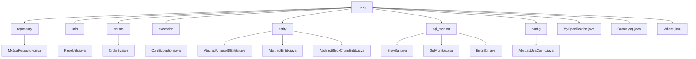

# 基础信息

|      |      |
|------|------|
| 名称 | mysql |
| 编码语言 | .java |
| 代码路径 | WeFe/common/java/common-data-mysql/src/main/java/com/welab/wefe/common/data/mysql |
| 包名 | docs.common.java.common-data-mysql.src.main.java.com.welab.wefe.common.data.mysql |
| 概述说明 | MyJpaRepository提供分页查询和字符串处理默认方法。PageUtils处理单对象分页。OrderBy枚举定义排序方向。CurdException为自定义异常。实体类继承体系管理通用字段。SQL监控模块捕获慢SQL和错误。抽象JPA配置类创建实体管理器工厂和数据源。MySpecification实现动态查询条件构建。DataMysql为数据库操作基础类。Where类链式构建查询条件。 |

# 说明

## 概述  
该模块是围绕JPA实现的MySQL数据访问层，核心职责是提供标准化CRUD操作与动态查询能力。接口规范包含三层：基础仓库接口（MyJpaRepository扩展JPA原生接口）、条件构建器（Where/MySpecification）和分页工具（PageUtils）。关键数据结构包括分页对象（Pageable）、排序枚举（OrderBy）和条件项（Where.Item）。外部依赖仅JPA和Druid数据源。例如MyJpaRepository通过getPageable方法自动处理分页参数校验。

模块同时实现SQL监控（类似AOP切面）和实体基类继承体系。SQL监控捕获慢查询（阈值100ms）和错误SQL，通过SlowSql/ErrorSql记录统计信息。实体基类（如AbstractUniqueIDEntity）提供全局唯一ID（UUID）和时间戳管理。例如AbstractBlockChainEntity扩展日志时间字段，支持区块链场景。

## 主要业务场景  
模块适用于需要动态查询与标准化数据管理的场景，类似Spring Data JPA增强版。典型流程为：通过Where链式构建条件（如contains模糊匹配），MySpecification生成动态Predicate，MyJpaRepository执行分页查询（如getPageableForAtQuery）。交互模式统一通过方法链组合条件，例如Where.equal().groupBy().build()。

SQL监控通过FilterEventAdapter实现全链路追踪，业务流程包括：执行前计时，判定慢查询/失败后更新统计。实体继承体系支持快速扩展，如区块链实体继承AbstractBlockChainEntity自动获得日志时间字段。完整覆盖从条件构建（支持10+操作符）、分页查询到监控分析的闭环需求。例如PageUtils统一处理单对象分页，CurdException封装业务异常。

### 包内部结构视图

该流程图展示了WeFe项目中common-data-mysql模块的Java代码结构。根节点mysql下包含8个子目录和3个独立文件，每个子目录又包含具体的实现类。主要包含数据访问层组件（repository）、工具类（utils）、枚举（enums）、异常处理（exception）、实体类（entity）、SQL监控（sql_monitor）和配置类（config）等功能模块。

# 文件列表

| 名称   | 类型  | 说明 |
|-------|------|-------------|
| [MySpecification.java](MySpecification.md) | file | MySpecification类实现Specification接口，根据items列表生成动态查询条件，支持包含、分组、等于、不等于、范围、排序等操作，并转换为JPA Predicate。 |
| [DataMysql.java](DataMysql.md) | file | 类DataMysql用于处理MySQL数据库操作。 |
| [Where.java](Where.md) | file | Where类用于构建SQL条件查询，支持包含、等于、不等于、大于、小于、分组、排序等操作，自动跳过空值条件。 |
| [config](config/_module.md) | package | AbstractJpaConfig类提供JPA配置，包含创建实体管理器工厂和数据源的方法，支持自定义Druid数据源过滤器。 |
| [sql_monitor](sql_monitor/_module.md) | package | SlowSql类记录慢SQL统计信息，包括SQL语句、耗时等，维护最快SQL实例。SqlMonitor类监控SQL执行，捕获慢SQL和失败SQL，设定阈值和上限。ErrorSql类记录SQL错误信息，包括错误消息和捕获次数。 |
| [entity](entity/_module.md) | package | AbstractUniqueIDEntity是继承AbstractEntity的抽象基类，使用UUID生成主键。AbstractEntity包含创建和更新时间字段。AbstractBlockChainEntity继承AbstractUniqueIDEntity，新增logTime字段记录时间。 |
| [exception](exception/_module.md) | package | 自定义异常类CurdException，继承Exception，含message属性和构造方法，重写getMessage返回message。 |
| [enums](enums/_module.md) | package | OrderBy枚举定义两种排序方式：升序asc和降序desc。 |
| [utils](utils/_module.md) | package | PageUtils类提供两个静态方法，将单个对象或Optional对象转换为分页对象，便于统一ID查询。 |
| [repository](repository/_module.md) | package | 自定义JPA仓库接口，提供分页查询和字符串模糊匹配的默认方法，支持动态排序和参数校验。 |

