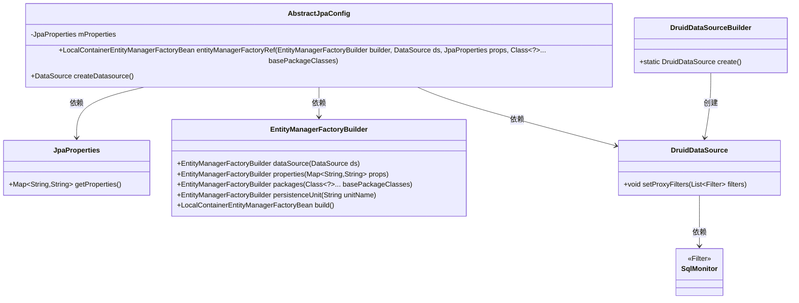
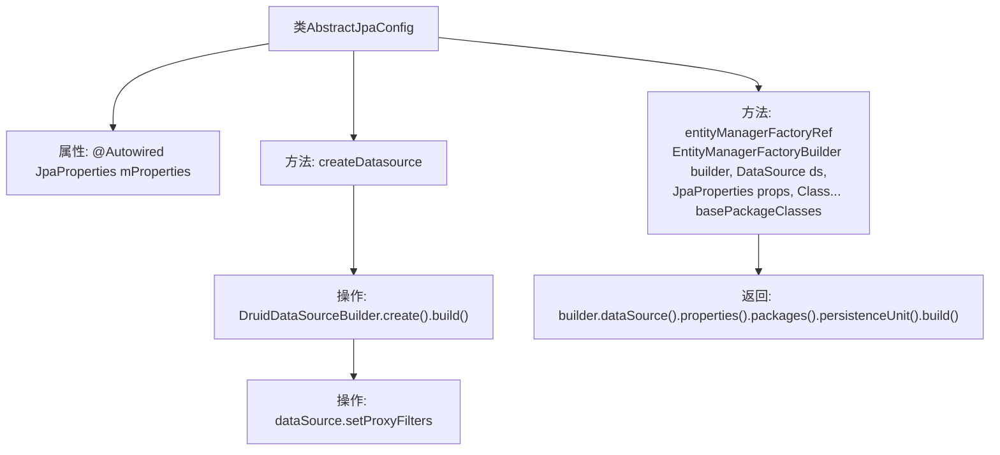

# 基础信息

|      |      |
|------|------|
| 名称 | AbstractJpaConfig |
| 编码语言 | .java |
| 代码路径 | WeFe/common/java/common-data-mysql/src/main/java/com/welab/wefe/common/data/mysql/config/AbstractJpaConfig.java |
| 包名 | com.welab.wefe.common.data.mysql.config |
| 依赖项 | ['com.alibaba.druid.pool.DruidDataSource', 'com.alibaba.druid.spring.boot.autoconfigure.DruidDataSourceBuilder', 'com.welab.wefe.common.data.mysql.sql_monitor.SqlMonitor', 'org.springframework.beans.factory.annotation.Autowired', 'org.springframework.boot.autoconfigure.orm.jpa.JpaProperties', 'org.springframework.boot.orm.jpa.EntityManagerFactoryBuilder', 'org.springframework.orm.jpa.LocalContainerEntityManagerFactoryBean', 'javax.sql.DataSource', 'java.util.Collections'] |
| 概述说明 | AbstractJpaConfig类提供JPA配置，包含创建实体管理器工厂和数据源的方法，支持自定义Druid数据源过滤器。 |

# 说明

这是一个抽象JPA配置类，包含两个核心方法。首先通过entityManagerFactoryRef方法创建实体管理器工厂Bean，接收构建器、数据源、JPA属性和实体类包路径作为参数，配置数据源、属性和持久化单元后返回。其次createDatasource方法创建Druid数据源实例，并添加了SQL监控过滤器。类中自动注入了JPA属性配置对象。

# 类列表 Class Summary

| 名称   | 类型  | 说明 |
|-------|------|-------------|
| AbstractJpaConfig | class | AbstractJpaConfig类包含JPA配置，提供创建实体管理器工厂和数据源的方法，数据源使用Druid并添加了SQL监控过滤器。 |

## 类 AbstractJpaConfig

|      |      |
|------|------|
| 访问范围 | public |
| 类型 | class |
| 名称 | AbstractJpaConfig |
| 说明 | AbstractJpaConfig类包含JPA配置，提供创建实体管理器工厂和数据源的方法，数据源使用Druid并添加了SQL监控过滤器。 |

### UML类图

该类图展示了AbstractJpaConfig的核心结构及其依赖关系。AbstractJpaConfig通过JpaProperties获取配置属性，利用EntityManagerFactoryBuilder构建实体管理器工厂，并通过DruidDataSourceBuilder创建带有SqlMonitor过滤器的数据源。图中清晰呈现了各组件间的协作方式，包括配置注入、工厂模式构建和数据源定制等关键交互流程。

### 内部方法调用关系图

这段代码流程图展示了AbstractJpaConfig类的结构和关键方法调用关系。类包含一个自动注入的JpaProperties属性和两个核心方法：entityManagerFactoryRef用于构建JPA实体管理器工厂，通过builder模式配置数据源、属性和持久化单元；createDatasource方法创建Druid数据源并添加SQL监控过滤器。流程图清晰呈现了数据源创建过程（包括Druid构建和过滤器设置）与实体管理器工厂的链式构建流程，体现了Spring Data JPA配置类的典型结构。

### 字段列表 Field List

| 名称  | 类型  | 说明 |
|-------|-------|------|
| mProperties | JpaProperties | 自动注入JpaProperties属性对象。 |

### 方法列表

| 名称  | 类型  | 说明 |
|-------|-------|------|
| entityManagerFactoryRef | LocalContainerEntityManagerFactoryBean | 创建LocalContainerEntityManagerFactoryBean，配置数据源、JPA属性和实体类包路径，指定持久化单元为"pu1"。 |
| createDatasource | DataSource | 创建Druid数据源并添加自定义SqlMonitor过滤器。 |

