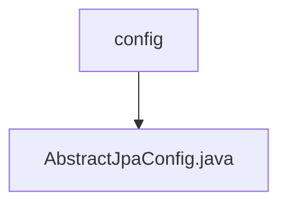

# 基础信息

|      |      |
|------|------|
| 名称 | config |
| 编码语言 | .java |
| 代码路径 | WeFe/common/java/common-data-mysql/src/main/java/com/welab/wefe/common/data/mysql/config |
| 包名 | docs.common.java.common-data-mysql.src.main.java.com.welab.wefe.common.data.mysql.config |
| 概述说明 | AbstractJpaConfig类提供JPA配置，包含创建实体管理器工厂和数据源的方法，支持自定义Druid数据源过滤器。 |

# 说明

这是一个抽象JPA配置类，包含两个核心方法。首先通过entityManagerFactoryRef方法创建实体管理器工厂Bean，接收构建器、数据源、JPA属性和实体类包路径作为参数，配置数据源、属性和持久化单元后返回。其次createDatasource方法创建Druid数据源实例，并添加了SQL监控过滤器。类中自动注入了JPA属性配置对象。

### 包内部结构视图

该流程图展示了WeFe项目中common-data-mysql模块的配置目录结构。config目录下包含一个AbstractJpaConfig.java文件，用于处理JPA相关的数据库配置。这是一个典型的Spring Boot项目配置结构，体现了分层架构中数据访问层的配置实现方式。

# 文件列表

| 名称   | 类型  | 说明 |
|-------|------|-------------|
| [AbstractJpaConfig.java](AbstractJpaConfig.md) | file | AbstractJpaConfig类提供JPA配置，包含创建实体管理器工厂和数据源的方法，支持自定义Druid数据源过滤器。 |

