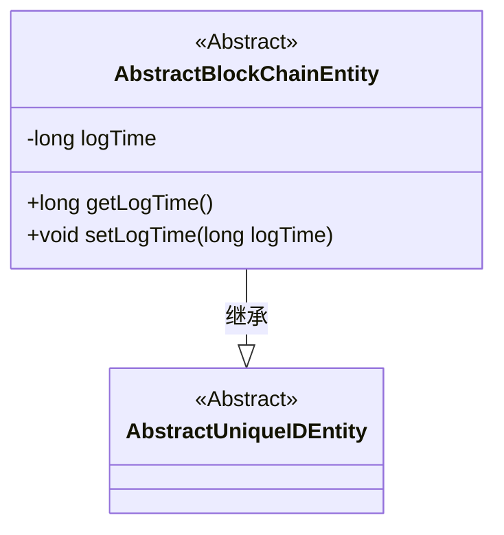
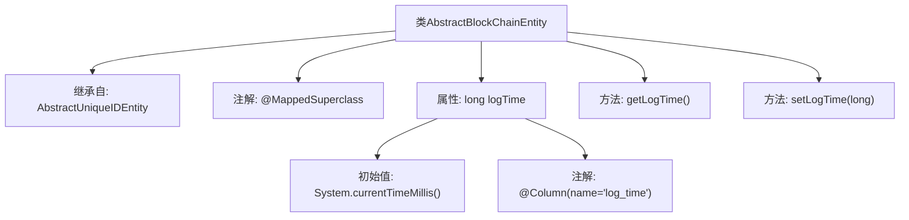

# 基础信息

|      |      |
|------|------|
| 名称 | AbstractBlockChainEntity |
| 编码语言 | .java |
| 代码路径 | WeFe/common/java/common-data-mysql/src/main/java/com/welab/wefe/common/data/mysql/entity/AbstractBlockChainEntity.java |
| 包名 | com.welab.wefe.common.data.mysql.entity |
| 依赖项 | ['javax.persistence.Column', 'javax.persistence.MappedSuperclass'] |
| 概述说明 | 抽象区块链实体类，继承唯一ID实体，包含日志时间字段及访问方法。 |

# 说明

AbstractBlockChainEntity是一个继承自AbstractUniqueIDEntity的抽象基类，使用@MappedSuperclass注解标注。它包含一个名为logTime的long类型字段，默认值为当前系统时间，并通过@Column注解映射到数据库表的log_time列。该类提供了getLogTime和setLogTime方法用于访问和修改logTime字段的值。

# 类列表 Class Summary

| 名称   | 类型  | 说明 |
|-------|------|-------------|
| AbstractBlockChainEntity | class | AbstractBlockChainEntity继承AbstractUniqueIDEntity，包含logTime字段及getter/setter方法，默认值为当前时间戳。 |

## 类 AbstractBlockChainEntity

|      |      |
|------|------|
| 访问范围 | @MappedSuperclass;public |
| 类型 | class |
| 名称 | AbstractBlockChainEntity |
| 说明 | AbstractBlockChainEntity继承AbstractUniqueIDEntity，包含logTime字段及getter/setter方法，默认值为当前时间戳。 |

### UML类图

这段类图展示了AbstractBlockChainEntity继承自AbstractUniqueIDEntity的层级关系。作为抽象基类，AbstractBlockChainEntity包含记录时间的logTime字段及其访问方法，通过@MappedSuperclass注解表明它是JPA实体类的父类。该设计提供了区块链相关实体的基础时间记录功能，同时保留了父类的唯一标识特性。

### 内部方法调用关系图

这段代码展示了一个继承自AbstractUniqueIDEntity的抽象基类AbstractBlockChainEntity，使用@MappedSuperclass注解标识其为JPA实体超类。类中包含一个记录时间的logTime属性，默认初始化为当前系统时间，并通过@Column注解映射到数据库的log_time字段。提供getter/setter方法用于访问和修改该属性，体现了实体类的基础时间戳功能设计。

### 字段列表 Field List

| 名称  | 类型  | 说明 |
|-------|-------|------|
| logTime = System.currentTimeMillis() | long | 数据库字段log_time映射为长整型私有变量logTime，默认值为当前系统时间戳。 |

### 方法列表

| 名称  | 类型  | 说明 |
|-------|-------|------|
| setLogTime | void | 这是一个Java方法，用于设置日志时间。方法名为setLogTime，接受一个long类型参数logTime，并将其赋值给类的成员变量logTime。 |
| getLogTime | long | 获取日志时间的方法，返回长整型变量logTime的值。 |

