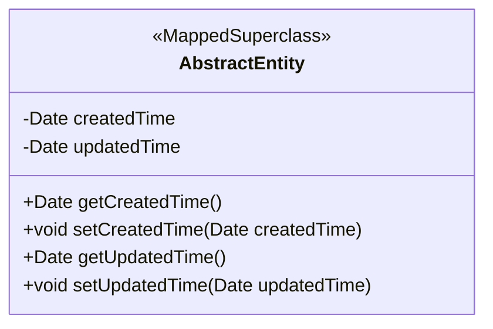
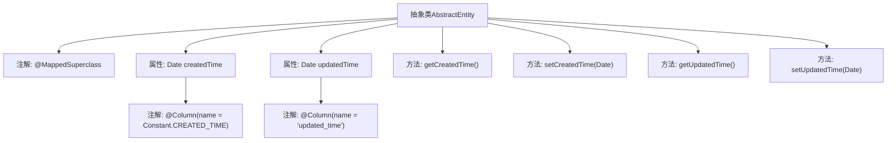

# 基础信息

|      |      |
|------|------|
| 名称 | AbstractEntity |
| 编码语言 | .java |
| 代码路径 | WeFe/common/java/common-data-mysql/src/main/java/com/welab/wefe/common/data/mysql/entity/AbstractEntity.java |
| 包名 | com.welab.wefe.common.data.mysql.entity |
| 依赖项 | ['com.welab.wefe.common.constant.Constant', 'javax.persistence.Column', 'javax.persistence.MappedSuperclass', 'java.util.Date'] |
| 概述说明 | 抽象基类AbstractEntity定义创建时间和更新时间字段，提供getter和setter方法。 |

# 说明

AbstractEntity是一个抽象基类，使用MappedSuperclass注解标注，用于实体类的继承。它包含两个日期类型字段：createdTime记录创建时间，通过Constant.CREATED_TIME常量指定列名；updatedTime记录更新时间，列名直接定义为updated_time。两个字段默认值为当前时间。类提供了标准的getter和setter方法用于访问和修改这两个字段值。

# 类列表 Class Summary

| 名称   | 类型  | 说明 |
|-------|------|-------------|
| AbstractEntity | class | 抽象类AbstractEntity定义创建时间和更新时间字段，包含getter和setter方法。 |

## 类 AbstractEntity

|      |      |
|------|------|
| 访问范围 | @MappedSuperclass;public abstract |
| 类型 | class |
| 名称 | AbstractEntity |
| 说明 | 抽象类AbstractEntity定义创建时间和更新时间字段，包含getter和setter方法。 |

### UML类图

这段代码定义了一个名为`AbstractEntity`的抽象基类，使用`@MappedSuperclass`注解标注，表明这是一个JPA实体类的父类。类中包含两个私有日期类型字段`createdTime`和`updatedTime`，分别表示创建时间和更新时间，并通过`@Column`注解与数据库表中的列进行映射。提供了这四个字段的getter和setter方法，允许子类继承这些基础属性。这个设计模式常用于实体类中需要记录创建和修改时间的场景，通过继承实现代码复用。

### 内部方法调用关系图

该流程图展示了AbstractEntity抽象类的结构，包含两个带@Column注解的Date类型属性（createdTime和updatedTime）及其对应的getter/setter方法。作为@MappedSuperclass标注的基类，它提供了实体共用的时间字段管理功能，createdTime使用常量配置列名，updatedTime直接使用字符串配置，体现了JPA实体类的典型设计模式。

### 字段列表 Field List

| 名称  | 类型  | 说明 |
|-------|-------|------|
| updatedTime = new Date() | Date | 数据库字段updated_time映射为Date类型，默认值为当前时间。 |
| createdTime = new Date() | Date | 数据库字段映射，createdTime对应CREATED_TIME，默认值为当前时间。 |

### 方法列表

| 名称  | 类型  | 说明 |
|-------|-------|------|
| getUpdatedTime | Date | 获取更新时间的方法，返回updatedTime对象。 |
| setUpdatedTime | void | 设置更新时间为指定日期对象。 |
| setCreatedTime | void | 设置创建时间的方法，将参数值赋给对象的createdTime属性。 |
| getCreatedTime | Date | 获取创建时间的方法，返回Date类型值。 |

