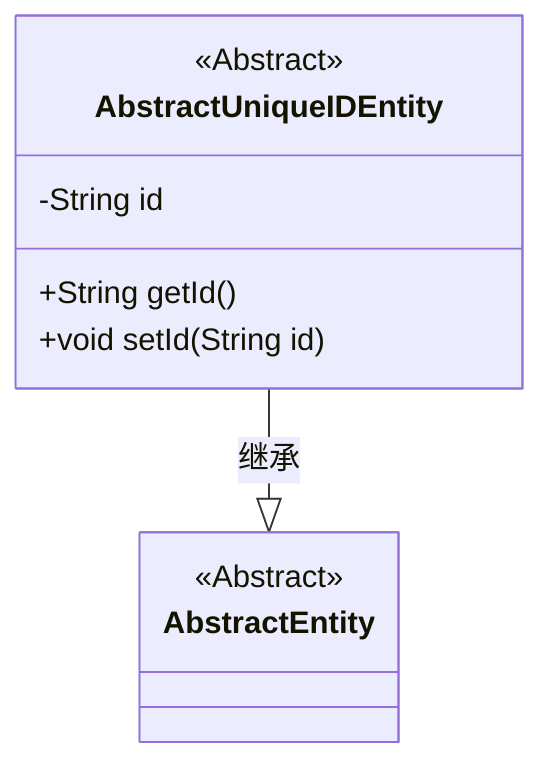
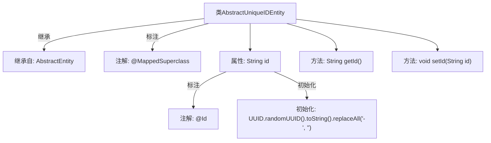

# 基础信息

|      |      |
|------|------|
| 名称 | AbstractUniqueIDEntity |
| 编码语言 | .java |
| 代码路径 | WeFe/common/java/common-data-mysql/src/main/java/com/welab/wefe/common/data/mysql/entity/AbstractUniqueIDEntity.java |
| 包名 | com.welab.wefe.common.data.mysql.entity |
| 依赖项 | ['javax.persistence.Id', 'javax.persistence.MappedSuperclass', 'java.util.UUID'] |
| 概述说明 | 抽象实体类AbstractUniqueIDEntity继承AbstractEntity，使用UUID生成无横杠的唯一ID，提供getter和setter方法。 |

# 说明

该代码定义了一个名为AbstractUniqueIDEntity的抽象基类，继承自AbstractEntity。类使用@MappedSuperclass注解标注，表明其为其他实体类的父类。核心字段id被@Id注解标记为主键，其初始值通过UUID随机生成并去除连字符。类提供了getId和setId方法用于访问和修改id字段。该设计实现了全局唯一标识符的生成与管理功能。

# 类列表 Class Summary

| 名称   | 类型  | 说明 |
|-------|------|-------------|
| AbstractUniqueIDEntity | class | 抽象实体类AbstractUniqueIDEntity继承AbstractEntity，使用UUID生成无横杠的唯一ID，提供getter和setter方法。 |

## 类 AbstractUniqueIDEntity

|      |      |
|------|------|
| 访问范围 | @MappedSuperclass;public |
| 类型 | class |
| 名称 | AbstractUniqueIDEntity |
| 说明 | 抽象实体类AbstractUniqueIDEntity继承AbstractEntity，使用UUID生成无横杠的唯一ID，提供getter和setter方法。 |

### UML类图

类图描述：该图展示了一个继承关系，AbstractUniqueIDEntity 是 AbstractEntity 的子类，用于为实体提供全局唯一ID功能。AbstractUniqueIDEntity 包含私有字段 id 和对应的 getter/setter 方法，其中 id 通过 UUID 生成并去除连字符。这个抽象基类适用于需要唯一标识的实体类继承。

### 内部方法调用关系图

这段代码定义了一个抽象基类AbstractUniqueIDEntity，它继承自AbstractEntity并使用@MappedSuperclass注解标注。该类包含一个使用@Id注解标注的id属性，该属性在初始化时通过UUID生成并去除连字符。提供了getId()和setId()方法来访问和修改id属性。这个类主要用于为其他实体类提供全局唯一标识符的基础功能。

### 字段列表 Field List

| 名称  | 类型  | 说明 |
|-------|-------|------|
| id = UUID.randomUUID().toString().replaceAll("-", "") | String | 实体ID字段，使用UUID生成并去除横线。 |

### 方法列表

| 名称  | 类型  | 说明 |
|-------|-------|------|
| getId | String | 该方法返回字符串类型的id值。 |
| setId | void | 设置对象ID的方法，将参数id赋值给对象的id属性。 |

