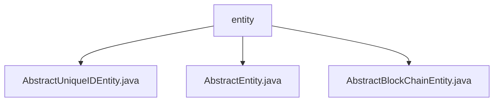

# 基础信息

|      |      |
|------|------|
| 名称 | entity |
| 编码语言 | .java |
| 代码路径 | WeFe/common/java/common-data-mysql/src/main/java/com/welab/wefe/common/data/mysql/entity |
| 包名 | docs.common.java.common-data-mysql.src.main.java.com.welab.wefe.common.data.mysql.entity |
| 概述说明 | AbstractUniqueIDEntity是继承AbstractEntity的抽象基类，使用UUID生成主键。AbstractEntity包含创建和更新时间字段。AbstractBlockChainEntity继承AbstractUniqueIDEntity，新增logTime字段记录时间。 |

# 说明

## 概述  
该模块提供基于JPA的实体类继承体系，核心职责是实现通用字段（如唯一ID、时间戳）的标准化管理。接口规范包含三层抽象：AbstractEntity定义基础时间字段（createdTime/updatedTime），AbstractUniqueIDEntity扩展全局唯一ID（UUID格式），AbstractBlockChainEntity新增区块链日志时间（logTime）。关键数据结构包括UUID主键、时间戳（Date/long类型）。无外部依赖。例如AbstractUniqueIDEntity通过去除连字符的UUID确保ID唯一性。

## 主要业务场景  
模块适用于需要标准化数据模型的场景，类似ORM模板模式。典型流程为：子类继承基础字段（如ID自动生成、时间自动记录），专注业务字段开发。例如区块链实体可继承AbstractBlockChainEntity直接获得日志时间功能。交互模式统一通过getter/setter操作字段，如setLogTime()修改区块链时间戳。完整覆盖实体类的基础元数据管理需求。

### 包内部结构视图

该流程图展示了MySQL数据实体层的核心结构，包含三个抽象基类文件：AbstractUniqueIDEntity、AbstractEntity和AbstractBlockChainEntity，它们都位于entity目录下，为数据持久化提供基础支持。这种设计模式体现了面向对象编程中的继承特性，便于统一管理实体类的公共属性和行为。

# 文件列表

| 名称   | 类型  | 说明 |
|-------|------|-------------|
| [AbstractUniqueIDEntity.java](AbstractUniqueIDEntity.md) | file | 抽象实体类AbstractUniqueIDEntity继承AbstractEntity，使用UUID生成无横杠的唯一ID，提供getter和setter方法。 |
| [AbstractEntity.java](AbstractEntity.md) | file | 抽象基类AbstractEntity定义创建时间和更新时间字段，提供getter和setter方法。 |
| [AbstractBlockChainEntity.java](AbstractBlockChainEntity.md) | file | 抽象区块链实体类，继承唯一ID实体，包含日志时间字段及访问方法。 |

