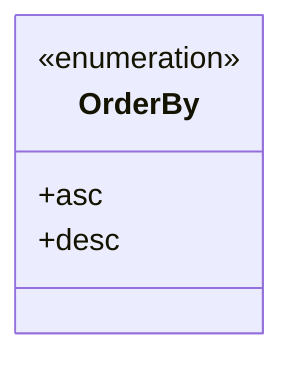
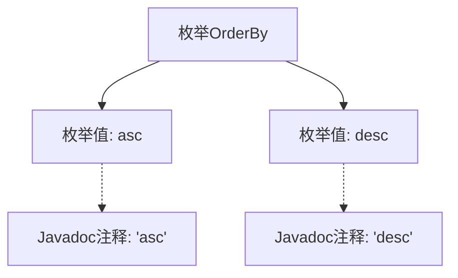

# 基础信息

|      |      |
|------|------|
| 名称 | OrderBy |
| 编码语言 | .java |
| 代码路径 | WeFe/common/java/common-data-mysql/src/main/java/com/welab/wefe/common/data/mysql/enums/OrderBy.java |
| 包名 | com.welab.wefe.common.data.mysql.enums |
| 依赖项 | [] |
| 概述说明 | OrderBy枚举定义两种排序方式：升序asc和降序desc。 |

# 说明

这是一个名为OrderBy的枚举类型，包含两个枚举值：asc表示升序排列，desc表示降序排列。每个枚举值都有对应的注释说明其含义。该枚举用于表示排序方向，结构简洁明了。

# 类列表 Class Summary

| 名称   | 类型  | 说明 |
|-------|------|-------------|
| OrderBy | enum | OrderBy枚举定义两种排序方式：升序(asc)和降序(desc)。 |

## 类 OrderBy

|      |      |
|------|------|
| 访问范围 | public |
| 类型 | enum |
| 名称 | OrderBy |
| 说明 | OrderBy枚举定义两种排序方式：升序(asc)和降序(desc)。 |

### UML类图

这段代码定义了一个名为OrderBy的枚举类型，包含两个枚举常量：asc（升序）和desc（降序）。枚举类型在类图中用<<enumeration>>标记，表示它是一个固定的值集合。该枚举常用于表示排序方向，简洁明了地提供了两种排序选项，便于在代码中直接引用而无需使用字符串或数字常量。

### 内部方法调用关系图

该流程图展示了OrderBy枚举的结构，包含两个枚举值asc和desc，每个枚举值都关联了对应的Javadoc注释。枚举作为特殊类类型，通过实线箭头表示包含关系，虚线箭头表示注释关联。图形清晰地呈现了简单枚举的定义方式及其文档说明的从属关系，适用于需要明确排序方向的场景。

### 字段列表 Field List

| 名称  | 类型  | 说明 |
|-------|-------|------|

### 方法列表

| 名称  | 类型  | 说明 |
|-------|-------|------|

