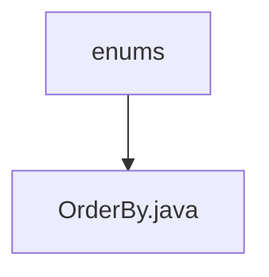

# 基础信息

|      |      |
|------|------|
| 名称 | enums |
| 编码语言 | .java |
| 代码路径 | WeFe/common/java/common-data-mysql/src/main/java/com/welab/wefe/common/data/mysql/enums |
| 包名 | docs.common.java.common-data-mysql.src.main.java.com.welab.wefe.common.data.mysql.enums |
| 概述说明 | OrderBy枚举定义两种排序方式：升序asc和降序desc。 |

# 说明

这是一个名为OrderBy的枚举类型，包含两个枚举值：asc表示升序排列，desc表示降序排列。每个枚举值都有对应的注释说明其含义。该枚举用于表示排序方向，结构简洁明了。

### 包内部结构视图

该流程图展示了WeFe项目中MySQL通用数据模块的枚举类层级关系。顶层节点为"enums"目录，包含一个子节点"OrderBy.java"枚举文件，表示排序方式的枚举定义。结构简洁明了，反映了项目中枚举类的组织方式。

# 文件列表

| 名称   | 类型  | 说明 |
|-------|------|-------------|
| [OrderBy.java](OrderBy.md) | file | OrderBy枚举定义两种排序方式：升序asc和降序desc。 |

