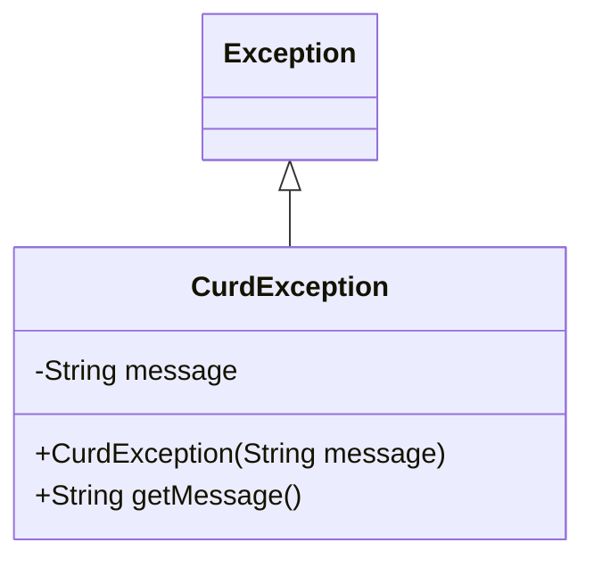
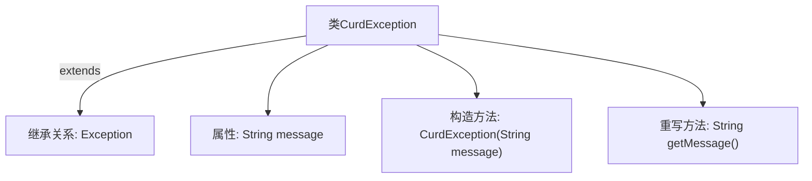

# 基础信息

|      |      |
|------|------|
| 名称 | CurdException |
| 编码语言 | .java |
| 代码路径 | WeFe/common/java/common-data-mysql/src/main/java/com/welab/wefe/common/data/mysql/exception/CurdException.java |
| 包名 | com.welab.wefe.common.data.mysql.exception |
| 依赖项 | [] |
| 概述说明 | 自定义异常类CurdException，继承Exception，含message属性和构造方法，重写getMessage返回message。 |

# 说明

该内容定义了一个名为CurdException的自定义异常类，继承自Exception类。该类包含一个私有字符串字段message用于存储异常信息，并通过构造函数初始化该字段。同时重写了父类的getMessage方法，返回存储的异常信息。这个自定义异常类主要用于处理特定业务逻辑中的错误情况。

# 类列表 Class Summary

| 名称   | 类型  | 说明 |
|-------|------|-------------|
| CurdException | class | 自定义异常类CurdException，继承Exception，含message属性和构造方法，重写getMessage返回message。 |

## 类 CurdException

|      |      |
|------|------|
| 访问范围 | public |
| 类型 | class |
| 名称 | CurdException |
| 说明 | 自定义异常类CurdException，继承Exception，含message属性和构造方法，重写getMessage返回message。 |

### UML类图

这段类图展示了一个自定义异常类CurdException，它继承自Java标准库中的Exception类。图中清晰地显示了类继承关系（CurdException是Exception的子类）和类内部结构，包含一个私有字符串字段message，一个公有构造方法CurdException(String)以及重写的公有方法getMessage()。这个异常类专门用于处理CRUD操作中的错误情况，通过构造时传入的错误信息可以获取详细的异常描述。类图简洁明了地呈现了该异常类的核心结构和继承关系。

### 内部方法调用关系图

这段流程图展示了CurdException类的结构，它是一个继承自Exception的自定义异常类。图中包含四个关键元素：继承关系、私有属性message、带参数的构造函数以及重写的getMessage()方法。该异常类通过构造函数接收错误信息并存储，再通过重写getMessage()方法返回该信息，为程序提供自定义异常处理能力。整体设计简洁，符合Java异常处理规范。

### 字段列表 Field List

| 名称  | 类型  | 说明 |
|-------|-------|------|
| message | String | 私有字符串变量message |

### 方法列表

| 名称  | 类型  | 说明 |
|-------|-------|------|
| getMessage | String | 重写getMessage方法，返回message字符串。 |

