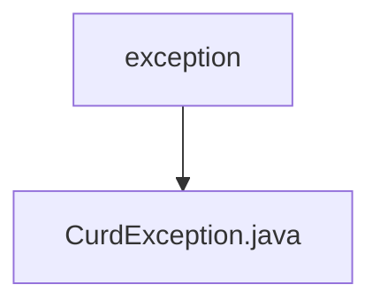

# 基础信息

|      |      |
|------|------|
| 名称 | exception |
| 编码语言 | .java |
| 代码路径 | WeFe/common/java/common-data-mysql/src/main/java/com/welab/wefe/common/data/mysql/exception |
| 包名 | docs.common.java.common-data-mysql.src.main.java.com.welab.wefe.common.data.mysql.exception |
| 概述说明 | 自定义异常类CurdException，继承Exception，含message属性和构造方法，重写getMessage返回message。 |

# 说明

该内容定义了一个名为CurdException的自定义异常类，继承自Exception类。该类包含一个私有字符串字段message用于存储异常信息，并通过构造函数初始化该字段。同时重写了父类的getMessage方法，返回存储的异常信息。这个自定义异常类主要用于处理特定业务逻辑中的错误情况。

### 包内部结构视图

该流程图展示了WeFe项目中common-data-mysql模块的异常处理类层级结构。根节点为exception包，其下包含具体的CurdException异常类实现，用于处理数据库CRUD操作中的异常情况。整个结构简洁明了，体现了异常类的单一职责设计原则。

# 文件列表

| 名称   | 类型  | 说明 |
|-------|------|-------------|
| [CurdException.java](CurdException.md) | file | 自定义异常类CurdException，继承Exception，含message属性和构造方法，重写getMessage返回message。 |

